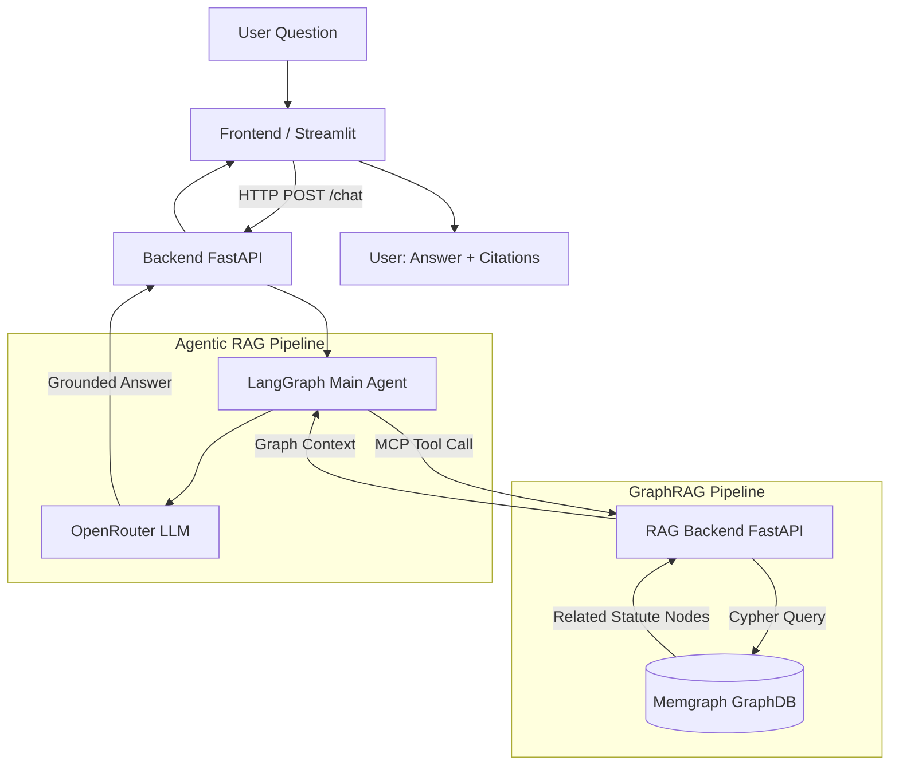

# Elderly Legal Consultation RAG System

<div align="center">

**옆집 손주 (Neighbor's Grandchild)** — AI legal assistant for Korean elderly citizens


*SK Networks AI Camp 3rd Project — Team 1*

</div>

---

## 📌 Overview

**Elderly Legal Consultation RAG System** is an AI-powered legal Q&A service designed to help elderly Korean citizens navigate complex legal situations — inheritance disputes, housing rights, and welfare benefit eligibility — in plain, conversational language.

The project name **옆집 손주 (Neighbor's Grandchild)** captures the spirit of the service: like a knowledgeable grandchild living next door, it answers legal questions simply, patiently, and with real legal backing.

The system combines two advanced RAG strategies — **GraphRAG** (graph-based relationship retrieval via Memgraph) and **Agentic RAG** (multi-step reasoning via LangGraph) — to deliver accurate, source-cited answers grounded in Korean statutes and public legal documents.

---

## 🎯 Problem Statement

| Dimension | Detail |
|---|---|
| **Target users** | Korean elderly citizens (65+) with limited digital literacy |
| **Core problem** | Legal documents are dense, jargon-heavy, and hard to navigate without professional help |
| **Domain gaps** | Inheritance law, housing rights, senior welfare benefits (기초연금, 노인장기요양보험) are interrelated — a single question may span multiple statutes |
| **Existing solutions** | Legal aid services are under-resourced; general LLMs hallucinate citations; vector-only RAG misses cross-statute relationships |
| **Our approach** | A graph-based knowledge system that models relationships *between* legal articles, combined with an agentic LLM that reasons step-by-step before answering |

---

## ✨ Features

| # | Feature | Description |
|---|---|---|
| 1 | **Natural Language Legal Q&A** | Users ask in everyday Korean; the system answers in plain language with source citations |
| 2 | **GraphRAG Relationship Retrieval** | Memgraph graph database models cross-statute relationships, enabling retrieval that follows legal cross-references |
| 3 | **Agentic Multi-Step Reasoning** | LangGraph agent decomposes complex questions, selects tools, and synthesizes a final answer |
| 4 | **Source-Cited Responses** | Every answer links back to specific statutes (e.g., 노인복지법, 기초연금법, 고령자고용법) |
| 5 | **Dual Frontend Interface** | Streamlit prototype for rapid testing; React 19 + TypeScript production UI |
| 6 | **RAG Operations Dashboard** | Admin UI for document ingestion, search result review, and graph edge candidate inspection |
| 7 | **LangSmith Observability** | Full trace of every LLM call and tool invocation for debugging and evaluation |
| 8 | **One-Command Deployment** | All services launch with a single `docker compose up` |

---

## 🛠 Tech Stack

### Core RAG & AI

| Technology | Role | Notes |
|---|---|---|
| **Memgraph** | Graph database (GraphRAG) | Stores legal article nodes and cross-reference edges; Cypher-compatible |
| **GraphRAG 3.0** | Graph-based retrieval | Traverses statute relationships for context-rich retrieval |
| **LangGraph 1.2** | Agentic RAG orchestration | Stateful agent graph for multi-step legal reasoning |
| **LangChain 1.3** | LLM tooling | Chains, prompts, and MCP tool integration |
| **OpenRouter** | LLM gateway | Model-agnostic LLM routing (GPT-4o, Claude, etc.) |
| **MCP** | Tool protocol | RAG backend exposed as MCP tool server consumed by the agent |
| **Redis 7** | Cache & job queue | RAG job queue and search result caching |

### Backend & Frontend

| Technology | Role |
|---|---|
| **FastAPI** | Backend API (`/chat`, `/health`, `/ingest`, `/search`) |
| **Python 3.13 + uv** | Runtime and package management |
| **Pydantic v2** | Settings and data validation |
| **React 19 + TypeScript 5** | Production frontend |
| **Vite + Tailwind CSS + shadcn/ui** | Frontend build and UI components |
| **Streamlit** | Prototype / demo UI |
| **Docker Compose** | Container orchestration |
| **LangSmith** | LLM tracing and evaluation |
| **Firecrawl** | Web crawling for legal document ingestion |

---

## 📁 Project Structure

```
elderly-legal-rag/
├── backend/                    # FastAPI + LangGraph Agent Orchestrator
│   ├── src/
│   │   ├── app.py              # FastAPI app entry point
│   │   ├── settings.py         # Environment variable management (Pydantic-settings)
│   │   ├── api/                # /chat, /health routers
│   │   ├── agent/              # LangGraph Agent, OpenRouter LLM, MCP tool wiring
│   │   └── prompt/             # Agent system prompts
│   ├── Dockerfile
│   └── pyproject.toml
│
├── rag/                        # RAG subsystem
│   ├── be/                     # RAG Backend (FastAPI + Memgraph + Redis + MCP)
│   │   ├── src/                # ingest, search, MCP endpoint implementations
│   │   └── pyproject.toml      # graphrag, neo4j, redis, mcp dependencies
│   ├── fe/                     # RAG Operations UI (React + Vite + Tailwind)
│   ├── infra/                  # Memgraph + Memgraph Lab Docker Compose
│   ├── RAG_ORIGINAL_DATA/      # Raw legal statute JSON data
│   ├── RAG_PREPROCESSED_DATA/  # Preprocessed TOON-format data
│   └── docs/                   # RAG design documents
│
├── streamlit/                  # Conversational UI prototype
│   ├── streamlit.py            # App entry point
│   └── src/                    # Screen composition and backend API client
│
├── frontend/                   # Production React frontend (React 19 + TypeScript)
│
├── infra/                      # Unified Docker Compose (all services)
│   └── docker-compose.yml      # backend, rag-be, rag-fe, streamlit, memgraph, redis
│
├── rag-red-team/               # Experimental Neo4j-based GraphRAG space
├── docs/                       # Meeting notes, onboarding, dev guides
├── presentation/               # Slide decks, test data, LLM-as-a-judge evaluation
├── AGENTS.md                   # AI agent collaboration rules and git workflow
└── README.md
```

---

## 🚀 Getting Started

### Prerequisites

- Docker & Docker Compose
- API keys: `OPENROUTER_API_KEY`, `OPENAI_API_KEY`, `LANGSMITH_API_KEY`

### Recommended: Full Stack via Docker Compose

```bash
# 1. Copy and fill all environment files
cp infra/.env.example        infra/.env
cp backend/.env.example      infra/.env_backend
cp streamlit/.env.example    infra/.env_streamlit
cp rag/be/.env.example       infra/.env_rag_be
cp rag/fe/.env.example       infra/.env_rag_fe
cp rag/infra/.env.example    infra/.env_rag_infra

# 2. Start all services
docker compose --env-file infra/.env -f infra/docker-compose.yml up -d --build
```

Default service endpoints:

| Service | URL |
|---|---|
| Backend API | http://127.0.0.1:8100 |
| Streamlit UI | http://127.0.0.1:8501 |
| RAG Backend | http://127.0.0.1:8110 |
| RAG Frontend | http://127.0.0.1:5174 |
| Memgraph Lab | http://127.0.0.1:3000 |
| Memgraph Bolt | bolt://127.0.0.1:7687 |
| Redis | redis://127.0.0.1:6379/0 |

### Backend Only

```bash
cd backend
cp .env.example .env   # fill OPENROUTER_API_KEY, LANGSMITH_API_KEY, BACKEND_RAG_MCP_URL
uv sync
set -a && source .env && set +a
PYTHONPATH=src uv run uvicorn app:app --host 127.0.0.1 --port 8000 --reload
```

### RAG Backend Only

```bash
cd rag/be
cp .env.example .env
uv sync
PYTHONPATH=src uv run uvicorn app:app --host 127.0.0.1 --port 8010
```

### Validation

```bash
# Backend tests
cd backend && PYTHONPATH=src uv run python -m unittest discover -s tests

# RAG backend tests
cd rag/be && PYTHONPATH=src uv run python -m unittest discover -s tests
```

---

## 🔄 Usage Flow

```
User submits a legal question
        │
        ▼
[Frontend / Streamlit]      ← Renders question input and displays answer
        │  HTTP POST /chat
        ▼
[Backend — FastAPI]         ← Receives request, starts agent
        │
        ▼
[LangGraph Main Agent]      ← Classifies question, decides tool use
        │  MCP Tool call
        ▼
[RAG MCP Tool Server]       ← Receives search request
        │  Cypher query
        ▼
[Memgraph GraphDB]          ← Traverses legal article graph, returns related nodes
        │  Search results
        ▼
[OpenRouter LLM]            ← Generates grounded, plain-language answer
        │
        ▼
[User]                      ← Receives answer with statute citations
```

### Service Responsibilities

| Service | Responsibility |
|---|---|
| Frontend / Streamlit | User-facing input and answer display |
| Backend (FastAPI) | `/chat` API, LangGraph agent execution |
| RAG Backend | Document ingestion, search API, MCP endpoint |
| Memgraph | GraphRAG graph storage for legal statutes |
| Redis | RAG job queue and result caching |
| Memgraph Lab | Graph visualization and Cypher query execution |

---

## 🏗 Architecture



### RAG Strategy Comparison

| Dimension | GraphRAG | Agentic RAG |
|---|---|---|
| **Retrieval method** | Graph traversal via Cypher (Memgraph) | Multi-step tool calls via LangGraph |
| **Strength** | Cross-statute relationships and legal cross-references | Complex, multi-hop questions requiring reasoning |
| **Best for** | "Which laws are related to inheritance for elderly?" | "Am I eligible for 기초연금 if I own a house?" |
| **Data model** | Nodes (articles) + Edges (cross-references) | Agent state + tool results |
| **When used** | Graph traversal depth > 1, relationship queries | Ambiguous questions, multi-document synthesis |

### Architecture Principles

| Principle | Detail |
|---|---|
| Service isolation | Frontend, Backend, and RAG run as independent containers |
| Agent-centric orchestration | LangGraph agent coordinates all retrieval and generation |
| MCP abstraction | Agent consumes RAG as a tool via MCP — decoupled from internals |
| Graph augmentation | Memgraph graph retrieval extends beyond vector similarity limits |
| Container-first | Full system starts with a single `docker compose up` |

---

## 🎯 Skills Demonstrated

| Skill | Detail |
|---|---|
| **GraphRAG** | Designed and implemented graph-based retrieval using Memgraph; modeled legal statutes as node-edge graphs with Cypher traversal |
| **Knowledge Graph Construction** | Parsed Korean legal documents (JSON) into graph entities and cross-reference edges; built preprocessing pipelines for TOON-format ingestion |
| **Agentic AI (LangGraph)** | Built a stateful LangGraph agent that decomposes legal questions, selects retrieval tools, and synthesizes multi-source answers |
| **MCP Tool Integration** | Exposed RAG backend as a Model Context Protocol tool server; agent calls it without tight coupling |
| **LLM Orchestration** | Integrated OpenRouter as a model-agnostic LLM gateway; managed prompt engineering for legal domain responses |
| **RAG Evaluation** | Applied LLM-as-a-judge evaluation on benchmark legal Q&A; stored results in `presentation/test-data/` |
| **Full-Stack Engineering** | Delivered end-to-end system: FastAPI backend, React 19 + TypeScript frontend, Streamlit prototype, Docker Compose infra |
| **Observability** | Wired LangSmith tracing across all LLM calls and tool invocations for production-grade debugging |

---

## 👥 Team

SK Networks AI Camp 3rd Project — Team 1 (May–June 2026)

| Name | Role |
|---|---|
| 이원빈 | Team Lead — project coordination and milestone management |
| 김지효 | RAG — legal data collection, document preprocessing, embedding pipeline |
| 송윤경 | Frontend — user interface, API integration, UX design |
| 전하영 | Backend — FastAPI `/chat`, LangGraph agent, MCP tool integration |
| 양도영 | Planning & Docs — service flow design, README, presentation |

---

## 📄 License

This repository is a team project produced during the SK Networks AI Camp educational program.

| Resource | Link |
|---|---|
| Korean National Law Information Center | https://www.law.go.kr |
| LangGraph Documentation | https://langchain-ai.github.io/langgraph/ |
| Memgraph Documentation | https://memgraph.com/docs |
| MCP (Model Context Protocol) | https://modelcontextprotocol.io |
| OpenRouter | https://openrouter.ai |
| Backend README | [backend/README.md](backend/README.md) |
| RAG Subsystem README | [rag/README.md](rag/README.md) |
| RAG Backend README | [rag/be/README.md](rag/be/README.md) |
| Infra README | [infra/README.md](infra/README.md) |
| Streamlit README | [streamlit/README.md](streamlit/README.md) |
