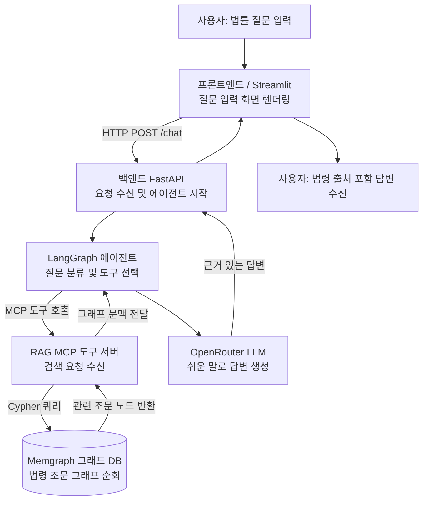
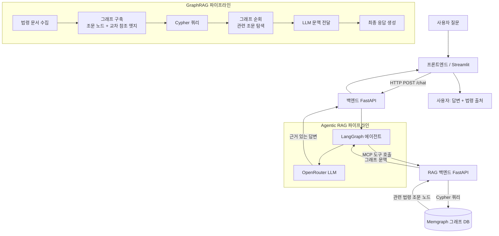

# Elderly Legal Consultation RAG System

<div align="center">


**노인 법률 상담을 위한 GraphRAG + Agentic RAG 기반 AI 법률 도우미 — 옆집 손주**

*SKNetworks Family AI Camp 3기 1팀 프로젝트*

</div>

---

## 📌 개요

**옆집 손주**는 한국 노인을 위한 AI 법률 상담 서비스입니다.

상속 분쟁, 주거 권리, 복지 수급 자격 등 복잡한 법률 상황을 쉽고 친근한 말로 안내합니다. 마치 법을 아는 옆집 손주가 어르신 곁에서 조근조근 설명해 주는 것처럼, 어려운 법령도 쉽게 이해할 수 있도록 도와줍니다.

두 가지 고급 RAG 전략을 결합하여 정확하고 출처가 명시된 답변을 제공합니다:

- **GraphRAG** — Memgraph 기반 지식 그래프로 법령 간 관계를 추적하는 그래프 검색
- **Agentic RAG** — LangGraph 기반 다단계 추론 에이전트

---

## 🎯 문제 정의

| 항목 | 내용 |
|---|---|
| **대상 사용자** | 디지털 기기에 익숙하지 않은 65세 이상 한국 노인 |
| **핵심 문제** | 법률 문서는 전문 용어가 많고 복잡하여 전문가 도움 없이는 이해하기 어렵다 |
| **도메인 특성** | 상속법·주거권·노인 복지 수급(기초연금, 노인장기요양보험) 등 여러 법령이 서로 얽혀 있어 하나의 질문이 복수의 법령에 걸치는 경우가 많다 |
| **기존 해결책의 한계** | 법률 구조 서비스는 인력 부족, 일반 LLM은 출처 없이 환각 답변 생성, 벡터 전용 RAG는 법령 간 관계를 파악하지 못한다 |
| **우리의 접근** | 법령 조문 간 관계를 그래프로 모델링하고, 질문을 단계적으로 분해하여 추론하는 에이전트 결합 |

---

## ✨ 주요 기능

| 번호 | 기능명 | 설명 |
|---|---|---|
| 1 | **자연어 법률 질의응답** | 어르신이 평소 말하듯 질문하면, 쉬운 말로 출처와 함께 답변 |
| 2 | **GraphRAG 관계 검색** | Memgraph 그래프 DB로 법령 간 교차 참조를 따라가며 관련 조문 검색 |
| 3 | **Agentic 다단계 추론** | LangGraph 에이전트가 복잡한 질문을 분해하고 여러 도구를 순차 호출하여 최종 답변 합성 |
| 4 | **출처 명시 답변** | 모든 답변에 근거 법령(예: 노인복지법, 기초연금법, 고령자고용법) 명시 |
| 5 | **이중 프론트엔드** | 빠른 프로토타이핑을 위한 Streamlit UI, 프로덕션용 React 19 + TypeScript UI |
| 6 | **RAG 운영 대시보드** | 문서 수집, 검색 결과 검토, 그래프 엣지 후보 확인을 위한 관리자 UI |
| 7 | **LangSmith 관측성** | 모든 LLM 호출과 도구 실행 전 과정 추적 및 평가 |
| 8 | **원커맨드 실행** | `docker compose up` 단 하나의 명령으로 전체 서비스 구동 |

---

## 🛠 기술 스택

### RAG 및 AI 핵심

| 기술 | 역할 | 비고 |
|---|---|---|
| **Memgraph** | 그래프 DB (GraphRAG 저장소) | 법령 조문 노드 + 교차 참조 엣지 저장, Cypher 호환 |
| **GraphRAG 3.0** | 그래프 기반 검색 | 법령 관계를 순회하며 문맥 풍부한 검색 수행 |
| **LangGraph 1.2** | Agentic RAG 오케스트레이션 | 법률 추론을 위한 상태 기반 에이전트 그래프 |
| **LangChain 1.3** | LLM 도구 체인 | 체인, 프롬프트, MCP 도구 연동 |
| **OpenRouter** | LLM 게이트웨이 | 모델 무관 LLM 라우팅 (GPT-4o, Claude 등) |
| **MCP** | 도구 프로토콜 | RAG 백엔드를 MCP 도구 서버로 노출하여 에이전트에서 호출 |
| **Redis 7** | 캐시 및 작업 큐 | RAG 작업 큐 및 검색 결과 캐싱 |

### 백엔드 및 프론트엔드

| 기술 | 역할 |
|---|---|
| **FastAPI** | 백엔드 API (`/chat`, `/health`, `/ingest`, `/search`) |
| **Python 3.13 + uv** | 런타임 및 패키지 관리 |
| **Pydantic v2** | 설정 및 데이터 유효성 검증 |
| **React 19 + TypeScript 5** | 프로덕션 프론트엔드 |
| **Vite + Tailwind CSS + shadcn/ui** | 프론트엔드 빌드 및 UI 컴포넌트 |
| **Streamlit** | 프로토타입 / 데모 UI |
| **Docker Compose** | 컨테이너 오케스트레이션 |
| **LangSmith** | LLM 추적 및 평가 |
| **Firecrawl** | 법령 문서 웹 크롤링 및 수집 |

---

## 🔍 RAG 전략 비교

| 항목 | GraphRAG | Agentic RAG |
|---|---|---|
| **검색 방식** | Cypher 쿼리로 그래프 순회 (Memgraph) | LangGraph를 통한 다단계 도구 호출 |
| **강점** | 법령 간 교차 참조 및 관계 추적 | 복잡한 다중 단계 추론이 필요한 질문 |
| **적합한 질문 유형** | "상속과 관련된 노인 법령은 무엇인가요?" | "집이 있으면 기초연금을 받을 수 있나요?" |
| **데이터 모델** | 노드(조문) + 엣지(교차 참조) | 에이전트 상태 + 도구 실행 결과 |
| **사용 시점** | 그래프 순회 깊이 1 이상, 관계 질의 | 모호한 질문, 다중 문서 합성 필요 시 |

---

## 📁 프로젝트 구조

```
elderly-legal-rag/
├── backend/                    # FastAPI + LangGraph 에이전트 오케스트레이터
│   ├── src/
│   │   ├── app.py              # FastAPI 앱 진입점
│   │   ├── settings.py         # 환경 변수 관리 (Pydantic-settings)
│   │   ├── api/                # /chat, /health 라우터
│   │   ├── agent/              # LangGraph 에이전트, OpenRouter LLM, MCP 도구 연결
│   │   └── prompt/             # 에이전트 시스템 프롬프트
│   ├── Dockerfile
│   └── pyproject.toml
│
├── rag/                        # RAG 서브시스템
│   ├── be/                     # RAG 백엔드 (FastAPI + Memgraph + Redis + MCP)
│   │   ├── src/                # 문서 수집, 검색, MCP 엔드포인트 구현
│   │   └── pyproject.toml      # graphrag, neo4j, redis, mcp 의존성
│   ├── fe/                     # RAG 운영 UI (React + Vite + Tailwind)
│   ├── infra/                  # Memgraph + Memgraph Lab Docker Compose
│   ├── RAG_ORIGINAL_DATA/      # 법령 원본 JSON 데이터
│   ├── RAG_PREPROCESSED_DATA/  # 전처리된 TOON 포맷 데이터
│   └── docs/                   # RAG 설계 문서
│
├── streamlit/                  # 대화형 UI 프로토타입
│   ├── streamlit.py            # 앱 진입점
│   └── src/                    # 화면 구성 및 백엔드 API 클라이언트
│
├── frontend/                   # 프로덕션 React 프론트엔드 (React 19 + TypeScript)
│
├── infra/                      # 통합 Docker Compose (전체 서비스)
│   └── docker-compose.yml      # backend, rag-be, rag-fe, streamlit, memgraph, redis
│
├── rag-red-team/               # Neo4j 기반 GraphRAG 실험 공간
├── docs/                       # 회의록, 온보딩, 개발 가이드
├── presentation/               # 발표 자료, 테스트 데이터, LLM-as-a-judge 평가 결과
├── AGENTS.md                   # AI 에이전트 협업 규칙 및 git 워크플로우
└── README.md
```

---

## 🚀 시작하기

### 사전 요구사항

- Docker 및 Docker Compose 설치
- API 키 준비: `OPENROUTER_API_KEY`, `OPENAI_API_KEY`, `LANGSMITH_API_KEY`

### 권장 방법: Docker Compose 전체 스택 실행

```bash
# 1. 환경 파일 복사 후 각 항목에 API 키 입력
cp infra/.env.example        infra/.env
cp backend/.env.example      infra/.env_backend
cp streamlit/.env.example    infra/.env_streamlit
cp rag/be/.env.example       infra/.env_rag_be
cp rag/fe/.env.example       infra/.env_rag_fe
cp rag/infra/.env.example    infra/.env_rag_infra

# 2. 전체 서비스 실행
docker compose --env-file infra/.env -f infra/docker-compose.yml up -d --build
```

서비스별 기본 접속 주소:

| 서비스 | 주소 |
|---|---|
| 백엔드 API | http://127.0.0.1:8100 |
| Streamlit UI | http://127.0.0.1:8501 |
| RAG 백엔드 | http://127.0.0.1:8110 |
| RAG 프론트엔드 | http://127.0.0.1:5174 |
| Memgraph Lab | http://127.0.0.1:3000 |
| Memgraph Bolt | bolt://127.0.0.1:7687 |
| Redis | redis://127.0.0.1:6379/0 |

### 백엔드만 단독 실행

```bash
cd backend
cp .env.example .env   # OPENROUTER_API_KEY, LANGSMITH_API_KEY, BACKEND_RAG_MCP_URL 입력
uv sync
set -a && source .env && set +a
PYTHONPATH=src uv run uvicorn app:app --host 127.0.0.1 --port 8000 --reload
```

### RAG 백엔드만 단독 실행

```bash
cd rag/be
cp .env.example .env
uv sync
PYTHONPATH=src uv run uvicorn app:app --host 127.0.0.1 --port 8010
```

### 테스트 실행

```bash
# 백엔드 테스트
cd backend && PYTHONPATH=src uv run python -m unittest discover -s tests

# RAG 백엔드 테스트
cd rag/be && PYTHONPATH=src uv run python -m unittest discover -s tests
```

---

## 🔄 사용 흐름



---

## 🏗 아키텍처



---

## 🎯 습득 기술 및 역량

| 기술 / 역량 | 상세 내용 |
|---|---|
| **GraphRAG** | Memgraph를 활용한 그래프 기반 검색 설계 및 구현; 법령 조문을 노드-엣지 그래프로 모델링하고 Cypher 순회 쿼리 작성 |
| **지식 그래프 구축** | 한국 법령 JSON 문서를 파싱하여 그래프 엔터티와 교차 참조 엣지로 변환; TOON 포맷 수집 전처리 파이프라인 구축 |
| **Agentic AI (LangGraph)** | 법률 질문을 분해하고 검색 도구를 선택·호출하며 다중 출처 답변을 합성하는 상태 기반 LangGraph 에이전트 구현 |
| **MCP 도구 연동** | RAG 백엔드를 Model Context Protocol 도구 서버로 노출; 에이전트가 내부 구현에 무관하게 도구를 호출하는 느슨한 결합 구조 |
| **LLM 오케스트레이션** | OpenRouter를 모델 무관 LLM 게이트웨이로 통합; 법률 도메인 특화 프롬프트 엔지니어링 |
| **RAG 평가** | LLM-as-a-judge 방식으로 법률 Q&A 벤치마크 평가 수행; 결과를 `presentation/test-data/`에 저장 |
| **풀스택 개발** | FastAPI 백엔드, React 19 + TypeScript 프론트엔드, Streamlit 프로토타입, Docker Compose 인프라까지 엔드투엔드 구현 |
| **관측성 (Observability)** | 모든 LLM 호출 및 도구 실행에 LangSmith 추적 연결; 프로덕션 수준의 디버깅 환경 구축 |

---

## 👥 팀

SKNetworks Family AI Camp 3기 1팀 (2026년 5월 – 6월)

| 이름 | 역할 |
|---|---|
| 이원빈 | 팀장 — 프로젝트 총괄 및 일정 관리 |
| 김지효 | RAG — 법령 데이터 수집, 문서 전처리, 임베딩 파이프라인 |
| 송윤경 | 프론트엔드 — 사용자 인터페이스, API 연동, UX 설계 |
| 전하영 | 백엔드 — FastAPI `/chat`, LangGraph 에이전트, MCP 도구 연동 |
| 양도영 | 기획 및 문서 — 서비스 흐름 설계, README, 발표 자료 |

---

## 📄 라이선스

이 저장소는 SKNetworks Family AI Camp 교육 프로그램에서 팀 프로젝트로 제작되었습니다.

| 참고 자료 | 링크 |
|---|---|
| 국가법령정보센터 | https://www.law.go.kr |
| LangGraph 공식 문서 | https://langchain-ai.github.io/langgraph/ |
| Memgraph 공식 문서 | https://memgraph.com/docs |
| MCP (Model Context Protocol) | https://modelcontextprotocol.io |
| OpenRouter | https://openrouter.ai |
| 백엔드 README | [backend/README.md](backend/README.md) |
| RAG 서브시스템 README | [rag/README.md](rag/README.md) |
| RAG 백엔드 README | [rag/be/README.md](rag/be/README.md) |
| 인프라 README | [infra/README.md](infra/README.md) |
| Streamlit README | [streamlit/README.md](streamlit/README.md) |
