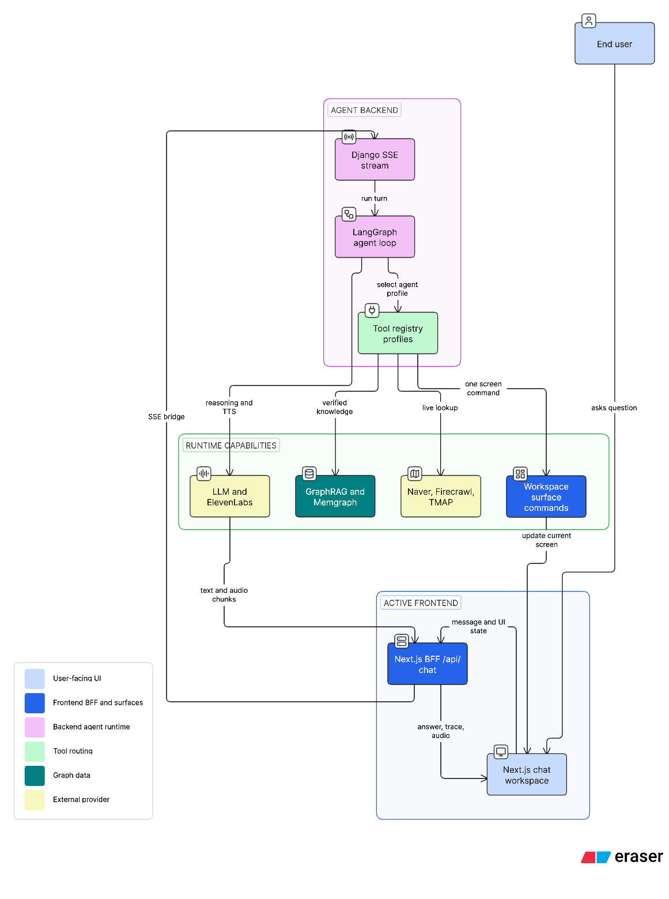

# 🧭 SKN28-3rd-1Team — 노년 복지·법령 Agentic RAG

<p align="center">
  <b>흩어진 노인·고령층 복지·법령·지역 기관 정보를 자연어로 묻고, 근거와 다음 행동까지 한 번에.</b><br>
  Agentic RAG · GraphRAG · LangGraph · Django Channels · Next.js
</p>

<p align="center">
  
  
  
  
  
  
  
  
</p>

## 1. ⌨️ 프로젝트 개요

- **프로젝트명** : SKN28-3rd-1Team — Agentic RAG 기반 노년 복지·법령 상담 서비스
- **기간** : 2026.05.22 ~ 2026.06.25
- **구성원** : 5명 (팀장 · RAG · 프론트엔드 · 백엔드 · 기획·문서)
- **내 역할** : **백엔드 (Django Channels `/chat/stream` · LangGraph Agent · MCP tool 연동)**
- **원본 저장소** : `SKNETWORKS-FAMILY-AICAMP/SKN28-3rd-1Team` (이 저장소는 fork)

---

## 2. 🙋 내가 한 일 — 전하영 ([@vosnuev](https://github.com/vosnuev))

> 3차 프로젝트 백엔드 단독 담당. Main Agent · BFF · MCP 연동 · LLM provider 설정까지 한 사람이 관통했다.
> 각 항목은 저장소 안의 `backend/` 코드·PR·테스트로 근거를 확인할 수 있다.

| 영역 | 내가 맡은 범위 | 스택 |
|---|---|---|
| **Django Channels `/chat/stream`** | ASGI SSE transport · canonical streaming chat endpoint | Django 5 · Channels · Pydantic |
| **LangGraph Agent 오케스트레이션** | Main Agent · Screen Control · Speech Text 노드 구성 | LangGraph · LangChain |
| **MCP tool 연동** | RAG MCP endpoint + External MCP(FastMCP) tool 호출 | MCP · FastMCP |
| **Next.js BFF `/api/chat`** | backend SSE → AI SDK `UIMessage` stream/data part 변환 | Next.js Route Handler |
| **LLM provider 설정** | agent별 `LLM_AGENT_<AGENT>_*` env로 OpenRouter/Cerebras 선택 | OpenRouter |
| **LangSmith trace 검증** | LLM 호출 · tool calling trace 확인 | LangSmith |
| **환경 변수 거버넌스** | Infisical + Varlock + `env-var-governance` skill 문서화 | Infisical · Varlock |

<br/>

### 1️⃣ Django Channels `/chat/stream` — 백엔드의 단일 진입점

`/chat/stream`이 백엔드의 canonical SSE chat endpoint다. 프론트(`/api/chat` BFF)와 MCP가 외부에서 보기에 똑같은 한 곳을 두드린다. Channels ASGI 위에 SSE 응답을 흘려보내고, LLM 호출·tool calling 결과를 같은 응답에 끼워 넣어 토큰 단위로 내보낸다.

**왜 BFF가 따로 있나** — 프론트는 `AI SDK`의 `UIMessage` stream/data part 규약을 따라야 하지만 백엔드 LLM이 그대로 흘려보내는 청크는 그 모양이 아니다. 그래서 `/api/chat`이 **SSE → UI message 변환기**로 한 번 번역한다. 백엔드 프로토콜이 바뀌어도 프론트는 그대로 둘 수 있다.

```python
# backend/src/django_backend/views.py (요지)
async def chat_stream(request):
    body = await request.json()
    async for event in run_agent_turn(body["session_id"], body["message"]):
        yield sse_format(event)   # token / tool / final 같은 part로
```

---

### 2️⃣ LangGraph Agent — Main / Screen Control / Speech Text

세 에이전트가 분리되어 있다. **Main Agent**는 사용자 요청을 보고 어떤 tool을 부를지 결정하고, **Screen Control Agent**는 최종 답변과 frontend state snapshot을 보고 *typed workspace command* 한 개를 골라 frontend에 내려보낸다. **Speech Text Agent**는 답변을 음성용으로 다듬어 ElevenLabs TTS 노드에 넘긴다.

**Screen Control을 따로 둔 이유** — LLM이 raw JSX나 endpoint를 직접 보내면 검증이 어렵다. Pydantic schema(backend) ↔ Zod schema(frontend)로 **명시적 command 계약을 강제**해 한 번에 1 surface만 갱신하도록 만들었다. 결과적으로 사용자 화면이 한 답변에 여러 번 바뀌지 않는다.

```text
Main Agent ─┬─ RAG MCP Tool ─→ Memgraph
            ├─ External MCP Tool ─→ Naver / Firecrawl / TMAP
            └─ finalize → Screen Control Agent → workspace command 1개
                                              ↘ Speech Text Agent → TTS
```

---

### 3️⃣ MCP tool 연동 — RAG + External

Main Agent는 RAG 내부 구현을 **모른다**. 대신 MCP tool 인터페이스로 검색 기능을 호출한다. 그래서 RAG 영역이 바뀌어도(예: 검색 모델 교체) Main Agent 코드는 그대로다.

| MCP 서버 | 용도 | 기본 endpoint |
|---|---|---|
| `rag/be` (RAG MCP) | 법령·행정 문서 검색 · ingest | `http://127.0.0.1:8010/mcp/` |
| `external_mcp` (FastMCP) | Naver · Firecrawl · TMAP | `http://127.0.0.1:8020/` |

RAG 측에서는 `read-only` MCP endpoint만 노출해 검색 전용으로 쓰고, ingest·운영 UI는 RAG 운영 영역에 그대로 둔다. 책임을 한쪽으로 몰지 않은 분리.

---

### 4️⃣ Next.js BFF `/api/chat` — backend ↔ frontend 다리

프론트엔드는 `AI SDK`의 `UIMessage` stream 규약으로 데이터를 받아야 한다. backend의 raw SSE chunk는 그 모양이 아니라서, `/api/chat` Route Handler가 **SSE → UI message data part 변환기**로 동작한다.

```typescript
// frontend_migration/src/app/api/chat/route.ts (요지)
export async function POST(req: Request) {
  const upstream = await fetch(`${BACKEND_URL}/chat/stream`, { ... });
  const stream = upstream.body!.pipeThrough(aiSdkTransform()); // SSE → UIMessage
  return new Response(stream, { headers: { 'content-type': 'text/event-stream' } });
}
```

TTS audio part도 같은 BFF에서 같이 흘려보낸다. 그래서 프론트는 `/api/chat`만 부르면 텍스트 답변 + 음성 chunk + workspace command를 한 번에 받는다.

---

### 5️⃣ LLM Provider 설정 — agent별로 다른 모델

Main Agent는 추론 능력이 중요하고, Speech Text Agent는 짧고 자연스러운 한국어 문장이 필요하다. 그래서 **agent별 LLM provider/model**을 따로 둔다.

```bash
# backend/.env (요지)
LLM_AGENT_MAIN_PROVIDER=openrouter
LLM_AGENT_MAIN_MODEL=anthropic/claude-3.5-sonnet
LLM_AGENT_SCREEN_PROVIDER=openrouter
LLM_AGENT_SCREEN_MODEL=openai/gpt-4o-mini
LLM_AGENT_SPEECH_PROVIDER=cerebras
LLM_AGENT_SPEECH_MODEL=llama-3.1-8b
```

`make env-check`로 provider 주입 + Varlock schema 계약을 한 번에 검증한다. env 이름 컨벤션은 `docs/legacy/llm_env_naming_convention.md`에 문서화해서, agent가 늘어날 때도 같은 패턴으로 추가할 수 있다.

---

### 6️⃣ 그 외 기여

- **메모리/세션** — `ChatThreadContextStore` + `InMemorySaver`로 `session_id` 단위 대화 이어가기. TTL 경계를 코드에 명시.
- **Main Agent tool indicator** — 메인 채팅 bubble에 tool call 발생 여부를 badge로 표시해서, 검색이 실제로 일어났는지 사용자가 알 수 있게.
- **LangSmith 검증** — LLM 호출 trace · mock tool call trace를 시연 전에 확인. trace drawer도 frontend에 노출.
- **Typed workspace command schema** — backend Pydantic ↔ frontend Zod로 화면 command 계약. 잘못된 형태는 BFF 단계에서 차단.
- **Backend 운영 가이드** — `backend/README.md`에 `make start` · `make test` · `make check` 흐름 + `/health` · `/chat/stream` curl 예시 정리.

<br/>

<!------- 왜 만들었나 -------->

## 3. 🎯 왜 만들었나

기존 복지·법령 정보 안내는 **어렵고, 흩어져 있고, 최신이 보장되지 않는다**. 노인복지·기초연금·고령자고용·근로기준 같은 문서는 국가법령정보센터, 보건복지부, 고용센터, 주민센터에 나눠 있고, 용어가 일반인에게 어렵고, 지원 금액·자격 조건은 매달 바뀔 수 있다.

일반 LLM은 학습된 지식만 답하기 때문에 **"작년에 폐지된 제도를 현재 유효한 것처럼"** 답할 수 있다. 잘못된 안내는 실제 불이익(신청 거절, 시일 지남)으로 이어진다.

이 서비스는 **실제 공공 문서를 먼저 찾고**(Retrieval) **문서 안에서 답을 만들고**(Generation) **다음 행동과 근거를 같이 보여주는** 구조로, 노년층이 직접 또는 가족이 옆에서 **"나한테 지금 뭐가 해당되는지, 어디에, 뭘 들고 가야 하는지"**를 한 번에 알게 한다.

| | 기존 복지 안내 | 이 서비스 |
|---|---|---|
| 정보 출처 | 기관 홈페이지·상담사 기억 | **공공 문서 + 법령 + GraphRAG 관계** |
| 용어 | 원문 법령 용어 | **사용자 질문 → 평이한 한국어 답변** |
| 최신성 | 정보 갱신 시차 | **문서 ingest → 재색인 → 즉시 반영** |
| 근거 | 없음 또는口头 | **법령·조문·원문 일부 + 출처 라벨** |
| 다음 행동 | 별도 안내 | **체크리스트 + 지역 기관 지도 + 음성 안내** |
| 접근성 | PC 중심 | **음성 입력·TTS 답변 + 모바일 반응형** |

---

<!------- 사용자 시나리오 -------->

## 4. 👤 사용자 시나리오

### 시나리오 A — 만 65세 본인, 기초연금 신청 전 확인

> 김 할머니(만 65세)는 TV에서 기초연금 광고를 보고, "내가 받을 수 있는지"부터 확인하고 싶어한다.

1. 김 할머니는 폰을 열고 `/chat`에 진입 → 마이크 버튼을 누르고 **"기초연금 신청하려면 뭐부터 해야 해?"** 라고 말한다.
2. Frontend는 음성 chunk를 STT → 텍스트로 변환해 `/api/chat`에 보낸다. 화면 우측에는 로디가 "듣는 중 → 생각 중"으로 바뀐다.
3. Backend `/chat/stream`은 Main Agent를 호출한다. Main Agent는 `pursuit`에서 "기초연금" + "신청" 신호를 보고 RAG MCP tool을 부른다.
4. RAG는 Memgraph에서 "기초연금법", "보건복지부", "신청 자격" 노드/엣지를 따라가며 관련 문서 top-k를 가져온다.
5. Main Agent는 **"만 65세 이상이고, 소득·재산 하위 70%이면 신청 가능. 필요한 서류는 신분증·통장·가족관계증명서. 가까운 주민센터 또는 정부24에서 신청 가능"** 같은 답변을 SSE로 흘려보낸다.
6. Screen Control Agent는 최종 답변 + frontend snapshot을 보고 **`action_checklist` surface 1개**를 골라 command로 내보낸다. 프론트는 체크리스트 surface만 갱신한다.
7. Speech Text Agent는 답변을 음성용으로 다듬고, ElevenLabs TTS가 audio chunk를 stream한다. 김 할머니는 폰으로 답을 들을 수 있다.

> **기대 효과** — 검색 + 신청 절차 + 다음 행동이 한 화면·한 음성 흐름에서 끝나서, "어디서부터 시작해야 하지"라는 인지 비용이 사라진다.

### 시나리오 B — 복지사, 상담 중 법령 근거 확인

> 박 복지사는 주민센터에서 어르신에게 긴급복지 생계지원을 안내하기 전, **정확한 법령과 신청 요건**을 빠르게 확인하고 싶다.

1. 박 복지사는 데스크톱 `/chat`에서 **"긴급복지 생계지원 신청 요건이랑 제출 서류를 알려줘"** 라고 입력한다.
2. Backend는 RAG MCP로 「긴급복지법」 + 「복지부 지침」 문서를 가져와 답변한다. 답변 우측 근거 패널에 **"긴급복지法第7조 (지원요건)", "2024년 지침 v3.1"** 같은 라벨로 출처가 보인다.
3. 박 복지사는 답변 끝의 **"근거 문서"** 클릭 → 문서 원문 일부와 조문이 같이 펼쳐진다.
4. 같은 화면의 **체크리스트 surface**에 "신분증 사본", "급여 통장 사본", "재산 신고서" 같은 항목이 자동으로 채워진다.
5. 필요하면 **"이 답변 인쇄"** 또는 **"클립보드에 복사"**로 상담 기록에 붙여넣을 수 있다.

> **기대 효과** — 잘못된 인용 없이, 근거가 항상 답변 옆에 붙어 다닌다. 복지사 입장에서 상담 신뢰도가 올라간다.

### 시나리오 C — 퇴직금 분쟁, 고령자 본인

> 이 씨는 60대 중반에 건설 현장 일을 마치고 퇴직금을 못 받았다. **"어디에 상담하고 어떤 절차로 가져가야 하지"**를 알고 싶다.

1. `/chat`에서 **"퇴직금을 못 받았을 때 어디에 상담해야 해?"** 입력.
2. Main Agent는 「근로기준법」 + 「고용노동부」 + 「권리 구제 신청 절차」 문서를 묶어 답변한다.
3. 답변 + 동시에 **"내 위치 기준 가까운 고용센터"**를 Naver 지도·목록 surface에 띄운다. 목록 선택 → 지도 포커스 + 상세(전화번호·운영시간)가 같이 갱신.
4. 답변 끝의 체크리스트에 **"근로계약서 사본", "임금대장", "통장 거래내역"** 같은 준비물이 자동으로 들어간다.
5. 음성 답변도 같이 흘러나와, 글씨가 작은 폰에서도 들으면서 진행할 수 있다.

> **기대 효과** — "검색 → 근거 확인 → 지역 기관 찾기 → 준비물 정리" 4단계를 한 흐름에서 마칠 수 있다.

---

## 5. ⭐️ 핵심 기능

| 기능 | 입력 | 출력 | 비고 |
|---|---|---|---|
| **자연어 상담** | 사용자 질문 (텍스트/음성) | LLM 답변 + 근거 | 어려운 법령 용어 그대로 OK |
| **스트리밍 답변** | 사용자 질문 | SSE 토큰 스트림 | Next.js `UIMessage` 변환 |
| **근거 문서** | 답변 컨텍스트 | 법령·행정 문서 + 조문 + 원문 일부 | 내부 id 숨김, 사용자 가독 라벨 |
| **기관 정보 UI** | 지역(시/구) | Naver 지도 + 목록 + 상세 | 선택 → 지도 포커스 + 상세 갱신 |
| **음성 입력** | 마이크 | STT 텍스트 → Agent 입력 | 로디 상태 애니메이션 |
| **음성 답변** | 최종 답변 | ElevenLabs TTS stream | Speech Text Agent 정리 |
| **RAG 검색** | 질문 임베딩 | 관련 문서 top-k | MCP tool로 노출 |
| **GraphRAG** | 노드/엣지 쿼리 | Memgraph 관계 검색 | 법령·기관 관계 탐색 |
| **실행 체크리스트** | 답변 + 문서 | 신청 절차 + 다음 행동 | accordion UI |
| **화면 제어** | 답변 + frontend snapshot | typed workspace command 1개 | 한 번에 1 surface만 갱신 |

---

## 6. ⚙️ 시스템 아키텍처



| 계층 | 서비스 | 역할 | 통신 |
|---|---|---|---|
| **클라이언트** | `frontend_migration/` | Next.js 15 App Router · `/chat` · workspace surface | HTTP · SSE |
| | `/api/chat` (BFF) | backend SSE → AI SDK `UIMessage` 변환 | HTTP |
| **애플리케이션** | `backend/` | Django Channels ASGI · LangGraph Agent 오케스트레이터 | ASGI · SSE |
| | `backend/agents` | Main Agent · Screen Control · Speech Text | LLM |
| | `backend/src/django_backend` | `/health` · `/chat/stream` HTTP/SSE transport | HTTP · SSE |
| | `backend/src/memory` | `session_id` · `InMemorySaver` · TTL 경계 | in-memory |
| **RAG** | `rag/be/` | ingest · 검색 API · MCP endpoint (`/mcp`) | HTTP · MCP |
| | `rag/fe/` | RAG 운영 UI (문서 목록 · ingest job · review queue) | HTTP |
| | `rag/infra/` | Memgraph · Memgraph Lab 실행 설정 | — |
| **외부 MCP** | `external_mcp/` | Naver · Firecrawl · TMAP FastMCP provider tools | MCP |
| **LLM** | OpenRouter · OpenAI · Cerebras | agent별 provider/model · `LLM_AGENT_<AGENT>_*` env | API |
| **관측** | LangSmith | LLM 호출 + tool calling trace | SDK |
| **데이터** | Memgraph (GraphRAG) | 노드·엣지·스키마 | Bolt |
| | Redis | 캐시 · checkpointer 보조 | RESP |
| **인프라** | Docker Compose | `db` / `api` / `weather` / `naver` / `eleven` / `all` profiles | — |
| | AWS | ECR · CodeBuild · CodePipeline · ECS | — |

`/chat/stream` → Main Agent → RAG MCP Tool / External MCP Tool → Memgraph 검색 → 최종 답변 → Screen Control Agent → typed workspace command → frontend 1 surface 갱신.

---

## 7. 🛠️ 기술 스택

### Backend


### Agent


### RAG


### Frontend


### Infra


---

## 8. 👥 팀원

| 이름 | GitHub | 주요 영역 |
|---|---|---|
| 이원빈 | — | 팀장 · 전체 일정 관리 · 작업 방향 컨펌 · 파트별 진행 상황 확인 |
| 김지효 | [@jjeoe0317](https://github.com/jjeoe0317) | RAG · 노인·고령층 관련 법령 데이터 확인 · 문서 전처리 · 임베딩 흐름 |
| 송윤경 | — | 프론트엔드 · 사용자 질문 화면 · API 연결 · 결과 화면 UX · RAG 테스트 케이스 |
| **전하영** | [**@vosnuev**](https://github.com/vosnuev) | **백엔드 · Django Channels `/chat/stream` · LangGraph Agent 실행 구조 · MCP tool 연동** |
| 양도영 | — | 기획·문서 · 서비스 흐름 정리 · README · 발표 자료 · 산출물 |

---

## 9. 📁 저장소 구조

```
SKN28-3rd-1Team/
├── backend/                 # Django Channels + LangGraph Agent 오케스트레이터
│   ├── src/django_backend/  # /health, /chat/stream HTTP/SSE transport
│   ├── src/agents/          # Main Agent · LLM provider · tools
│   ├── src/graph/           # chat turn stream runner
│   ├── src/memory/          # session_id, checkpointer, TTL boundary
│   ├── src/nodes/           # speech/TTS node
│   └── src/agents/*/*.j2    # agent별 prompt
├── rag/
│   ├── be/                  # RAG backend · ingest · 검색 API · MCP endpoint
│   ├── fe/                  # RAG 운영 UI
│   ├── infra/               # Memgraph · Memgraph Lab 실행 설정
│   ├── RAG_ORIGINAL_DATA/   # RAG 대상 원본 JSON 데이터
│   ├── RAG_PREPROCESSED_DATA/ # RAG 입력용 TOON 전처리 데이터
│   ├── related/             # 루트에서 이동한 RAG 관련 실험/작업 공간
│   └── docs/                # RAG 설계 문서
├── external_mcp/            # Naver / Firecrawl / TMAP FastMCP provider tools
├── frontend_migration/      # 현재 active Next.js App Router 상담 UI
│   ├── src/app/             # /chat, /api/chat, /mocks
│   ├── src/page/chat/       # chat controller + BFF stream orchestration
│   ├── src/page/mocks/      # full-size workspace scene fixture
│   ├── src/ui/components/   # chat sidebar · workspace surface · mascot UI
│   └── public/              # mascot sprite · static assets
├── presentation/            # 발표 자료 · 평가 산출물
├── deploy/                  # 통합 배포 (Docker · AWS · Makefile)
├── docs/                    # 회의록 · 온보딩 · 에이전트 가이드라인
└── AGENTS.md                # 협업 및 agent 작업 규칙
```

---

## 10. 🚀 빠른 시작

> 환경변수는 **Infisical + Varlock**로 관리한다. 실제 `.env`는 커밋 금지, schema(`*.env.schema`)가 계약 기준.

### 통합 (Make)

```bash
cd deploy/makefile
make dev              # frontend_migration + backend 병렬 실행
make compose-up       # 전체 스택 (frontend · backend · RAG · Memgraph · Redis)
```

기본 접속:

| 서비스 | URL |
|---|---|
| Frontend (Migration) | http://127.0.0.1:3005 |
| Frontend `/chat` | http://127.0.0.1:3005/chat |
| Backend API | http://127.0.0.1:8000 |
| Memgraph Lab | http://127.0.0.1:3000 |
| Memgraph Bolt | bolt://127.0.0.1:7687 |

### 개별 실행

```bash
cd frontend_migration && make start    # Next.js /chat
cd backend && make start                # Django Channels
cd rag && make infra-up                 # Memgraph + Lab
cd rag && make be-start                 # RAG backend + MCP
cd external_mcp && make start           # Naver/Firecrawl/TMAP MCP
```

### 채팅 API 테스트

```bash
curl -N http://127.0.0.1:8000/chat/stream \
  -H "Content-Type: application/json" \
  -d '{"session_id":"readme-test-1","message":"안녕. 너는 어떤 일을 할 수 있어?"}'
```

---

## 11. 🔐 환경 변수

| 서비스 | Schema | 주요 값 |
|---|---|---|
| Shared | `.env.schema` | `APP_ENV` |
| Frontend Migration | `frontend_migration/.env.schema` | BFF backend URL · Naver map public key · TTS BFF key |
| Backend | `backend/.env.schema` | LLM provider API key · CORS · RAG MCP URL |
| External MCP | `external_mcp/.env.schema` | Naver / Firecrawl / TMAP API key · endpoint |
| RAG Backend | `rag/be/.env.schema` | Memgraph 연결 · MCP endpoint |
| RAG Frontend | `rag/fe/.env.schema` | RAG API base URL |
| RAG Infra | `rag/infra/.env.schema` | Memgraph/Lab 포트 |
| Deploy | `deploy/docker/.env.schema` | 통합 Docker Compose host 포트 · public build args |

- `make env-check`로 Infisical 주입 + Varlock schema 계약 검증
- env var / Infisical / Varlock / LLM 이름 변경 시 `AGENTS.md`의 `env-var-governance` skill과 `docs/legacy/llm_env_naming_convention.md` 먼저 확인

---

## 12. 📚 문서

| 문서 | 내용 |
|---|---|
| [`AGENTS.md`](AGENTS.md) | 협업 및 agent 작업 규칙 |
| [`frontend_migration/README.md`](frontend_migration/README.md) | 현재 active Next.js `/chat` · `/api/chat` · workspace · env |
| [`backend/README.md`](backend/README.md) | Backend Agent 구조 · `/chat/stream` SSE · MCP 연결 |
| [`rag/README.md`](rag/README.md) | RAG 서브시스템 전체 구조 |
| [`rag/be/README.md`](rag/be/README.md) | RAG Backend API · MCP endpoint · 환경 변수 |
| [`rag/fe/README.md`](rag/fe/README.md) | RAG 운영 UI 실행 |
| [`external_mcp/README.md`](external_mcp/README.md) | Naver · Firecrawl · TMAP MCP tool 서버 |
| [`deploy/README.md`](deploy/README.md) | local dev · Docker Compose · AWS 배포 준비 |
| [`docs/chat_workspace_surfaces.md`](docs/chat_workspace_surfaces.md) | workspace surface 스키마 |
| [`docs/requirement_list_ops.md`](docs/requirement_list_ops.md) | 운영 요건 정리 |
| [`docs/legacy/llm_env_naming_convention.md`](docs/legacy/llm_env_naming_convention.md) | LLM agent/provider/model env naming · Infisical 동기화 |

### 제출 산출물

| 필수 산출물 | 제출 위치 |
|---|---|
| 요구사항·화면정의서 | [`presentation/ppt/reviewable-graphrag-service-presentation-v4.pptx`](presentation/ppt/reviewable-graphrag-service-presentation-v4.pptx) |
| 개발된 LLM 연동 웹앱 | [배포 Application](https://d2psjdqzzwvjpi.cloudfront.net/) |
| 시스템 구성도 | [Eraser 시스템 구성도](https://app.eraser.io/workspace/QaaF195Z5KgdFDGK7GiV) |
| 테스트 계획·결과 보고서 | [`presentation/test_results/unit_test.pdf`](presentation/test_results/unit_test.pdf), [`presentation/test_results/integration_test.pdf`](presentation/test_results/integration_test.pdf) |
| 발표 PDF | [`presentation/ppt/옆집 손주_찐최종 (1).pdf`](presentation/ppt/옆집%20손주_찐최종%20(1).pdf) |
| 발표 스크립트 | [`presentation/ppt/20min-presentation-script-v4.md`](presentation/ppt/20min-presentation-script-v4.md) |

---

<p align="center">
  <sub>SK네트웍스 Family AI 캠프 28기 · 3차 프로젝트 1팀 · SKN28-3rd-1Team</sub>
</p>
