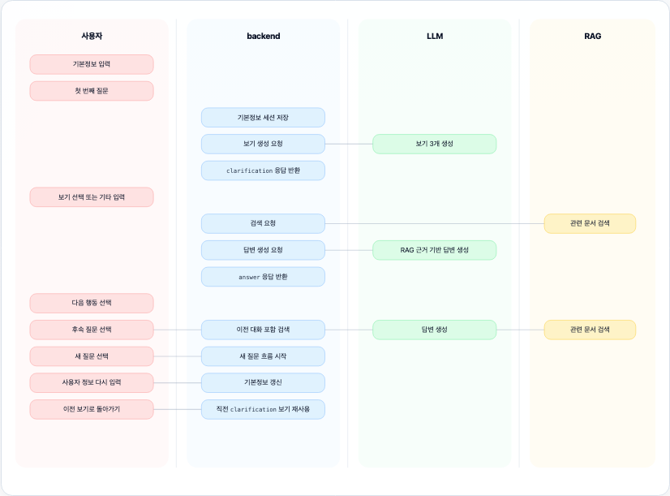

# ⚙️ Backend

FastAPI 기반 메인 백엔드이다.

- frontend는 `rag/`를 직접 호출하지 않는다. 프론트는 `backend`만 호출한다. 
- backend는 질문 흐름, 세션, 파일 업로드, RAG 검색 연결, LLM 답변 생성을 담당한다.

## 🎯 핵심 역할

- `POST /api/chat`: 질문, 보기 선택, 기타 입력, 후속 질문 처리
- `GET /api/chat/mock`: front 결과 화면용 mock 응답 반환
- `POST /api/files/upload`: 파일 업로드 후 RAG ingest 요청
- `GET /api/files/{job_id}/status`: 파일 처리 상태 조회
- `src/prompt/*.md`: LLM 답변 흐름과 출력 원칙 정의
- `src/schemas/*.py`: API 요청/응답 schema 정의
- `src/mock/chat_response.json`: front 연결용 샘플 응답

## 🗂️ 구조

```text
backend/                              # backend 루트
├── README.md                         # 안내 문서
├── pyproject.toml                    # 의존성 설정
├── .env.example                      # 환경 변수 예시
│ 
├── scripts/                          # 테스트 스크립트
│   └── manual_chat.py                # 터미널 대화 테스트
│ 
├── src/                              # 앱 코드
│   ├── app.py                        # 앱 시작점
│   ├── settings.py                   # 설정 로딩
│   ├── session_store.py              # 세션 저장 (TTL 포함)
│   ├── rate_limiter.py               # 요청 제한
│   ├── file_store.py                 # 파일 저장 및 검증
│   ├── rag_ingest_client.py          # RAG ingest 호출
│   │ 
│   ├── api/                          # API 라우터
│   │   ├── chat.py                   # 채팅 API
│   │   └── files.py                  # 파일 API
│   │ 
│   ├── agent/                        # 답변 로직
│   │   ├── graph.py                  # 질문 처리 흐름
│   │   └── openrouter_llm.py         # LLM 연결
│   │ 
│   ├── prompt/                       # 프롬프트
│   │   ├── clarification_system.md   # 보기 생성 규칙
│   │   ├── clarification_human.md    # 보기 생성 입력
│   │   ├── grounded_answer_system.md # 답변 생성 규칙
│   │   └── grounded_answer_human.md  # 답변 생성 입력
│   │ 
│   ├── schemas/                      # 데이터 계약
│   │   ├── chat.py                   # 채팅 schema
│   │   └── files.py                  # 파일 schema
│   │ 
│   └── mock/                         # mock 응답
│       ├── chat.py                   # mock 검증
│       └── chat_response.json        # mock JSON
│ 
└── tests/                            # 단위 테스트
    └── test_backend_core.py          # 핵심 로직 검증
```

## 🧩 Prompt, Schema, Mock

| 위치 | 의미 |
| --- | --- |
| `src/prompt/*.md` | LLM에게 답변 방식 지시 |
| `src/schemas/*.py` | frontend와 맞출 데이터 계약 |
| `src/mock/chat_response.json` | frontend가 받을 응답 예시 |

즉, 답변 흐름은 prompt에 둔다. frontend 연결 검증은 mock JSON으로 한다.

## 💬 Chat Flow



기본정보는 나이, 지역, 소득, 가구원 수 등을 뜻한다. 미입력 시, 질문만으로 진행한다.
LLM 보기 생성 실패 시, backend가 기본 보기 3개를 반환한다.

- 답변 뒤 메뉴:

| 번호 | 선택 | 흐름 |
| --- | --- | --- |
| 1 | 후속 질문 | 기존 세션과 이전 대화 이어서 질문 |
| 2 | 새 질문 | 같은 사용자 정보로 새 질문 시작 |
| 3 | 사용자 정보 다시 입력 | 기본정보 갱신 후 질문 |
| 4 | 이전 보기로 돌아가기 | 직전 보기 3개 다시 선택 |
| 5 | 종료 | 현재 세션 삭제 후 터미널 테스트 종료 |

이전 보기가 없으면 4번은 종료로 표시된다.
새 채팅은 종료 후 다시 시작하는 흐름이다. 
이때, 기존 세션 메모리는 삭제되고 새 세션으로 시작한다.

- `kind` 기준으로 frontend 화면을 나눈다.

| kind | frontend 화면 |
| --- | --- |
| `clarification` | 보기 3개, 기타 입력 |
| `answer` | 답변, 출처, 관련 문서, 신뢰도, 근거 상태 |

`clarification`은 아직 검색 결과가 아니다. 그래서 `confidence`는 `null`, `evidence_status`는 `not_applicable`이다.

프론트는 `kind === "answer"`일 때만 근거 상태를 표시한다.

## 🔌 Chat API

### POST `/api/chat`

최초 질문 예시:

```json
{
  "question": "수원시 노인일자리 신청방법이 궁금해요",
  "user_profile": {
    "age": 72,
    "location": {
      "city": "경기도",
      "district": "수원시"
    }
  }
}
```

보기 선택 예시:

```json
{
  "session_id": "처음 응답에서 받은 session_id",
  "question": "수원시 노인일자리 신청방법이 궁금해요",
  "selected_option": {
    "id": "1",
    "title": "신청 절차",
    "search_focus": "수원시 노인일자리 신청 절차와 방법"
  }
}
```

기타 입력 예시:

```json
{
  "session_id": "처음 응답에서 받은 session_id",
  "question": "수원시 노인일자리 신청방법이 궁금해요",
  "custom_intent": "담당부서 문의처 중심으로 찾아줘"
}
```

후속 질문 예시:

```json
{
  "session_id": "처음 응답에서 받은 session_id",
  "question": "그럼 어디에 문의하면 돼?",
  "is_follow_up": true
}
```

`selected_option`과 `custom_intent`는 동시에 보내지 않는다. 동시에 보내면 400 오류이다.

### GET `/api/chat/mock`

front 결과 화면 연결용 endpoint이다. LLM이나 RAG 서버를 호출하지 않는다.

```bash
curl -s http://127.0.0.1:8000/api/chat/mock
```

mock 응답은 `src/mock/chat_response.json`에 있다. 
`src/mock/chat.py`가 `ChatResponse` schema로 검증한다.

### DELETE `/api/chat/session/{session_id}`

현재 대화 세션 메모리 삭제용 endpoint이다.

```bash
curl -X DELETE http://127.0.0.1:8000/api/chat/session/{session_id}
```

터미널 테스트에서 종료 시 자동 호출한다.

## 📦 ChatResponse 핵심 필드

| 필드 | 의미 |
| --- | --- |
| `summary` | 답변 요약 |
| `details` | 상세 설명 |
| `laws` | 관련 법령, 조항 |
| `sources` | 화면용 출처 문자열 |
| `references` | 상세 출처, 파일명, URL, 원문 발췌, score |
| `eligibility` | 자격 가능성 판단 |
| `confidence` | 답변 신뢰도, 0~1 |
| `evidence_status` | 근거 상태 |
| `warning` | 확인 필요 메시지 |
| `options` | clarification 보기 3개 |
| `allow_custom_input` | 기타 입력 허용 여부 |

## 🧭 evidence_status

| 값 | 의미 |
| --- | --- |
| `not_applicable` | 판단 대상 아님. 주로 `clarification` |
| `sufficient` | 근거 충분 |
| `insufficient` | 검색 결과 없음 또는 근거 부족 |
| `rag_error` | RAG 검색 실패 |
| `llm_fallback` | 문서는 찾았지만 LLM 답변 생성 실패 |

## 📁 File Upload Flow

```text
1. 프론트가 파일 업로드
2. backend가 파일 형식/크기 검증
3. backend가 로컬 저장
4. backend가 RAG /ingest 호출 (비동기 스레드)
5. 프론트가 job_id로 상태 조회
6. indexed면 다음 검색부터 포함
```

### POST `/api/files/upload`

```bash
curl -s http://127.0.0.1:8000/api/files/upload \
  -F "file=@./sample.md"
```

허용되지 않는 형식이나 크기 초과 시 HTTP 400을 반환한다.

### GET `/api/files/{job_id}/status`

```bash
curl -s http://127.0.0.1:8000/api/files/{job_id}/status
```

처리 단계:

- `uploaded`
- `parsed`
- `converted`
- `stored`
- `indexed`
- `failed`

업로드 허용 파일 형식 (기본값):

| 확장자 | 형식 |
| --- | --- |
| `.csv` | CSV |
| `.json` | JSON |
| `.txt` | 일반 텍스트 |
| `.md` | 마크다운 |
| `.pdf` | PDF 문서 |
| `.docx` | Word 문서 |
| `.hwp` | 한글 문서 |

`.env`의 `BACKEND_UPLOAD_ALLOWED_EXTENSIONS`로 변경 가능하다.  
MIME 타입은 `BACKEND_UPLOAD_ALLOWED_MIME_TYPES`로 확장자별 허용 목록을 관리한다.  
업로드 최대 크기는 기본 50MB이며 `BACKEND_UPLOAD_MAX_FILE_MB`로 변경 가능하다.

## 🔐 환경 변수

`.env`는 `backend/.env`에 둔다. 커밋하지 않는다.

```bash
cp .env.example .env
# BACKEND_OPENROUTER_API_KEY 값을 채운 뒤 실행
```

주요 값:

| 변수 | 기본값 | 설명 |
| --- | --- | --- |
| `BACKEND_API_PORT` | `8000` | 서버 포트 |
| `BACKEND_RELOAD` | `false` | 핫 리로드. 개발 중에는 `true`로 변경 |
| `BACKEND_CORS_ORIGINS` | `["http://localhost:5173","http://localhost:3000"]` | 허용할 프론트 주소 목록 |
| `BACKEND_OPENROUTER_API_KEY` | (없음) | OpenRouter API 키. 반드시 설정 |
| `BACKEND_OPENROUTER_MODEL` | `openai/gpt-oss-120b` | 사용할 LLM 모델 |
| `BACKEND_UPLOAD_MAX_FILE_MB` | `50` | 업로드 허용 최대 크기 (MB) |
| `BACKEND_UPLOAD_ALLOWED_EXTENSIONS` | `.csv .json .txt .md .pdf .docx .hwp` | 허용 확장자 목록 |
| `BACKEND_UPLOAD_ALLOWED_MIME_TYPES` | JSON map | 확장자별 허용 MIME 목록 |
| `BACKEND_SESSION_TTL_SECONDS` | `3600` | 세션 만료 시간 (초) |
| `BACKEND_RATE_LIMIT_ENABLED` | `true` | 요청 제한 사용 |
| `BACKEND_RATE_LIMIT_REQUESTS` | `60` | 제한 시간 안의 최대 요청 수 |
| `BACKEND_RATE_LIMIT_WINDOW_SECONDS` | `60` | 요청 제한 시간 |
| `BACKEND_RAG_INGEST_URL` | `http://127.0.0.1:8010/ingest` | RAG ingest 주소 |
| `BACKEND_RAG_INGEST_STATUS_URL` | `http://127.0.0.1:8010/ingest/status` | RAG 상태 조회 주소 |
| `BACKEND_RAG_SEARCH_URL` | `http://127.0.0.1:8010/search` | RAG 검색 주소 |
| `BACKEND_RAG_SEARCH_TOP_K` | `5` | 검색 결과 최대 개수 |
| `BACKEND_RAG_SEARCH_QUERY_MAX_CHARS` | `500` | RAG 검색 쿼리 최대 길이 |

### CORS 설정

프론트엔드가 다른 포트에서 실행될 경우 `.env`에 주소를 추가한다.

```dotenv
# Vite 기본 포트: 5173 / CRA 기본 포트: 3000
BACKEND_CORS_ORIGINS='["http://localhost:5173","http://localhost:3000"]'
```

기본값은 Vite `5173`, CRA `3000`을 허용한다.

## 🚀 실행

의존성 설치:

```bash
cd backend
uv sync
```

RAG 서버:

```bash
cd rag
PYTHONPATH=src uv run uvicorn app:app --host 127.0.0.1 --port 8010
```

backend 서버:

```bash
cd backend
PYTHONPATH=src uv run uvicorn app:app --host 127.0.0.1 --port 8000
```

개발 중 핫 리로드가 필요하면 `.env`에서 `BACKEND_RELOAD=true`로 변경한다.

상태 확인:

```bash
curl -s http://127.0.0.1:8000/health
```

터미널 수동 대화 테스트:

```bash
cd backend
PYTHONPATH=src uv run python scripts/manual_chat.py
# 다른 포트를 쓴다면: --base-url http://127.0.0.1:8000
```

## ✅ 검증

컴파일 확인:

```bash
cd backend
uv run python -m compileall src scripts tests
uv run python -m unittest discover -s tests
```

mock, schema, clarification 기본값 확인:

```bash
cd backend
PYTHONPATH=src uv run python - <<'PY'
from fastapi.testclient import TestClient
from app import app
from mock.chat import create_mock_chat_response
from schemas.chat import ChatResponse, ResponseKind, EvidenceStatus

mock = create_mock_chat_response()
assert mock.kind == ResponseKind.ANSWER
assert mock.sources
assert mock.references
assert mock.confidence is not None
assert mock.evidence_status == EvidenceStatus.SUFFICIENT

clarification = ChatResponse(
    kind=ResponseKind.CLARIFICATION,
    summary="질문 범위를 먼저 좁혀 주세요.",
)
assert clarification.confidence is None
assert clarification.evidence_status == EvidenceStatus.NOT_APPLICABLE

client = TestClient(app)
response = client.get("/api/chat/mock")
assert response.status_code == 200

print("completion criteria validation: ok")
PY
```

## ⚠️ 주의

**운영 전 반드시 처리해야 하는 항목:**

| 항목 | 상태 | 설명 |
| --- | --- | --- |
| API 키 관리 | ❗ 필수 | `.env`는 절대 커밋하지 않는다. 키 유출 시 즉시 OpenRouter에서 폐기 후 재발급 |
| CORS 설정 | ✅ 반영 | 기본 개발 포트 `5173`, `3000` 허용 |
| `BACKEND_RELOAD=false` | ❗ 필수 | 프로덕션 배포 시 반드시 `false`로 유지 |
| 인증/인가 | 🔲 미구현 | 세션 ID 기반 접근 제어 없음. 서비스 오픈 전 토큰 인증 추가 필요 |
| Rate Limiting | ✅ 반영 | 메모리 기반 요청 제한 적용. 운영 시 Redis 등 외부 저장소 권장 |
| 테스트 코드 | ✅ 반영 | 핵심 로직 `unittest` 추가 |

**현재 구현 상태:**

- 세션 저장소는 메모리 기반이다. 서버 재시작 시 사라진다.
- 세션은 마지막 활동 기준 `BACKEND_SESSION_TTL_SECONDS`(기본 1시간) 후 자동 삭제된다.
- 터미널 테스트 종료 시 `/api/chat/session/{session_id}`로 현재 세션을 삭제한다.
- RAG ingest 상태도 현재 메모리 기반이다.
- 파일 업로드는 크기, 확장자, MIME, 실행 파일 시그니처를 검증한다.
- mock은 front 연결 확인용이다. 실제 답변은 `/api/chat` 흐름을 사용한다.
