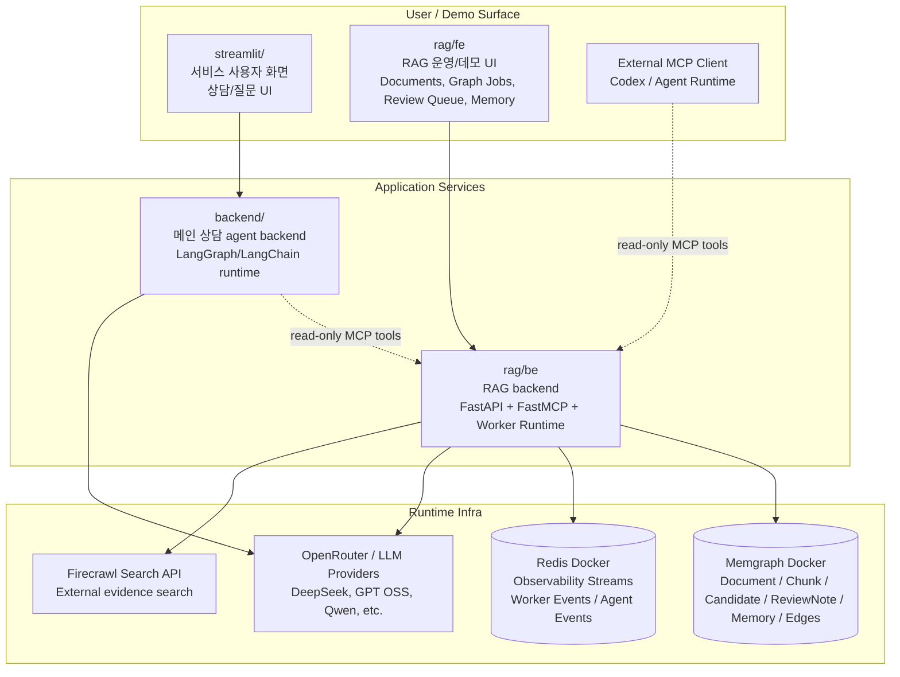
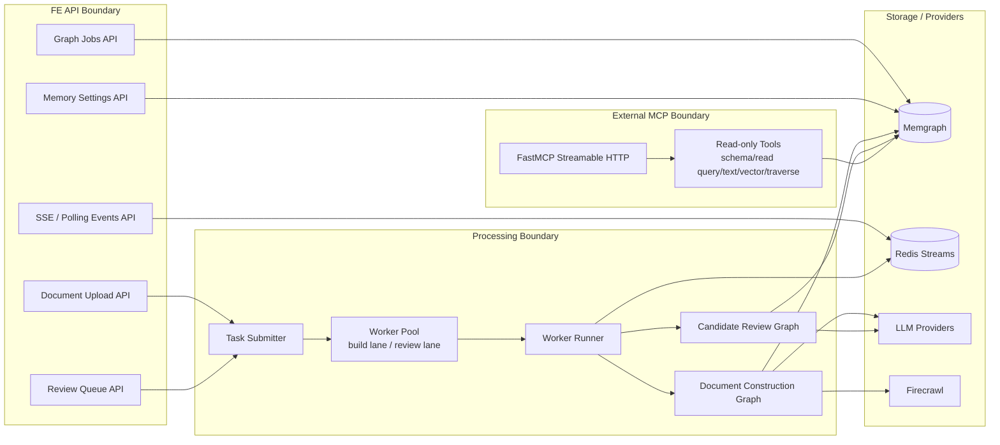
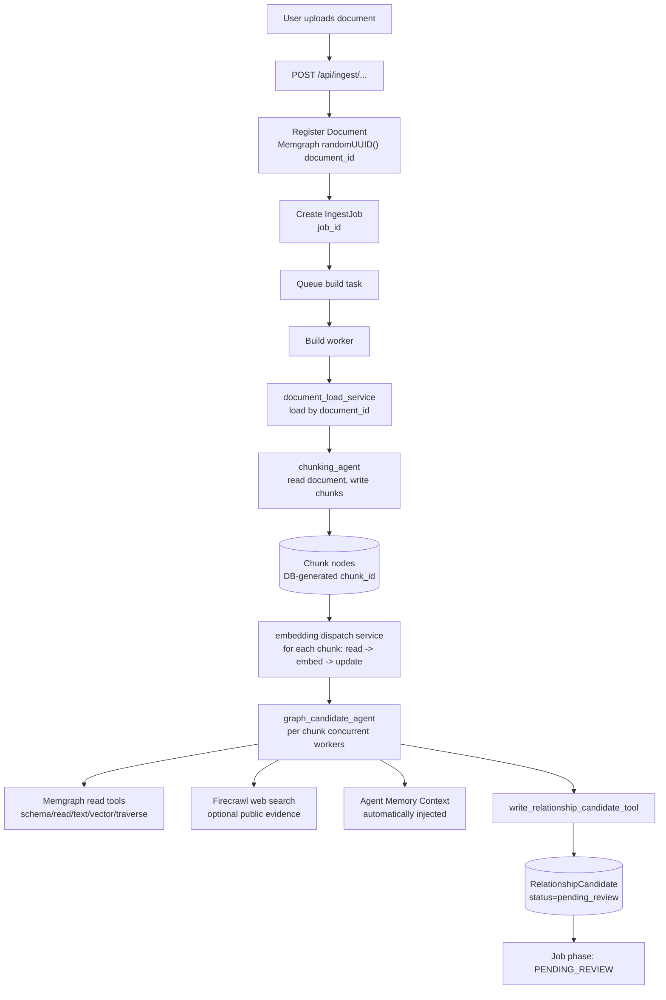
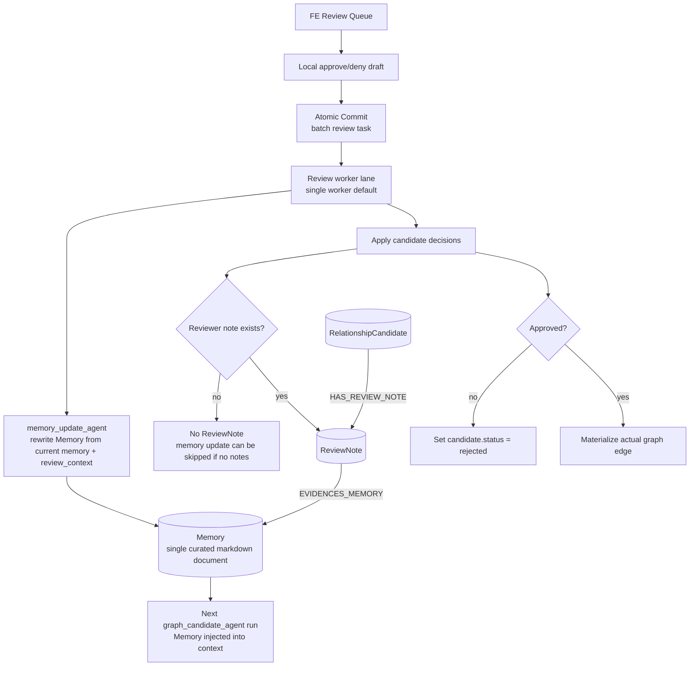
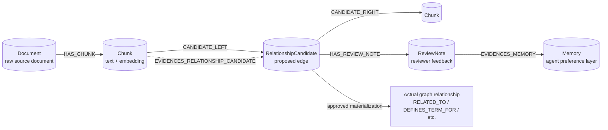
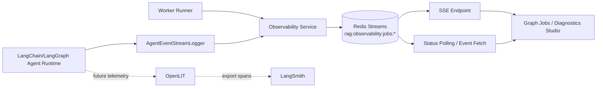

# RAG Architecture Reference Diagrams

이 파일은 발표 자료 제작용 Mermaid reference이다. 슬라이드에는 필요한 다이어그램만 복사해서 사용한다.

## 1. 전체 프로젝트/컨테이너 아키텍처



### 설명

- `streamlit/`: 최종 사용자 상담/질문 UI 성격의 화면.
- `backend/`: 실제 상담 agent runtime. 이후 RAG MCP server를 소비하는 쪽이다.
- `rag/fe`: RAG 구축/검수/운영을 위한 데모 UI.
- `rag/be`: RAG backend. 프론트엔드 API, 비동기 worker pipeline, read-only MCP server를 함께 제공한다.
- `Memgraph`: graph RAG storage.
- `Redis`: job/agent observability stream.

## 2. RAG backend 내부 역할 3분할



### 설명

`rag/be`는 하나의 서버지만 역할은 세 가지로 나뉜다.

1. FE API boundary: 문서 업로드, job 상태, review queue, memory 설정.
2. Processing boundary: task queue와 worker pool이 graph pipeline을 실행.
3. MCP boundary: 외부 agent가 graph를 읽을 수 있는 read-only tool surface.

## 3. Document Construction Graph



### 설명

- document와 chunk id는 DB-generated id를 사용한다.
- chunking agent는 raw document를 state에 싣지 않고 document id 기반으로 DB에서 읽는다.
- embedding은 새 노드를 만들지 않고 기존 Chunk node에 vector property를 업데이트한다.
- graph candidate agent는 실제 edge를 쓰지 않고 RelationshipCandidate만 쓴다.

## 4. Candidate Review Graph와 Memory Feedback Loop



### 설명

- ReviewNote는 candidate review feedback event이다.
- Memory는 ReviewNote를 그대로 누적하는 append log가 아니라 curated markdown 문서이다.
- 다음 candidate generation 때 Memory가 자동 주입된다.
- 발표 표현: "사용자와 함께 작업할수록 agent의 판단 기준이 누적된다."

## 5. Memgraph 저장 모델



### 설명

- `RelationshipCandidate`는 semantic edge가 아니라 workflow artifact이다.
- approved candidate만 실제 graph relationship으로 materialize된다.
- Memory의 durable provenance는 ReviewNote edge와 evidence id arrays로 남는다.

## 6. Observability / Transparency

<!-- 발표 전체 아키텍처 다이어그램에서만 보여줄 것. 세부 이벤트 타입은 발표 본문에서 깊게 다루지 않는다. -->



### 설명

- Redis Streams는 운영/디버깅용 event stream이다.
- Graph Jobs와 Diagnostics Studio는 worker lifecycle, node service start/end, agent token/event, tool call/result, error를 보여준다.
- LangSmith/OpenLIT는 다음 단계에서 span-level telemetry를 붙일 위치이다.

## 7. 발표용 한 줄 요약

```text
문서 업로드 -> 비동기 construction graph -> RelationshipCandidate 생성 -> 사용자 review -> 실제 edge 확정 -> ReviewNote 기반 Memory update -> 다음 agent run에 Memory 자동 주입 -> read-only MCP로 외부 agent가 graph 사용
```

