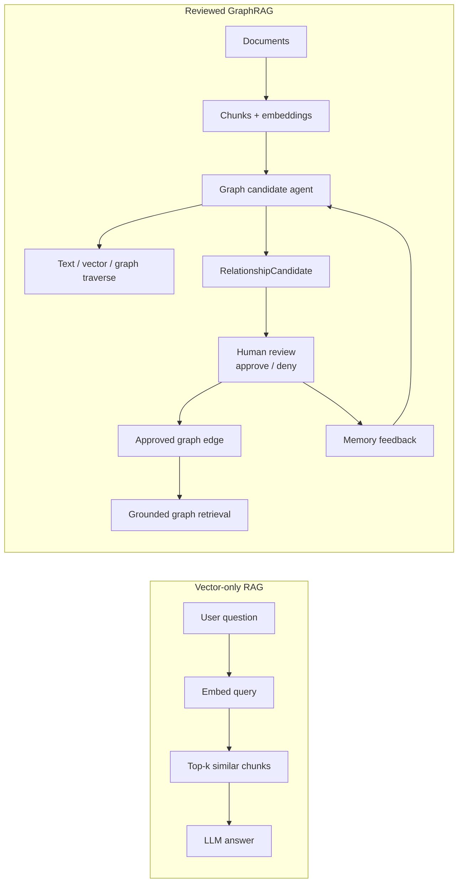

# Slide 02. Vector-only RAG vs Reviewed GraphRAG

## 사용 위치

- PPT slide 2
- 발표 구간: 문제 정의

## 슬라이드에서 말할 내용

일반 vector RAG는 유사 chunk를 찾아 답변하는 데 강하지만, 법령/조례처럼 조문 간 관계, 예외, 근거 검수가 중요한 데이터에서는 graph relationship과 human review가 필요하다.

## 원본 근거

- `presentation/script-demo/demo1.md`
- `presentation/script-demo/demo2.md`
- `presentation/marking_criteria/evaluation-coverage-check.md`
- `rag/be/src/api/mcp/server.py`
- `rag/be/src/tools/memgraph_read_tools.py`

## Mermaid

## PPT 구성 제안

- 좌우 비교 슬라이드로 구성한다.
- 왼쪽은 단순하고 짧게, 오른쪽은 `candidate -> review -> edge -> memory`가 보이게 한다.
- 핵심 문장: `LLM suggestion is not final knowledge.`

