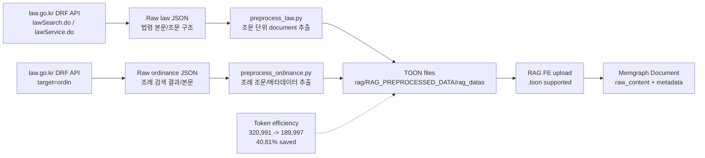

# Slide 04. Data Source and TOON Preprocessing

## 사용 위치

- PPT slide 4
- 발표 구간: 데이터 출처와 전처리

## 슬라이드에서 말할 내용

`law.go.kr` API에서 법령/조례 JSON을 수집하고, 조문 단위 document로 정리한 뒤, 최종 RAG 입력은 TOON으로 변환했다. TOON 변환으로 전체 토큰 합계 기준 40.81%를 절감했다.

## 원본 근거

- `rag/code_reference/collect.py`
- `rag/code_reference/collect_ordinance.py`
- `rag/code_reference/preprocess_law.py`
- `rag/code_reference/preprocess_ordinance.py`
- `rag/RAG_PREPROCESSED_DATA/README.md`
- `rag/RAG_PREPROCESSED_DATA/rag_datas`

## Mermaid

## PPT 구성 제안

- 왼쪽 60%: 위 Mermaid를 단순화한 pipeline.
- 오른쪽 40%: token compression 숫자 카드.
- 하단 작은 문구: `절감률은 문서별 평균이 아니라 전체 토큰 합계 기준`.

