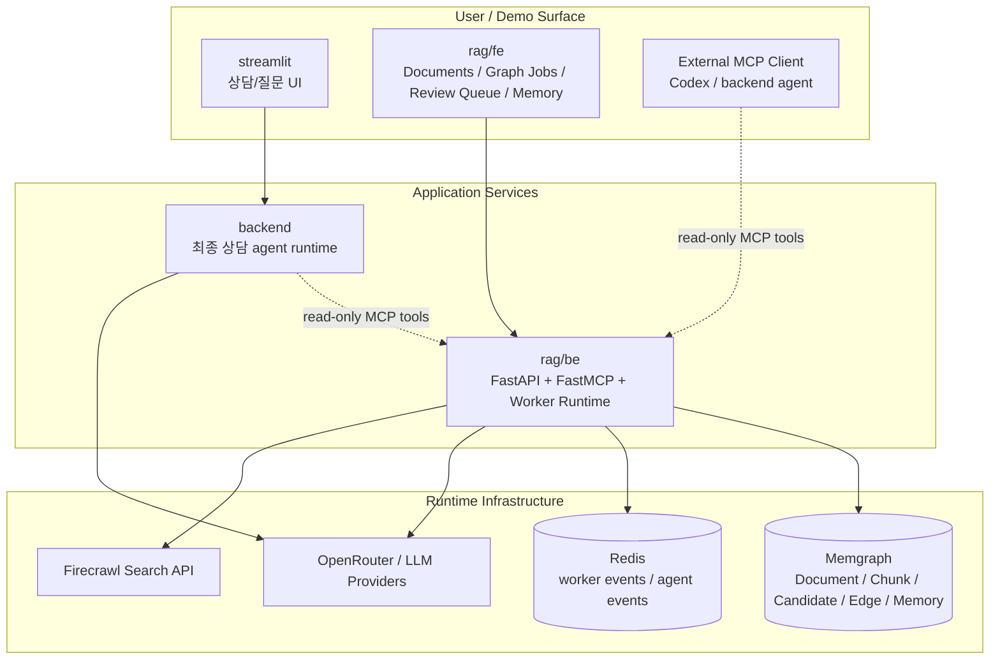

# Slide 05. System Boundary

## 사용 위치

- PPT slide 5
- 발표 구간: 전체 시스템 아키텍처

## 슬라이드에서 말할 내용

프로젝트는 사용자 화면, application services, runtime infra로 분리된다. `rag/be`는 RAG 운영 API와 MCP server를 제공하고, Memgraph/Redis/LLM provider/Firecrawl을 사용한다.

## 원본 근거

- `presentation/script-demo/reference-diagrams/rag-architecture.md`
- `rag/be/src/api/router.py`
- `rag/be/src/api/mcp/server.py`
- `rag/fe/src/pages/documents-page.tsx`
- `rag/fe/src/pages/graph-jobs-page.tsx`
- `rag/fe/src/pages/review-queue-page.tsx`

## Mermaid

## PPT 구성 제안

- 세 개 boundary를 명확히 구분한다.
- `rag/be`에 강조 stroke를 둔다. 발표의 중심 서비스이기 때문이다.
- `read-only MCP tools`는 점선으로 표시해 write 권한이 없다는 점을 시각화한다.

