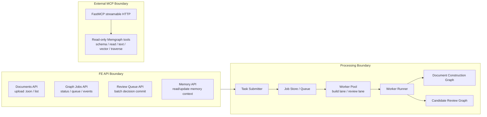

# Slide 06. RAG Backend Role Split

## 사용 위치

- PPT slide 6
- 발표 구간: `rag/be` 내부 역할

## 슬라이드에서 말할 내용

`rag/be`는 하나의 FastAPI 서버이지만 FE API boundary, processing boundary, external MCP boundary라는 세 가지 역할을 가진다.

## 원본 근거

- `rag/be/src/api/operations/documents.py`
- `rag/be/src/api/operations/memory.py`
- `rag/be/src/api/ingest/jobs.py`
- `rag/be/src/api/ingest/review.py`
- `rag/be/src/knowledge_runtime/tasks/submitter.py`
- `rag/be/src/knowledge_runtime/workers/pool.py`
- `rag/be/src/knowledge_runtime/workers/runner.py`
- `rag/be/src/api/mcp/server.py`

## Mermaid

## PPT 구성 제안

- 세 boundary를 가로 3분할한다.
- FE API는 product surface, Processing은 agent pipeline, MCP는 integration surface라고 라벨링한다.

