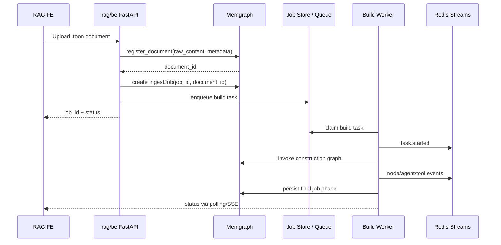

# Slide 07. Async Ingest Job Flow

## 사용 위치

- PPT slide 7
- 발표 구간: 비동기 문서 처리

## 슬라이드에서 말할 내용

문서 업로드 API는 graph build가 끝날 때까지 기다리지 않는다. Document를 DB에 먼저 저장하고 `document_id`와 `job_id`를 기준으로 worker task를 enqueue한다.

## 원본 근거

- `rag/be/src/api/operations/documents.py`
- `rag/be/src/query/write/document_registration.py`
- `rag/be/src/query/write/runtime.py`
- `rag/be/src/knowledge_runtime/tasks/submitter.py`
- `rag/be/src/knowledge_runtime/tasks/store.py`
- `rag/be/src/knowledge_runtime/workers/pool.py`
- `rag/be/src/knowledge_runtime/workers/runner.py`
- `rag/fe/src/features/workspace/use-rag-workspace.ts`

## Mermaid

## PPT 구성 제안

- Sequence diagram은 너무 세밀하면 복잡하므로, PPT에서는 5개 actor만 유지한다.
- 핵심 문구: `API returns job first, worker builds graph later`.

