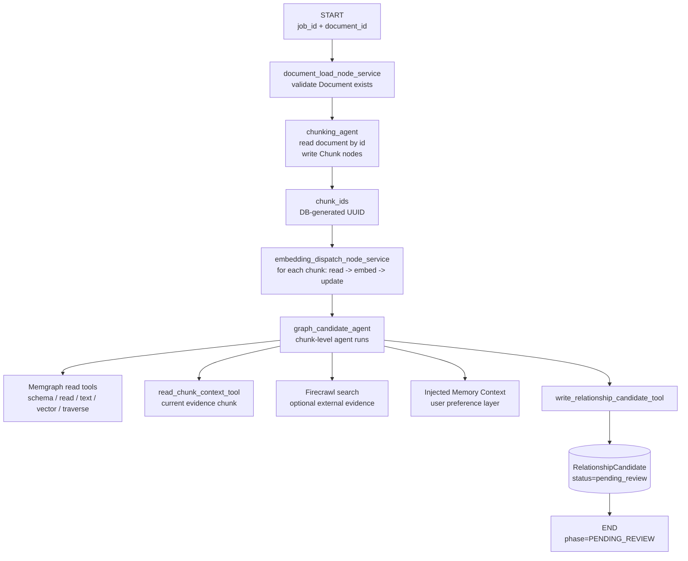

# Slide 08. Document Construction Graph

## 사용 위치

- PPT slide 8
- 발표 구간: 첫 번째 graph pipeline

## 슬라이드에서 말할 내용

LangGraph 기반 construction graph는 document load, chunking, embedding dispatch, graph candidate generation 순서로 실행된다. 마지막 agent는 실제 edge가 아니라 review 대상 candidate를 만든다.

## 원본 근거

- `rag/be/src/pipeline/graphs/document_construction_graph.py`
- `rag/be/src/pipeline/sub_agents/chunking_agent.py`
- `rag/be/src/pipeline/node_services/document_construction/embedding_dispatch_node_service.py`
- `rag/be/src/pipeline/sub_agents/graph_candidate_agent.py`
- `rag/be/src/query/write/chunks.py`
- `rag/be/src/query/write/embeddings.py`
- `rag/be/src/query/write/candidates.py`

## Mermaid

## PPT 구성 제안

- main path는 굵은 선으로, tool/context는 얇은 보조 선으로 표시한다.
- `RelationshipCandidate`를 실제 edge와 다른 색으로 표시한다.

