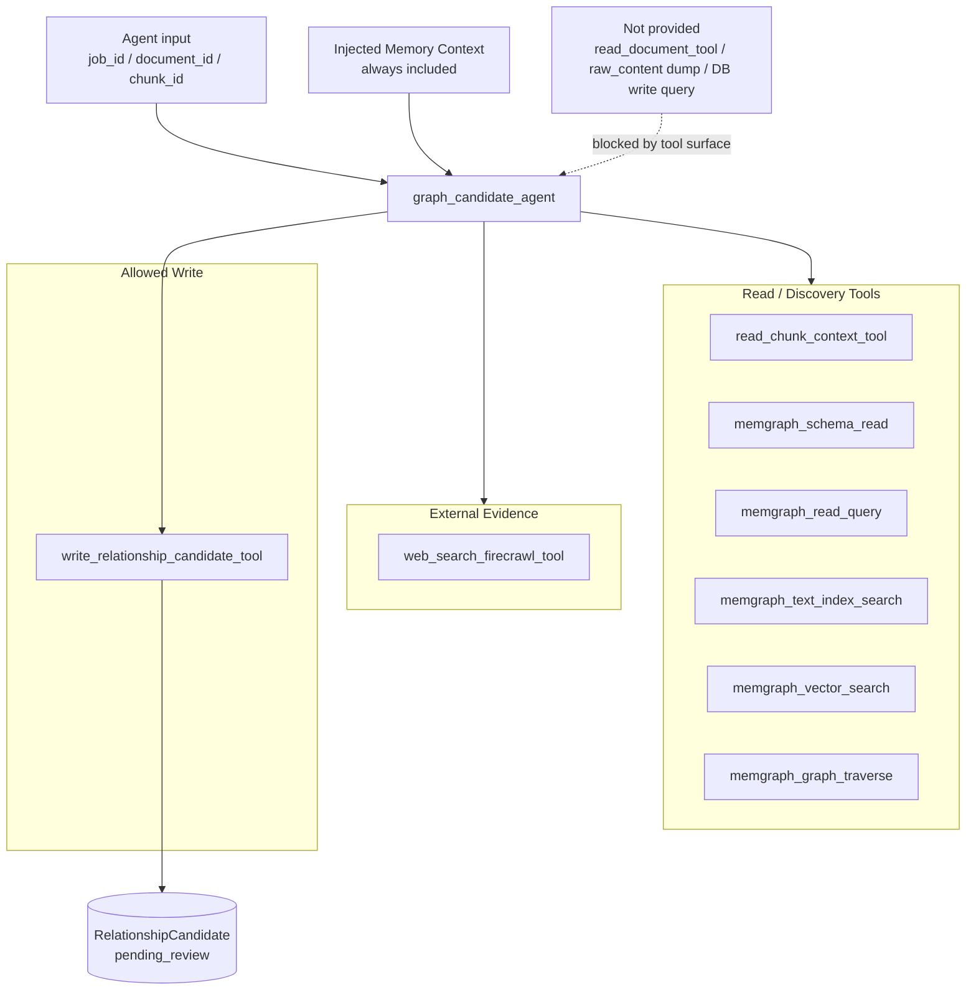

# Slide 09. Agent Harness and Tool Surface

## 사용 위치

- PPT slide 9
- 발표 구간: agent에게 제공한 context/tool boundary

## 슬라이드에서 말할 내용

graph candidate agent는 모든 데이터를 직접 들고 있지 않는다. `document_id`, `chunk_id`, Memory context를 받고, 제한된 read tools와 하나의 candidate write tool을 사용한다.

## 원본 근거

- `rag/be/src/pipeline/sub_agents/graph_candidate_agent.py`
- `rag/be/src/tools/chunk_tools.py`
- `rag/be/src/tools/memgraph_read_tools.py`
- `rag/be/src/tools/web_search_tools.py`
- `rag/be/src/tools/candidate_tools.py`
- `rag/be/src/tools/agent_output_sanitize.py`

## Mermaid

## PPT 구성 제안

- `Allowed Write`를 하나만 강조한다.
- 금지된 도구는 회색 점선 박스로 처리한다.
- 발표 문장: "agent가 바로 edge를 만들 권한은 없습니다."

