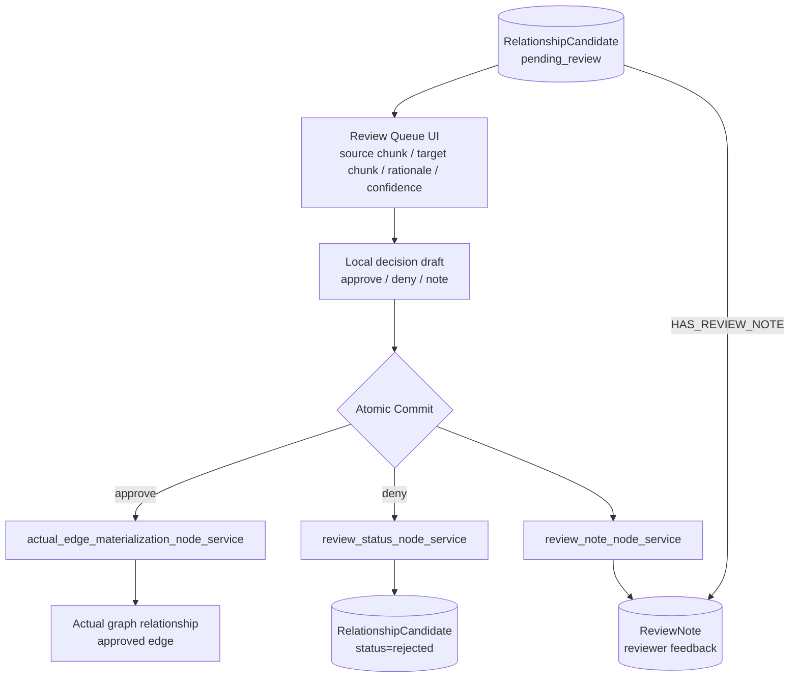

# Slide 10. Review Queue Candidate Flow

## 사용 위치

- PPT slide 10
- 발표 구간: Human-in-the-loop review

## 슬라이드에서 말할 내용

LLM agent가 만든 관계 후보는 `pending_review` 상태로 UI에 올라오고, 사용자가 approve/deny를 commit해야 실제 edge 또는 rejected artifact로 확정된다.

## 원본 근거

- `rag/be/src/pipeline/graphs/candidate_review_graph.py`
- `rag/be/src/pipeline/node_services/candidate_review/actual_edge_materialization_node_service.py`
- `rag/be/src/pipeline/node_services/candidate_review/review_status_node_service.py`
- `rag/be/src/pipeline/node_services/candidate_review/review_note_node_service.py`
- `rag/fe/src/pages/review-queue-page.tsx`
- `rag/fe/src/pages/review-job-page.tsx`
- `rag/fe/src/features/review/review-candidate-card.tsx`

## Mermaid

## PPT 구성 제안

- UI screenshot을 같이 넣는다면 Mermaid는 오른쪽 작은 흐름도로 둔다.
- 강조 문장: `Candidate first, edge later`.

