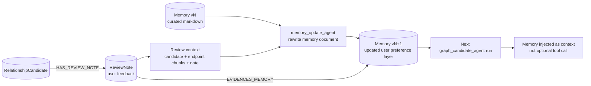

# Slide 11. Memory Feedback Loop

## 사용 위치

- PPT slide 11
- 발표 구간: ReviewNote 기반 Memory update

## 슬라이드에서 말할 내용

사용자의 review note는 단순 로그가 아니라 다음 graph candidate agent의 판단 기준을 갱신하는 evidence가 된다.

## 원본 근거

- `rag/be/src/pipeline/graphs/candidate_review_graph.py`
- `rag/be/src/pipeline/sub_agents/memory_update_agent.py`
- `rag/be/src/pipeline/node_services/candidate_review/memory_node_service.py`
- `rag/be/src/query/schema/memory.py`
- `rag/be/src/query/write/memory.py`
- `rag/be/src/api/operations/memory.py`
- `rag/be/src/pipeline/sub_agents/graph_candidate_agent.py`

## Mermaid

## PPT 구성 제안

- "학습"이라는 단어를 쓰더라도 하단에 작은 보정 문구를 넣는다.
- 보정 문구: `Model weights are not trained; system memory context is updated.`

