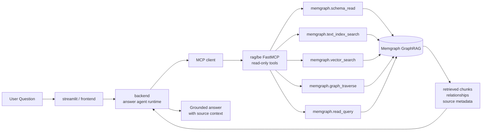

# Slide 12. Final QA Runtime via MCP

## 사용 위치

- PPT slide 12
- 발표 구간: 최종 질의응답 runtime

## 슬라이드에서 말할 내용

문서 구축 pipeline과 최종 답변 runtime은 분리된다. 구축된 Memgraph knowledge graph는 read-only MCP tools로 외부 backend/agent에서 조회한다.

## 원본 근거

- `rag/be/src/api/mcp/server.py`
- `rag/be/src/query/read/core/cypher.py`
- `rag/be/src/query/read/discovery/text.py`
- `rag/be/src/query/read/discovery/vector.py`
- `rag/be/src/query/read/discovery/traversal.py`
- `backend/`
- `streamlit/`

## Mermaid

## PPT 구성 제안

- `read-only` 라벨을 MCP box에 반드시 넣는다.
- construction graph와 final QA runtime을 분리했다는 메시지를 강조한다.

