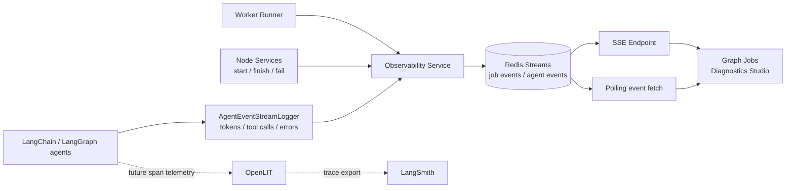

# Slide 13. Observability Stream

## 사용 위치

- PPT slide 13
- 발표 구간: Observability / Transparency

## 슬라이드에서 말할 내용

agent pipeline은 내부 tool call과 실패 원인을 볼 수 있어야 운영 가능하다. Redis Streams와 FE Diagnostics Studio로 worker lifecycle과 agent event를 확인한다.

## 원본 근거

- `rag/be/src/pipeline/agent_runtime/event_stream.py`
- `rag/be/src/observability/events/models.py`
- `rag/be/src/observability/events/ports.py`
- `rag/be/src/external/redis/client.py`
- `rag/fe/src/features/jobs/use-event-streamer.ts`
- `rag/fe/src/pages/graph-jobs-page.tsx`

## Mermaid

## PPT 구성 제안

- 현재 구현: Redis Streams + FE Diagnostics.
- 후속 확장: OpenLIT + LangSmith.
- 발표에서는 후속 확장보다 현재 내부 event를 볼 수 있다는 점을 중심으로 설명한다.

