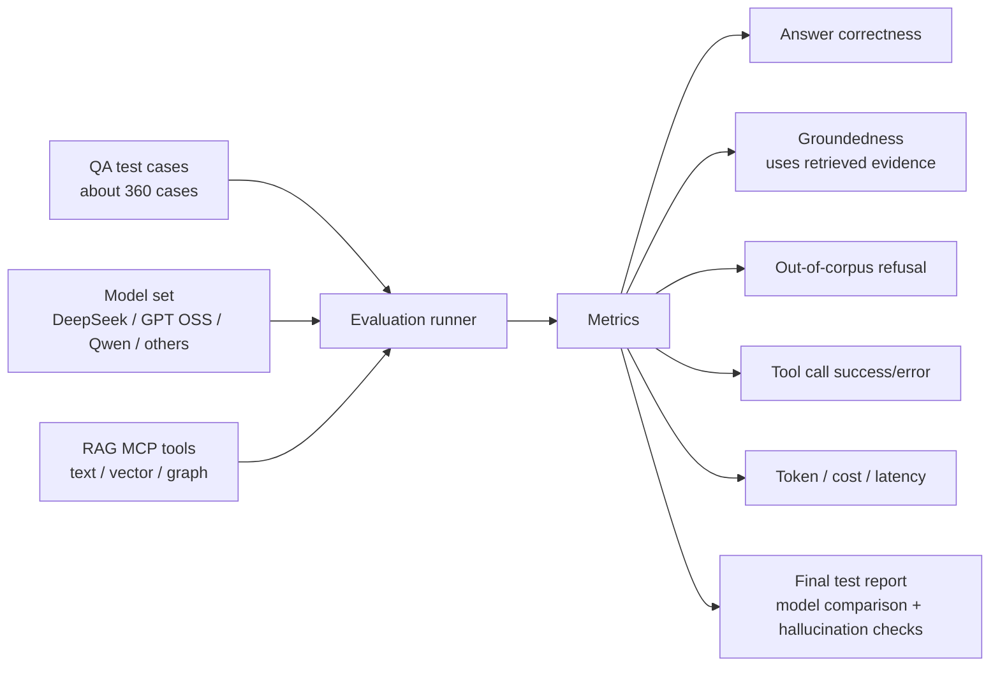

# Slide 14. Test and Validation Plan

## 사용 위치

- PPT slide 14
- 발표 구간: 테스트 계획과 남은 검증

## 슬라이드에서 말할 내용

테스트는 모델 성능만 보는 것이 아니라 RAG 검색 품질, 근거 충실도, 문서 외 질문 환각 방지, tool call 안정성을 함께 평가해야 한다.

## 원본 근거

- `presentation/marking_criteria/evaluation-coverage-check.md`
- `presentation/script-demo/demo3.md`

## Mermaid

## PPT 구성 제안

- 아직 리모트 테스트 결과 병합 전인 항목은 `TODO`로 명확히 표시한다.
- 발표에서는 "현재 구현은 끝났고, 보고서화할 검증 데이터가 남아 있다"는 식으로 말한다.

