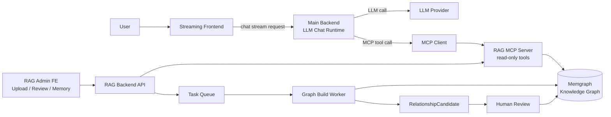
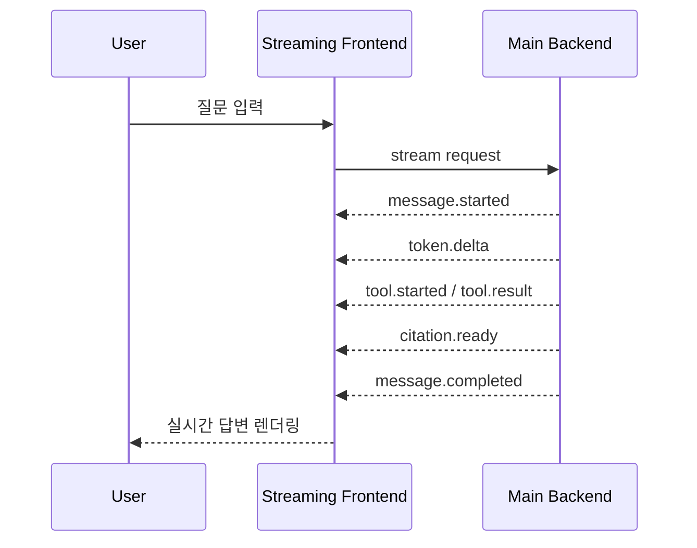
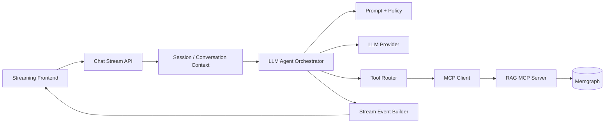
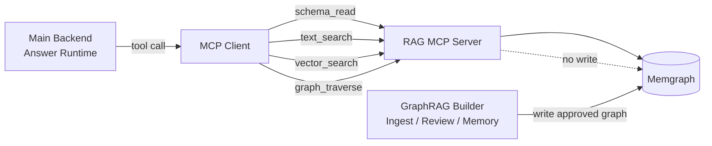
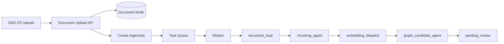
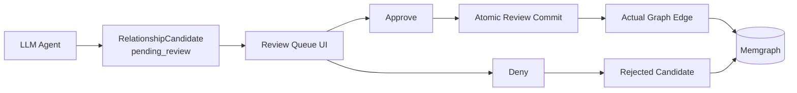

# v3 Service Architecture Diagrams

이 파일은 v3 PPT에서 사용한 diagram-as-code 원본이다. PPT 안에서는 Mermaid 이미지를 그대로 붙이지 않고, 같은 구조를 artifact-tool native shape로 다시 렌더링했다.

## Slide 4. Simplified End-to-End Architecture



```text
direction right

User [shape: oval, icon: user]
Streaming Frontend [icon: monitor, color: blue]
Main Backend [icon: server, color: purple] {
  Chat Stream API [icon: radio]
  LLM Runtime [icon: brain]
  MCP Client [icon: plug]
}
GraphRAG System [icon: network, color: green] {
  RAG Admin FE [icon: layout-dashboard]
  RAG Backend API [icon: server-cog]
  Task Queue [icon: list]
  Worker [icon: workflow]
  RAG MCP Server [icon: plug-zap]
}
Memgraph [shape: cylinder, icon: database]

User > Streaming Frontend
Streaming Frontend > Chat Stream API
LLM Runtime > MCP Client
MCP Client > RAG MCP Server: read-only tool call
Worker > Memgraph: approved graph write
RAG MCP Server > Memgraph: read
```

## Slide 6. Streaming Frontend Runtime



## Slide 7. Main Backend LLM Chat Runtime



## Slide 8. Backend to RAG via MCP



## Slide 10. Async Ingest and Construction Graph



## Slide 12. Review Queue



