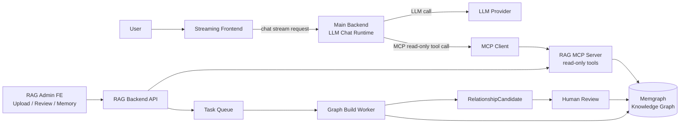
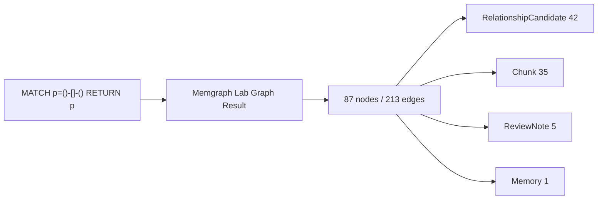
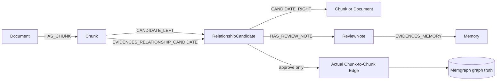
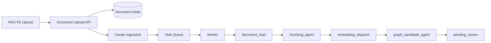
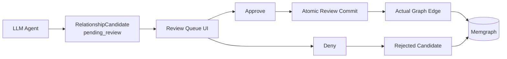
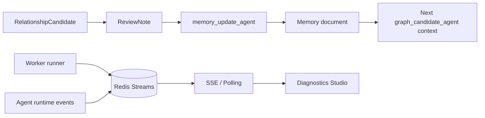

# v4 Service Architecture Diagrams

이 파일은 v4 PPT에서 사용한 발표용 diagram-as-code 원본이다. PPT 내부에는 Mermaid 이미지를 직접 붙이지 않고, 같은 구조를 artifact-tool native shape로 다시 렌더링했다.

## Evidence Assets

- 실제 Memgraph Lab graph result: `presentation/ppt/assets/memgraph-lab-graph-cluster.png`
- 실제 graph result full screenshot: `presentation/ppt/assets/memgraph-lab-graph-results-full.png`
- DB node count: `presentation/ppt/assets/memgraph-node-counts.txt`
- DB edge count: `presentation/ppt/assets/memgraph-edge-counts.txt`
- DB schema triplets: `presentation/ppt/assets/memgraph-schema-triplets.txt`

현재 관측된 핵심 값:

- RelationshipCandidate: 42
- Chunk: 35
- ReviewNote: 5
- IngestJob: 2
- Document: 2
- Memory: 1
- Total graph result: 87 nodes, 213 edges

## Slide 4. Simplified End-to-End Architecture



```eraser
direction right

User [shape: oval, icon: user]
Streaming Frontend [icon: monitor, color: blue]

Main Backend [icon: server, color: purple] {
  Chat Stream API [icon: radio]
  LLM Runtime [icon: brain]
  MCP Client [icon: plug]
}

GraphRAG System [icon: network, color: green] {
  RAG Admin FE [icon: layout-dashboard]
  RAG Backend API [icon: server-cog]
  Task Queue [icon: list]
  Worker [icon: workflow]
  RAG MCP Server [icon: plug-zap]
}

Memgraph [shape: cylinder, icon: database]

User > Streaming Frontend
Streaming Frontend > Chat Stream API
LLM Runtime > MCP Client
MCP Client > RAG MCP Server: read-only tool call
Worker > Memgraph: approved graph write
RAG MCP Server > Memgraph: graph read
```

## Slide 9. Actual Memgraph Evidence



발표에서는 이 Mermaid를 쓰지 않고 실제 screenshot을 삽입한다.

## Slide 10. Clean Node / Edge Structure



```eraser
direction right

Document [icon: file-text, color: blue]
Chunk [icon: split, color: teal]
RelationshipCandidate [icon: git-branch, color: orange]
ReviewNote [icon: message-square, color: red]
Memory [icon: sticky-note, color: purple]
Approved Edge [shape: oval, icon: check, color: green]

Document > Chunk: HAS_CHUNK
Chunk > RelationshipCandidate: CANDIDATE_LEFT / EVIDENCE
RelationshipCandidate > Chunk: CANDIDATE_RIGHT
RelationshipCandidate > ReviewNote: HAS_REVIEW_NOTE
ReviewNote > Memory: EVIDENCES_MEMORY
RelationshipCandidate > Approved Edge: approve only
```

## Slide 10. Construction Pipeline



핵심 state contract:

```text
GraphIngestState = job_id + document_id + chunk_ids
raw document는 state에 싣지 않고 DB read tool로 조회한다.
```

## Slide 12. Candidate First, Edge Later



## Slide 13. Memory Feedback and Observability



