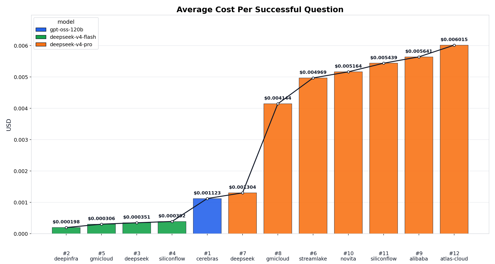
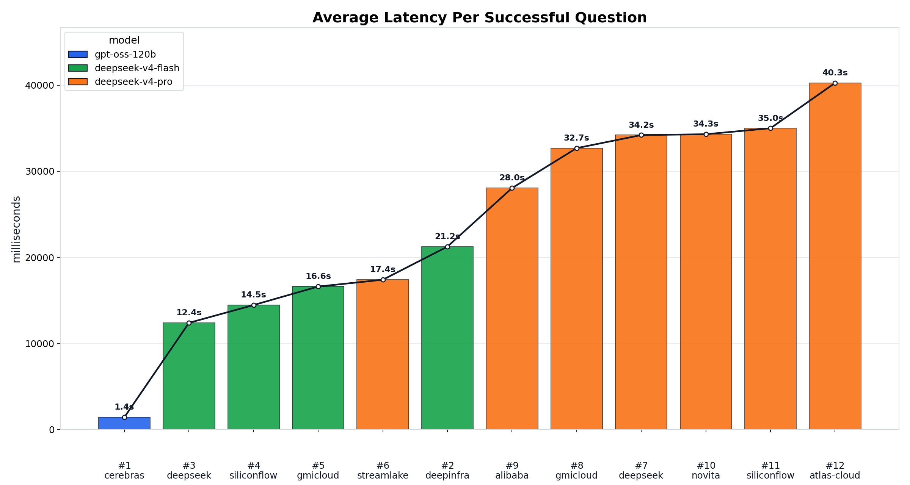
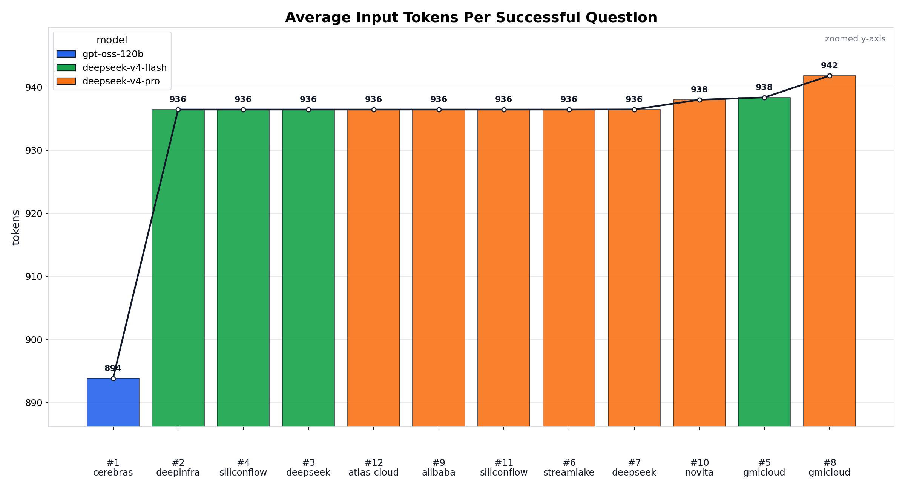
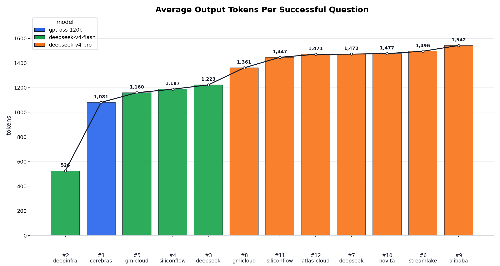
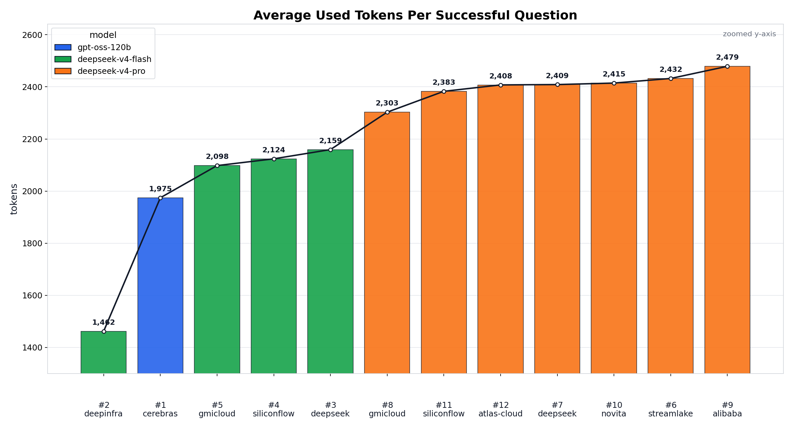
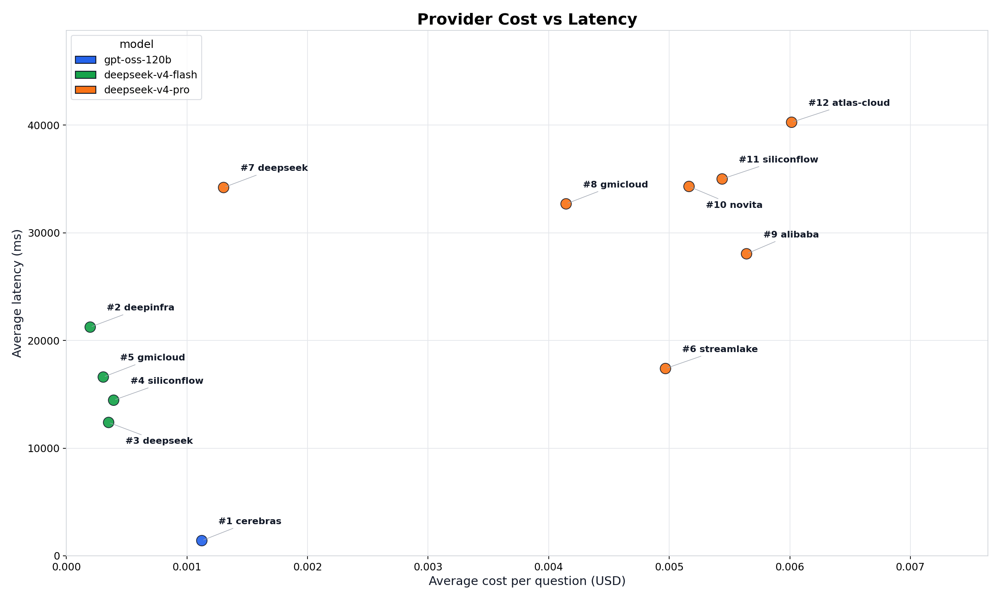
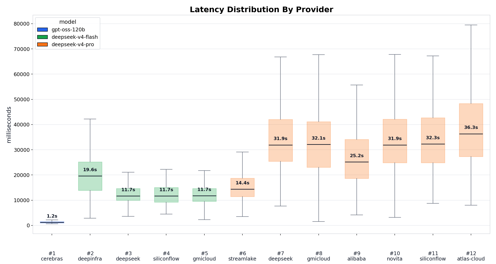

# Model by provider Benchmark(no_tool) 통합 분석 리포트

이 문서 하나에서 no_tool benchmark의 계산 기준, 입력 데이터, 차트, 실패 리포트, 후보 판단을 모두 확인한다.

## 분석 범위

- 이 리포트는 tool을 연결하지 않은 **no_tool** benchmark 결과를 분석한다.
- 동일한 360개 testcase를 model/provider별로 실행한 CSV를 기준으로 token, 비용, latency, 실패 여부, routing 검증만 비교한다.
- 실제 RAG tool은 연결하지 않았고, 각 모델은 system prompt와 testcase 질문만 보고 답했다.
- `with_tool` 결과와 섞어 비교하지 않는다.
- Qwen 3.7 Max는 비용 문제로 후보군에서 제외했고, 현재 분석 CSV에도 포함하지 않는다.
- 답변 품질 평가는 별도 단계이며, 최종 provider 결정에는 품질 평가 결과를 함께 반영해야 한다.

## 입력 데이터

분석 대상 폴더:

```text
presentation/test-data/no-tool-benchmark/raw-results
```

초기 비용/latency 분석 대상 CSV:

```text
deepseek_v4_flash_deepinfra.csv
deepseek_v4_flash_deepseek.csv
deepseek_v4_flash_gmicloud.csv
deepseek_v4_flash_siliconflow.csv
deepseek_v4_pro_alibaba.csv
deepseek_v4_pro_atlas_cloud.csv
deepseek_v4_pro_deepseek.csv
deepseek_v4_pro_gmicloud.csv
deepseek_v4_pro_novita.csv
deepseek_v4_pro_siliconflow.csv
deepseek_v4_pro_streamlake.csv
openai_gpt_oss_120b_cerebras_fp16.csv
```

LLM judge 단계는 `../llm-as-a-judge/`에 따로 분리했다. 비용/latency 후보군을 좁힌 뒤 아래 4개 raw CSV를 기준으로 판정 결과를 보관한다.

```text
deepseek_v4_flash_deepseek.csv
deepseek_v4_pro_deepseek.csv
openai_gpt_oss_120b_cerebras_fp16.csv
qwen_qwen3_7_plus_alibaba.csv
```

## CSV 구조

결과 CSV는 아래 주요 컬럼을 사용한다.

`timestamp`, `testcase_id`, `query_reference`, `answer`,
`input_price_per_1m`, `output_price_per_1m`,
`input_tokens`, `output_tokens`, `used_tokens`,
`input_cost_usd`, `output_cost_usd`, `total_cost_usd`,
`batch`, `difficulty`, `special_case`,
`model_id`, `provider_order`, `primary_provider_slug`,
`primary_provider_quantization`,`actual_provider`, `allow_fallbacks`,
`endpoint_tools_supported`, `context_length`, `max_completion_tokens`,
`quantization`, `openrouter_generation_id`, `latency_ms`,
`langsmith_project`, `langsmith_tags`, `status`, `error`

- `query_reference` = 기존 `query`, `expected_keywords`, `reference`, `judge_criteria`를 한 컬럼으로 묶었다.
- 이 기준은 후속 답변 품질 평가에 쓰는 참고값이고, 현재 no_tool 운영 지표 계산에는 token/비용/latency/실패/routing 값만 사용한다.

## 전처리와 계산 원칙

1. `presentation/test-data/no-tool-benchmark/raw-results/*.csv`를 읽되 `summary`, `qwen`, `smoke`, `raw` 파일은 제외한다.
2. 숫자 컬럼은 `pd.to_numeric(..., errors="coerce")`로 변환한다.
3. 평균 token, 비용, latency는 `status == "success"` row 기준으로 계산한다.
4. 실패 row는 평균 계산에서 제외하되, `failed_count`와 `failure_report`에는 남긴다.
5. provider별 순수 비교는 routing 검증을 통과한 provider만 기준으로 본다.
6. routing 검증 통과 조건은 `allow_fallbacks=false`이고, 성공 row의 `actual_provider`가 `primary_provider_slug`와 일치하는 것이다.
7. `p95_latency_ms`, `p95_used_tokens`는 `numpy.percentile(..., 95)` 기본값인 linear 보간 방식으로 계산한다.

이 문서에서 strict 후보로 인정하는 조건은 다음과 같다.

- `allow_fallbacks=false`
- 성공 row의 `actual_provider`가 `primary_provider_slug`와 일치
- 평균, 비용, p95는 `status=success` row 기준

## 분석 스크립트

```bash
cd /home/vosnuevo/workspace/SKN28-3rd-1Team/backend
uv run python ../presentation/test-data/no-tool-benchmark/tools/analyze_no_tool_results.py \
  --results-dir ../presentation/test-data/no-tool-benchmark/raw-results \
  --output-dir ../presentation/test-data/no-tool-benchmark/artifacts
```

## 분석 산출물

차트 범주 색상:

- 파란색: `gpt-oss-120b`
- 초록색: `deepseek-v4-flash`
- 주황색: `deepseek-v4-pro`

```text
presentation/test-data/no-tool-benchmark/artifacts/no_tool_all_results.csv
presentation/test-data/no-tool-benchmark/artifacts/no_tool_combined_results.csv
presentation/test-data/no-tool-benchmark/artifacts/no_tool_provider_summary.csv
presentation/test-data/no-tool-benchmark/artifacts/no_tool_question_summary.csv
presentation/test-data/no-tool-benchmark/artifacts/no_tool_segment_summary.csv
presentation/test-data/no-tool-benchmark/artifacts/no_tool_failure_report.csv
presentation/test-data/no-tool-benchmark/artifacts/no_tool_routing_report.csv
presentation/test-data/no-tool-benchmark/artifacts/no_tool_excluded_routing_report.csv
presentation/test-data/llm-as-a-judge/artifacts/tools-no/llm_judge_results.csv
presentation/test-data/llm-as-a-judge/artifacts/tools-no/llm_judge_model_summary.csv
presentation/test-data/no-tool-benchmark/charts/*.png
```

## 전체 요약

표의 `#번호`는 차트 x축과 후보 판단표에서 같은 strict 후보를 가리킨다. 차트 x축은 번호와 provider 이름만 표시하고, 모델 구분은 범례 색상으로 한다.

형광펜 표시:

- <mark>최저 평균 비용</mark>
- <mark>최저 평균 used token</mark>
- <mark>최저 평균 latency</mark>

<table>
  <thead>
    <tr>
      <th align="right">#</th>
      <th>model</th>
      <th>provider</th>
      <th align="right">success</th>
      <th align="right">failed</th>
      <th align="right">avg_input_tokens</th>
      <th align="right">avg_output_tokens</th>
      <th align="right">avg_used_tokens</th>
      <th align="right">avg_cost_usd</th>
      <th align="right">total_cost_usd</th>
      <th align="right">avg_latency_ms</th>
      <th align="right">p95_latency_ms</th>
    </tr>
  </thead>
  <tbody>
    <tr>
      <td align="right">#1</td>
      <td><code>gpt-oss-120b</code></td>
      <td><code>cerebras</code></td>
      <td align="right">360/360</td>
      <td align="right">0</td>
      <td align="right">893.8</td>
      <td align="right">1,080.7</td>
      <td align="right">1,974.5</td>
      <td align="right">0.00112336</td>
      <td align="right">0.40440835</td>
      <td align="right"><mark>1,411</mark></td>
      <td align="right">2,106</td>
    </tr>
    <tr>
      <td align="right">#2</td>
      <td rowspan="4"><code>deepseek-v4-flash</code></td>
      <td><code>deepinfra</code></td>
      <td align="right">360/360</td>
      <td align="right">0</td>
      <td align="right">936.4</td>
      <td align="right">525.8</td>
      <td align="right"><mark>1,462.2</mark></td>
      <td align="right"><mark>0.00019778</mark></td>
      <td align="right">0.07120136</td>
      <td align="right">21,240</td>
      <td align="right">40,612</td>
    </tr>
    <tr>
      <td align="right">#3</td>
      <td><code>deepseek</code></td>
      <td align="right">360/360</td>
      <td align="right">0</td>
      <td align="right">936.4</td>
      <td align="right">1,222.9</td>
      <td align="right">2,159.4</td>
      <td align="right">0.00035059</td>
      <td align="right">0.12621101</td>
      <td align="right">12,385</td>
      <td align="right">18,371</td>
    </tr>
    <tr>
      <td align="right">#4</td>
      <td><code>siliconflow</code></td>
      <td align="right">360/360</td>
      <td align="right">0</td>
      <td align="right">936.4</td>
      <td align="right">1,187.5</td>
      <td align="right">2,123.9</td>
      <td align="right">0.00039211</td>
      <td align="right">0.14115901</td>
      <td align="right">14,452</td>
      <td align="right">21,647</td>
    </tr>
    <tr>
      <td align="right">#5</td>
      <td><code>gmicloud</code></td>
      <td align="right">360/360</td>
      <td align="right">0</td>
      <td align="right">938.4</td>
      <td align="right">1,159.5</td>
      <td align="right">2,097.9</td>
      <td align="right">0.00030621</td>
      <td align="right">0.11023653</td>
      <td align="right">16,603</td>
      <td align="right">25,158</td>
    </tr>
    <tr>
      <td align="right">#6</td>
      <td rowspan="7"><code>deepseek-v4-pro</code></td>
      <td><code>streamlake</code></td>
      <td align="right">360/360</td>
      <td align="right">0</td>
      <td align="right">936.4</td>
      <td align="right">1,495.8</td>
      <td align="right">2,432.3</td>
      <td align="right">0.00496864</td>
      <td align="right">1.78871151</td>
      <td align="right">17,393</td>
      <td align="right">27,379</td>
    </tr>
    <tr>
      <td align="right">#7</td>
      <td><code>deepseek</code></td>
      <td align="right">359/360</td>
      <td align="right">1</td>
      <td align="right">936.5</td>
      <td align="right">1,472.4</td>
      <td align="right">2,408.9</td>
      <td align="right">0.00130400</td>
      <td align="right">0.46813639</td>
      <td align="right">34,204</td>
      <td align="right">56,152</td>
    </tr>
    <tr>
      <td align="right">#8</td>
      <td><code>gmicloud</code></td>
      <td align="right">360/360</td>
      <td align="right">0</td>
      <td align="right">941.8</td>
      <td align="right">1,361.1</td>
      <td align="right">2,302.9</td>
      <td align="right">0.00414434</td>
      <td align="right">1.49196184</td>
      <td align="right">32,685</td>
      <td align="right">60,376</td>
    </tr>
    <tr>
      <td align="right">#9</td>
      <td><code>alibaba</code></td>
      <td align="right">360/360</td>
      <td align="right">0</td>
      <td align="right">936.4</td>
      <td align="right">1,542.5</td>
      <td align="right">2,478.9</td>
      <td align="right">0.00564091</td>
      <td align="right">2.03072712</td>
      <td align="right">28,049</td>
      <td align="right">52,131</td>
    </tr>
    <tr>
      <td align="right">#10</td>
      <td><code>novita</code></td>
      <td align="right">360/360</td>
      <td align="right">0</td>
      <td align="right">938.0</td>
      <td align="right">1,476.6</td>
      <td align="right">2,414.6</td>
      <td align="right">0.00516377</td>
      <td align="right">1.85895712</td>
      <td align="right">34,303</td>
      <td align="right">58,748</td>
    </tr>
    <tr>
      <td align="right">#11</td>
      <td><code>siliconflow</code></td>
      <td align="right">360/360</td>
      <td align="right">0</td>
      <td align="right">936.4</td>
      <td align="right">1,446.5</td>
      <td align="right">2,383.0</td>
      <td align="right">0.00543860</td>
      <td align="right">1.95789440</td>
      <td align="right">34,998</td>
      <td align="right">62,825</td>
    </tr>
    <tr>
      <td align="right">#12</td>
      <td><code>atlas-cloud</code></td>
      <td align="right">360/360</td>
      <td align="right">0</td>
      <td align="right">936.4</td>
      <td align="right">1,471.1</td>
      <td align="right">2,407.5</td>
      <td align="right">0.00601472</td>
      <td align="right">2.16529972</td>
      <td align="right">40,263</td>
      <td align="right">73,860</td>
    </tr>
  </tbody>
</table>

핵심만 보면:

- 평균 latency가 빠른 모델은 `#1 gpt-oss-120b / cerebras`, `1,411ms`이다.
- 평균 비용이 저렴한 모델은 `#2 deepseek-v4-flash / deepinfra`, `0.00019778`이다.
- 평균 used token이 적은 모델은 `#2 deepseek-v4-flash / deepinfra`, `1,462.2`이다.
- 평균 input token이 많은 모델은 `#8 deepseek-v4-pro / gmicloud`, `941.8`이다.
- 평균 output token이 많은 모델은 `#9 deepseek-v4-pro / alibaba`, `1,542.5`이다.

## 1. 평균 비용 비교



이 차트는 성공 질문 1개당 평균 비용을 보여준다. 같은 색은 같은 모델 계열이다.


- 비용 1위는 `#2 deepseek-v4-flash / deepinfra`, `0.00019778`이다.
- 비용 2위는 `#5 deepseek-v4-flash / gmicloud`, `0.00030621`이다.
- 비용 3위는 `#3 deepseek-v4-flash / deepseek`, `0.00035059`이다.
- 비용 4위는 `#4 deepseek-v4-flash / siliconflow`, `0.00039211`이다.
- 비용 5위는 `#1 gpt-oss-120b / cerebras`, `0.00112336`이다.

## 2. 평균 latency 비교



이 차트는 성공 질문 1개당 평균 응답 시간을 보여준다. 막대 위 숫자는 초 단위 평균 latency다.

- 속도 1위는 `#1 gpt-oss-120b / cerebras`, `1,411ms`이다.
- 속도 2위는 `#3 deepseek-v4-flash / deepseek`, `12,385ms`이다.
- 속도 3위는 `#4 deepseek-v4-flash / siliconflow`, `14,452ms`이다.
- 속도 4위는 `#5 deepseek-v4-flash / gmicloud`, `16,603ms`이다.
- 속도 5위는 `#6 deepseek-v4-pro / streamlake`, `17,393ms`이다.

## 3. 평균 input token 비교



이 차트는 provider별 평균 input token을 보여준다. input token이 크면 같은 답변 길이라도 기본 비용이 올라간다.

- 평균 input token이 많은 1위는 `#8 deepseek-v4-pro / gmicloud`, `941.8`이다.
- 평균 input token이 많은 2위는 `#5 deepseek-v4-flash / gmicloud`, `938.4`이다.
- 평균 input token이 많은 3위는 `#10 deepseek-v4-pro / novita`, `938.0`이다.
- 평균 input token이 많은 4위는 `#7 deepseek-v4-pro / deepseek`, `936.5`이다.
- 평균 input token이 많은 5위는 `#2 deepseek-v4-flash / deepinfra`, `936.4`이다.

## 4. 평균 output token 비교



이 차트는 provider별 평균 output token을 보여준다. output token은 비용과 답변 길이에 직접 영향을 준다.

- 평균 output token이 많은 1위는 `#9 deepseek-v4-pro / alibaba`, `1,542.5`이다.
- 평균 output token이 많은 2위는 `#6 deepseek-v4-pro / streamlake`, `1,495.8`이다.
- 평균 output token이 많은 3위는 `#10 deepseek-v4-pro / novita`, `1,476.6`이다.
- 평균 output token이 많은 4위는 `#7 deepseek-v4-pro / deepseek`, `1,472.4`이다.
- 평균 output token이 많은 5위는 `#12 deepseek-v4-pro / atlas-cloud`, `1,471.1`이다.

## 5. 평균 used token 비교



이 차트는 input과 output을 합친 평균 used token 수를 보여준다. 미세한 차이를 보기 위해 y축을 확대했다.

- 평균 used token이 적은 1위는 `#2 deepseek-v4-flash / deepinfra`, `1,462.2`이다.
- 평균 used token이 적은 2위는 `#1 gpt-oss-120b / cerebras`, `1,974.5`이다.
- 평균 used token이 적은 3위는 `#5 deepseek-v4-flash / gmicloud`, `2,097.9`이다.
- 평균 used token이 적은 4위는 `#4 deepseek-v4-flash / siliconflow`, `2,123.9`이다.
- 평균 used token이 적은 5위는 `#3 deepseek-v4-flash / deepseek`, `2,159.4`이다.

주의:

- token 수가 낮다고 무조건 좋은 것은 아니다.
- 답변이 짧아 비용은 줄어도 필수 키워드나 설명 품질이 부족할 수 있다.
- 최종 선택에는 keyword/answer 품질 평가를 같이 붙여야 한다.

## 6. 비용 vs latency 산점도



이 차트는 provider별 평균 비용과 평균 latency를 함께 보여준다. 왼쪽 아래에 가까울수록 비용과 속도 측면에서 유리하다.

## 7. latency 분포 비교



이 차트는 provider별 latency 분포를 보여준다. 박스 위 숫자는 median latency다.

## 질문별 특이 케이스

질문별 요약은 `no_tool_question_summary.csv`에서 확인한다.

### 평균 latency가 높은 질문:

| testcase_id | avg_latency_ms | 질문 요약 |
| --- | ---: | --- |
| `RAG-Q-173` | 76,883 | 어머니가 66세인데 서울 강남구에 살고 혼자 지내세요. 기초연금이랑 강남구 어르신 지원 중 뭘 먼저 확인해야 해요? |
| `RAG-Q-297` | 69,776 | 노인맞춤돌봄 생활지원사가 이용자에게 폭언을 들었는데 노인학대 신고로 처리해야 하는지 근로 문제로 봐야 하는지 물으면? |
| `RAG-Q-326` | 69,468 | 여러 지역 노인복지 자료를 동시에 검색했는데 지역마다 지원 금액이 달라요. 어느 지역 기준이 맞나요? |
| `RAG-Q-015` | 67,096 | 수원시 노인일자리 사회활동 지원사업 자료에서 뭘 확인할 수 있어? |
| `RAG-Q-182` | 44,725 | 울산 북구 시설 정보가 필요한데 시설명만 말고 위치나 운영 정보도 있으면 같이 알려줘. |


### 평균 비용이 높은 질문:
| testcase_id | avg_cost_usd | 질문 요약 |
| --- | ---: | --- |
| `RAG-Q-015` | 0.01918348 | 수원시 노인일자리 사회활동 지원사업 자료에서 뭘 확인할 수 있어? |
| `RAG-Q-182` | 0.00681060 | 울산 북구 시설 정보가 필요한데 시설명만 말고 위치나 운영 정보도 있으면 같이 알려줘. |
| `RAG-Q-095` | 0.00513950 | 광주 광산구 노인복지시설 현황에서 시설명과 주소를 함께 알려줘. |
| `RAG-Q-019` | 0.00510026 | 대구 달서구 노인복지시설 현황을 요약해줘. |
| `RAG-Q-220` | 0.00509499 | 노인학대가 의심되는데 복지시설 문제인지 가족 문제인지 몰라. 어떤 법 조항과 통계 자료를 같이 봐야 해? |

## 실패 리포트

실패 리포트는 `no_tool_failure_report.csv`에 저장되어 있다.

현재 실패는 `1`건이다.

| model/provider | testcase_id | 원인 |
| --- | --- | --- |
| `deepseek-v4-pro / deepseek` | `RAG-Q-096` | `APIConnectionError('Connection error.')Traceback (most recent call last): File "/home/vosnuevo/workspace/SKN28-3rd-1Team/backend/.venv/lib/p` |

## 후보 판단 체크리스트

체크 기준:

- 성공률 100%: failed row가 0개
- 비용 우수: 질문당 평균 비용이 `$0.001` 이하
- 평균 속도 우수: 평균 latency가 `20초` 이하
- p95 안정: p95 latency가 `30초` 이하
- 토큰 효율: 평균 used token이 `2,200` 이하
- 운영 균형: 성공률 100%, 비용 우수, 평균 속도 우수, p95 안정 조건을 모두 만족

| 후보 ID | 후보 | 성공률 100% | 비용 우수 | 평균 속도 우수 | p95 안정 | 토큰 효율 | 운영 균형 | 체크 수 | 후보 순위 |
| --- | --- | --- | --- | --- | --- | --- | --- | ---: | ---: |
| #3 | `deepseek-v4-flash / deepseek` | ✅ | ✅ | ✅ | ✅ | ✅ | ✅ | 6 | 1 |
| #4 | `deepseek-v4-flash / siliconflow` | ✅ | ✅ | ✅ | ✅ | ✅ | ✅ | 6 | 2 |
| #5 | `deepseek-v4-flash / gmicloud` | ✅ | ✅ | ✅ | ✅ | ✅ | ✅ | 6 | 3 |
| #1 | `gpt-oss-120b / cerebras` | ✅ |  | ✅ | ✅ | ✅ |  | 4 | 4 |
| #6 | `deepseek-v4-pro / streamlake` | ✅ |  | ✅ | ✅ |  |  | 3 | 5 |
| #2 | `deepseek-v4-flash / deepinfra` | ✅ | ✅ |  |  | ✅ |  | 3 | 6 |
| #9 | `deepseek-v4-pro / alibaba` | ✅ |  |  |  |  |  | 1 | 7 |
| #8 | `deepseek-v4-pro / gmicloud` | ✅ |  |  |  |  |  | 1 | 8 |
| #10 | `deepseek-v4-pro / novita` | ✅ |  |  |  |  |  | 1 | 9 |
| #11 | `deepseek-v4-pro / siliconflow` | ✅ |  |  |  |  |  | 1 | 10 |
| #12 | `deepseek-v4-pro / atlas-cloud` | ✅ |  |  |  |  |  | 1 | 11 |
| #7 | `deepseek-v4-pro / deepseek` |  |  |  |  |  |  | 0 | 12 |

`#7 deepseek-v4-pro / deepseek`는 실패 `1`건이 있어서 성공률 100% 조건을 통과하지 못했다. 평균 비용 `0.00130400`은 `$0.001`보다 높고, 평균 latency `34,204ms`는 `20초`보다 높고, p95 latency `56,152ms`는 `30초`보다 높고, 평균 used token `2,408.9`는 `2,200`보다 높다. 그래서 체크가 0개다.

## 현재 결론

no_tool strict 기준으로만 보면 후보 우선순위는 체크리스트 순위를 따른다.

1. `#3 deepseek-v4-flash / deepseek`
   - 평균 latency `12,385ms`, 평균 비용 `0.00035059`, 평균 used token `2,159.4`
2. `#4 deepseek-v4-flash / siliconflow`
   - 평균 latency `14,452ms`, 평균 비용 `0.00039211`, 평균 used token `2,123.9`
3. `#5 deepseek-v4-flash / gmicloud`
   - 평균 latency `16,603ms`, 평균 비용 `0.00030621`, 평균 used token `2,097.9`
4. `#1 gpt-oss-120b / cerebras`
   - 평균 latency `1,411ms`, 평균 비용 `0.00112336`, 평균 used token `1,974.5`
5. `#6 deepseek-v4-pro / streamlake`
   - 평균 latency `17,393ms`, 평균 비용 `0.00496864`, 평균 used token `2,432.3`
