# RAG Backend

FastAPI 기반 RAG backend입니다. 문서 ingest API, external read-only MCP endpoint, internal agentic graph ingestion, Memgraph query business logic을 포함합니다.

## Runtime

- Python 3.13
- FastAPI
- FastMCP / MCP Streamable HTTP
- LangGraph pipeline for agentic ingest
- LangChain tools for internal graph ingest subagents
- OpenRouter-compatible LangChain chat/embedding clients via `src/external/openrouter/`
- Memgraph via Neo4j-compatible Bolt driver
- Pydantic / pydantic-settings

## Layout

```text
be/
├── src/app.py                  # FastAPI bootstrap and MCP mount
├── src/api/                    # MCP, ingest command, and FE operations API surfaces
├── src/ingestion/              # API-facing ingestion service, job state, and dispatch
├── src/pipeline/               # LangGraph ingest pipeline, subagents, and service nodes
├── src/external/memgraph/      # Pure Memgraph Bolt adapter
├── src/external/openrouter/    # OpenRouter chat and embedding client adapters
├── src/logger.py               # Loguru structured logging setup
├── src/query/                  # Memgraph read/write query functions
├── src/tools/                  # Singleton LangChain tools and context binding
├── src/settings.py             # Environment settings
├── tests/
├── .env.example
├── pyproject.toml
└── uv.lock
```

## Run

```bash
uv sync
PYTHONPATH=src uv run uvicorn app:app --host 127.0.0.1 --port 8010
```

## API

API code is split by boundary:

- `src/api/mcp/`: external read-only MCP server.
- `src/api/ingest/`: document ingest job creation and pipeline start commands.
- `src/api/operations/`: FE operations endpoints for status, documents, and search.

- `GET /health`
- `GET /api/system/dependencies`
- `POST /ingest`
- `GET /ingest/status/{job_id}`
- `POST /search`
- `POST /api/ingest/jobs`
- `GET /api/ingest/jobs/{job_id}`
- `POST /api/ingest/jobs/{job_id}/start`
- `GET /api/documents`
- `POST /api/documents/search`
- `GET /api/review/edge-candidates`
- `POST /api/review/edge-candidates/{candidate_id}/decision`

## Query Layer

`src/query/` is a direct function layer over Memgraph query primitives. It does
not contain prompt text, MCP instructions, repository abstractions, or a service
singleton.

- `src/query/read/`: raw read Cypher, schema reads, text search, vector search,
  bounded graph traversal, and document lookup by id.
- `src/query/write/`: raw write Cypher and deterministic original-document
  registration.
- `src/external/memgraph/`: pure Memgraph Bolt driver lifecycle and result
  serialization.

## MCP

External read-only MCP endpoint:

```text
http://127.0.0.1:8010/mcp
```

### MCP Server Settings

MCP는 FastAPI app 안에 FastMCP Streamable HTTP ASGI app으로 mount된다.

```bash
cd rag/be
uv sync
PYTHONPATH=src uv run uvicorn app:app --host 127.0.0.1 --port 8010
```

`.env`에서 조정하는 주요 값:

| env | default | description |
| --- | --- | --- |
| `RAG_MCP_HOST` | `127.0.0.1` | FastAPI/MCP server bind host |
| `RAG_MCP_PORT` | `8010` | FastAPI/MCP server port |
| `RAG_EXTERNAL_MCP_PATH` | `/mcp` | mounted Streamable HTTP MCP path |
| `RAG_QUERY_MAX_ROWS` | `100` | MCP `memgraph.read_query` default/max row bound |
| `RAG_QUERY_TIMEOUT_MS` | `30000` | query timeout budget documented for callers |

External MCP tools:

- `memgraph.read_query`
- `memgraph.vector_search`
- `memgraph.text_index_search`
- `memgraph.graph_traverse`
- `memgraph.schema_read`

MCP only exposes read tools. Internal ingest subagents import singleton
read/write tools from `src/tools/`; runtime context is bound in-process and is
not part of the LLM-facing tool schema.

`memgraph.read_query` is wrapped at the MCP layer before it calls
`query.read.core.read_query()`. The core query primitive stays reusable for
internal code, while the external MCP wrapper rejects write-capable Cypher
operations and always passes a bounded `max_rows` value.

### MCP Tool Args

| tool | args |
| --- | --- |
| `memgraph.read_query` | `query: str`, `parameters: dict \| null = null`, `max_rows: int \| null = null` |
| `memgraph.schema_read` | none |
| `memgraph.text_index_search` | `keyword: str`, `top_k: int = 20`, `index_name: str \| null = null`. Requires a Memgraph text index; use `memgraph.read_query` with `CONTAINS` for ad hoc substring scans. |
| `memgraph.vector_search` | `index_name: str`, `embedding: list[float]`, `top_k: int = 5` |
| `memgraph.graph_traverse` | `node_id: str`, `id_property: str = "id"`, `max_depth: int = 2`, `max_rows: int = 50` |

Denied `memgraph.read_query` operations include `CREATE`, `MERGE`, `SET`,
`DELETE`, `DETACH`, `REMOVE`, `DROP`, `ALTER`, `RENAME`, `GRANT`, `DENY`,
`REVOKE`, `FOREACH`, `LOAD CSV`, and known write-capable procedure families.

### Connect To A Running MCP Server

For MCP clients that support Streamable HTTP, point the client at:

```text
http://127.0.0.1:8010/mcp
```

Example Python MCP SDK smoke check:

```python
import anyio

from mcp import ClientSession
from mcp.client.streamable_http import streamable_http_client


async def main() -> None:
    async with streamable_http_client("http://127.0.0.1:8010/mcp") as (
        read_stream,
        write_stream,
        _get_session_id,
    ):
        async with ClientSession(read_stream, write_stream) as session:
            await session.initialize()
            tools = await session.list_tools()
            print([tool.name for tool in tools.tools])

            result = await session.call_tool(
                "memgraph.read_query",
                {
                    "query": "MATCH (n) RETURN n",
                    "max_rows": 5,
                },
            )
            print(result)


anyio.run(main)
```

## Ingest Flow

1. API receives text/file input.
2. `src/ingestion/` stores the original document in Memgraph and creates an ingest job with `document_id`.
3. `IngestionDispatcher` starts the LangGraph pipeline with `job_id` and `document_id`.
4. `src/pipeline/invocation.py` invokes graph flows under `src/pipeline/graphs/`.
5. `chunking_agent` writes chunks through `write_chunk_tool`; `graph_candidate_agent` writes relationship candidates through `write_relationship_candidate_tool`.
6. Deterministic services persist embeddings, progress, review status, reviewer notes, and approved actual edge materialization.
7. Review APIs resume pending candidate decisions.

## Component Flow

```mermaid
flowchart LR
    fe[RAG FE / operator UI]
    external_agent[Main agent / external MCP client]
    lab[Memgraph Lab]
    openrouter[OpenRouter]

    subgraph rag_be[RAG FastAPI backend]
        app[app.py]

        subgraph api[api/]
            api_router[api.router]
            ingest_api[api.ingest]
            operations_api[api.operations]
            mcp_api[api.mcp FastMCP]
        end

        subgraph ingestion[ingestion/]
            ingestion_service[IngestionService]
            document_service[DocumentIngestService]
            job_store[IngestJobStore]
            dispatcher[IngestionDispatcher]
            future_queue[future queue adapter]
        end

        subgraph pipeline[pipeline/]
            invocation[GraphIngestInvocation]
            construction_graph[document_construction_graph]
            review_graph[candidate_review_graph]
            sub_agents[sub_agents]
            pipeline_services[services]
        end

        subgraph tools[tools/]
            read_tools[Memgraph read tools]
            write_tools[Memgraph write tools]
            context_tools[ingest context tools]
        end

        subgraph query[query/]
            query_read[query.read]
            query_write[query.write]
        end

        subgraph external[external/]
            memgraph_adapter[external.memgraph]
            openrouter_adapter[external.openrouter]
        end
    end

    memgraph[(Memgraph Docker DB)]

    fe --> app
    app --> api_router
    api_router --> ingest_api
    api_router --> operations_api
    app --> mcp_api

    ingest_api --> ingestion_service
    operations_api --> ingestion_service
    ingestion_service --> document_service
    ingestion_service --> job_store
    ingestion_service --> dispatcher
    dispatcher -. future async boundary .-> future_queue
    dispatcher --> invocation

    invocation --> construction_graph
    invocation --> review_graph
    construction_graph --> sub_agents
    construction_graph --> pipeline_services
    review_graph --> sub_agents
    review_graph --> pipeline_services

    sub_agents --> read_tools
    sub_agents --> write_tools
    sub_agents --> context_tools
    pipeline_services --> query_write
    pipeline_services --> openrouter_adapter
    read_tools --> query_read
    write_tools --> query_write

    mcp_api --> read_tools
    external_agent --> mcp_api

    query_read --> memgraph_adapter
    query_write --> memgraph_adapter
    document_service --> query_write
    memgraph_adapter --> memgraph
    lab --> memgraph
    openrouter_adapter --> openrouter
```



## Eraser Diagram Source

```text
direction right
colorMode pastel
styleMode shadow
typeface clean

RAG FE operator UI [icon: monitor, color: cyan]
Main agent external MCP client [icon: bot, color: purple]
Memgraph Lab [icon: chart-network, color: green]

RAG FastAPI backend [icon: server, color: blue] {
  app.py FastAPI bootstrap [icon: server, color: blue]

  api [icon: route, color: blue] {
    api router [icon: split, color: blue]
    ingest API document jobs review decisions [icon: upload, color: blue]
    operations API documents search health [icon: list, color: cyan]
    mcp API FastMCP read only [icon: plug, color: purple]
  }

  ingestion [icon: workflow, color: orange] {
    IngestionService API facing use cases [icon: settings, color: orange]
    DocumentIngestService original document registration [icon: file-plus, color: orange]
    IngestJobStore job status state [icon: list-checks, color: orange]
    IngestionDispatcher pipeline invocation boundary [icon: send, color: orange]
    Future queue adapter async worker pool [icon: refresh-cw, color: gray]
  }

  pipeline [icon: route, color: pink] {
    GraphIngestInvocation graph facade [icon: activity, color: pink]
    document construction graph [icon: network, color: pink]
    candidate review graph [icon: shield-check, color: pink]
    sub agents LLM tool users [icon: bot, color: pink]
    pipeline services deterministic nodes [icon: cog, color: pink]
  }

  tools [icon: wrench, color: yellow] {
    Memgraph read tools [icon: search, color: yellow]
    Memgraph write tools [icon: pencil, color: yellow]
    ingest context tools [icon: locate-fixed, color: yellow]
  }

  query [icon: terminal, color: teal] {
    query read Memgraph read methods [icon: search, color: teal]
    query write Memgraph write methods [icon: pencil, color: teal]
  }

  external adapters [icon: cable, color: gray] {
    external memgraph Neo4j Bolt adapter [icon: database, color: green]
    external openrouter chat embeddings adapter [icon: cloud, color: black]
  }
}

Runtime providers [icon: cloud, color: gray] {
  Memgraph Docker DB [icon: database, color: green]
  OpenRouter LLM embedding API [icon: cloud, color: black]
}

RAG FE operator UI > app.py FastAPI bootstrap: document upload job start review decision inspect status
app.py FastAPI bootstrap > api router: include HTTP routers
app.py FastAPI bootstrap > mcp API FastMCP read only: mount streamable HTTP MCP

api router > ingest API document jobs review decisions: create job status start graph review candidates
api router > operations API documents search health: document list search dependencies health

ingest API document jobs review decisions > IngestionService API facing use cases: command request
operations API documents search health > IngestionService API facing use cases: FE read request

IngestionService API facing use cases > DocumentIngestService original document registration: store raw document first
DocumentIngestService original document registration > query write Memgraph write methods: register Document node
IngestionService API facing use cases > IngestJobStore job status state: create update read job status
IngestionService API facing use cases > IngestionDispatcher pipeline invocation boundary: start graph construction or review decision
IngestionDispatcher pipeline invocation boundary > Future queue adapter async worker pool: later async worker boundary
IngestionDispatcher pipeline invocation boundary > GraphIngestInvocation graph facade: pass job id document id or review decision

GraphIngestInvocation graph facade > document construction graph: new document graph construction
GraphIngestInvocation graph facade > candidate review graph: apply user yes no retry decision
document construction graph > sub agents LLM tool users: chunking candidate generation feedback judge
candidate review graph > sub agents LLM tool users: candidate revision when retry
document construction graph > pipeline services deterministic nodes: embedding dispatch progress update
candidate review graph > pipeline services deterministic nodes: materialize edge status memory progress

sub agents LLM tool users > Memgraph read tools: schema read text vector traversal raw read
sub agents LLM tool users > Memgraph write tools: write chunks and relationship candidates
sub agents LLM tool users > ingest context tools: document marker and job context helpers
Memgraph read tools > query read Memgraph read methods: call read query functions
Memgraph write tools > query write Memgraph write methods: call write query functions
pipeline services deterministic nodes > query write Memgraph write methods: deterministic persistence
pipeline services deterministic nodes > external openrouter chat embeddings adapter: create embedding client

Main agent external MCP client > mcp API FastMCP read only: read only GraphRAG MCP tools
mcp API FastMCP read only > Memgraph read tools: expose read tools only

query read Memgraph read methods > external memgraph Neo4j Bolt adapter: execute read Cypher
query write Memgraph write methods > external memgraph Neo4j Bolt adapter: execute write Cypher
external memgraph Neo4j Bolt adapter > Memgraph Docker DB: bolt://127.0.0.1:7687
Memgraph Lab > Memgraph Docker DB: inspect graph on forwarded port 3000
external openrouter chat embeddings adapter > OpenRouter LLM embedding API: graph LLM and embeddings

legend [position: bottom-left] {
  [connection: >, color: blue, label: API or in-process call]
  [connection: >, color: purple, label: MCP read-only]
  [connection: >, color: green, label: Memgraph Bolt]
  [connection: >, color: black, label: OpenRouter]
}
```

## Environment

- Example file: `.env.example`
- Local file: `.env` (do not commit)
- Settings prefix: `RAG_`
- Text search indexes are configured with `RAG_TEXT_SEARCH_INDEX_NAME`, `RAG_DOCUMENT_TEXT_SEARCH_INDEX_NAME`, and `RAG_REVIEW_NOTE_TEXT_SEARCH_INDEX_NAME`.
- Structured logs use Loguru. `RAG_LOG_JSON=true` emits JSON logs to stderr.

## Checks

```bash
PYTHONPATH=src uv run python -m unittest discover -s tests
PYTHONPATH=src uv run python -m compileall src tests
```
