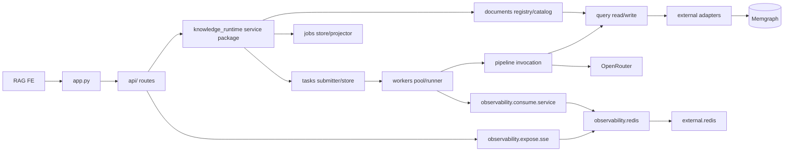

# RAG Backend

FastAPI 기반 RAG backend입니다. 문서 작업 API, external read-only MCP endpoint, internal agentic pipeline, Memgraph query business logic을 포함합니다.

## Runtime

- Python 3.13
- FastAPI
- FastMCP / MCP Streamable HTTP
- LangGraph pipeline for agentic ingest
- LangChain tools for internal graph ingest subagents
- OpenRouter-compatible LangChain chat/embedding clients via `src/external/openrouter/`
- Memgraph via Neo4j-compatible Bolt driver
- Pydantic / pydantic-settings

## Layout

```text
be/
├── src/app.py                  # FastAPI bootstrap and MCP mount
├── src/api/                    # MCP, document command, and FE operations API surfaces
├── src/knowledge_runtime/      # API-facing business/runtime layer, jobs, tasks, workers
├── src/observability/          # logging, Redis job event publisher/reader, and SSE helpers
├── src/pipeline/               # LangGraph ingest pipeline, subagents, and service nodes
├── src/external/memgraph/      # Pure Memgraph Bolt adapter
├── src/external/openrouter/    # OpenRouter chat and embedding client adapters
├── src/external/redis/         # Redis client adapter for observability streams
├── src/query/                  # Memgraph read/write query functions
├── src/tools/                  # Singleton LangChain tools and context binding
├── src/settings.py             # Environment settings
├── tests/
├── .env.example
├── pyproject.toml
└── uv.lock
```

## Run

```bash
uv sync
PYTHONPATH=src uv run uvicorn app:app --host 127.0.0.1 --port 8010
```

## API

API code is split by boundary:

- `src/api/mcp/`: external read-only MCP server.
- `src/api/ingest/`: document job creation, worker task submission, and review decisions.
- `src/api/operations/`: FE operations endpoints for status, documents, and search.

- `GET /health`
- `GET /api/system/dependencies`
- `POST /ingest`
- `GET /ingest/status/{job_id}`
- `POST /search`
- `POST /api/ingest/jobs`
- `POST /api/ingest/debug/chunking-preview` (development preview: store document, run through `chunking_agent`, return transcript events)
- `GET /api/ingest/jobs/{job_id}`
- `POST /api/ingest/jobs/{job_id}/start` (idempotent manual/fallback construction dispatch)
- `GET /api/documents`
- `POST /api/documents/search`
- `GET /api/review/edge-candidates`
- `POST /api/review/edge-candidates/{candidate_id}/decision`

Ingest job responses include an optional `current_task` snapshot with `task_id`,
`kind`, `status`, `idempotency_key`, timestamps, and `error`. FE uses this with
`job_id` to track queued/running worker execution without a separate operation id.

## Query Layer

`src/query/` is a direct function layer over Memgraph query primitives. It does
not contain prompt text, MCP instructions, repository abstractions, or a service
singleton.

- `src/query/read/`: raw read Cypher, schema reads, text search, vector search,
  bounded graph traversal, and document lookup by id.
- `src/query/write/`: raw write Cypher and deterministic original-document
  registration.
- `src/external/memgraph/`: pure Memgraph Bolt driver lifecycle and result
  serialization.

## MCP

External read-only MCP endpoint:

```text
http://127.0.0.1:8010/mcp/
```

루트 통합 Docker Compose에서는 컨테이너 내부 endpoint가
`http://rag-be:8010/mcp/`이고, host publish는 기본 `http://127.0.0.1:8110`이다.

### MCP Server Settings

MCP는 FastAPI app 안에 FastMCP Streamable HTTP ASGI app으로 mount된다.

```bash
cd rag/be
uv sync
PYTHONPATH=src uv run uvicorn app:app --host 127.0.0.1 --port 8010
```

`.env`에서 조정하는 주요 값:

| env | default | description |
| --- | --- | --- |
| `RAG_MCP_HOST` | `127.0.0.1` | FastAPI/MCP server bind host |
| `RAG_MCP_PORT` | `8010` | FastAPI/MCP server port |
| `RAG_EXTERNAL_MCP_PATH` | `/mcp` | mounted Streamable HTTP MCP path |
| `RAG_OBSERVABILITY_STREAM_PREFIX` | `rag:observability:jobs` | Redis Stream key prefix for job event logs |
| `RAG_OBSERVABILITY_STREAM_MAXLEN` | `2000` | approximate max events retained per job stream |
| `RAG_OBSERVABILITY_STREAM_TTL_SECONDS` | `3600` | Redis TTL refreshed on each job event; `0` disables expiry |
| `RAG_QUERY_MAX_ROWS` | `100` | MCP `memgraph.read_query` default/max row bound |
| `RAG_QUERY_TIMEOUT_MS` | `30000` | query timeout budget documented for callers |
| `RAG_GRAPH_LLM_MODEL` | `openai/gpt-oss-120b` | OpenRouter model used by graph agents |
| `RAG_GRAPH_LLM_PROVIDER` | `groq` | optional preferred OpenRouter provider slug; leave empty for model-compatible routing |
| `RAG_GRAPH_LLM_PROVIDER_ALLOW_FALLBACKS` | `true` | allow OpenRouter to fall back when the preferred provider fails |
| `RAG_GRAPH_LLM_RETRY_WITHOUT_PROVIDER` | `true` | retry chunking once without provider pinning when the preferred route returns no DB writes |
| `RAG_GRAPH_LLM_REQUEST_TIMEOUT_SECONDS` | `60` | OpenRouter request/connect timeout for graph agent calls |
| `RAG_GRAPH_LLM_STREAM_CHUNK_TIMEOUT_SECONDS` | `60` | max wait between streamed model/tool events before treating the provider route as stalled |
| `RAG_GRAPH_LLM_MAX_RETRIES` | `2` | LangChain/OpenAI transport retry count per provider route |
| `RAG_GRAPH_CANDIDATE_WORKER_COUNT` | `8` | concurrent chunk-level graph candidate agent runs per build job, bounded by chunk count |
| `RAG_KNOWLEDGE_BUILD_WORKER_COUNT` | `1` | build worker lane size |
| `RAG_KNOWLEDGE_REVIEW_WORKER_COUNT` | `1` | review worker lane size |
| `RAG_KNOWLEDGE_TASK_QUEUE_MAX_SIZE` | `100` | bounded queue size per task lane |

Docker network에서 MCP client가 `http://rag-be:8010/mcp/`처럼 서비스명으로
접속하려면 `RAG_MCP_HOST=0.0.0.0`을 사용한다. FastMCP는 host가
`127.0.0.1`이면 DNS rebinding protection을 자동 활성화해서
`Host: rag-be:8010` 요청을 거부할 수 있다.

External MCP tools:

- `memgraph.read_query`
- `memgraph.vector_search`
- `memgraph.text_index_search`
- `memgraph.graph_traverse`
- `memgraph.schema_read`

MCP only exposes read tools. Internal ingest subagents import singleton
read/write tools from `src/tools/`; runtime context is bound in-process and is
not part of the LLM-facing tool schema.

`memgraph.read_query` is wrapped at the MCP layer before it calls
`query.read.core.read_query()`. The core query primitive stays reusable for
internal code, while the external MCP wrapper rejects write-capable Cypher
operations and always passes a bounded `max_rows` value.

### MCP Tool Args

| tool | args |
| --- | --- |
| `memgraph.read_query` | `query: str`, `parameters: dict \| null = null`, `max_rows: int \| null = null` |
| `memgraph.schema_read` | none |
| `memgraph.text_index_search` | `keyword: str`, `top_k: int = 20`, `index_name: str \| null = null`. Requires a Memgraph text index; use `memgraph.read_query` with `CONTAINS` for ad hoc substring scans. |
| `memgraph.vector_search` | `index_name: str`, `embedding: list[float]`, `top_k: int = 5` |
| `memgraph.graph_traverse` | `node_id: str`, `id_property: str = "id"`, `max_depth: int = 2`, `max_rows: int = 50` |

Denied `memgraph.read_query` operations include `CREATE`, `MERGE`, `SET`,
`DELETE`, `DETACH`, `REMOVE`, `DROP`, `ALTER`, `RENAME`, `GRANT`, `DENY`,
`REVOKE`, `FOREACH`, `LOAD CSV`, and known write-capable procedure families.

### Connect To A Running MCP Server

For MCP clients that support Streamable HTTP, point the client at:

```text
http://127.0.0.1:8010/mcp/
```

Example Python MCP SDK smoke check:

```python
import anyio

from mcp import ClientSession
from mcp.client.streamable_http import streamable_http_client


async def main() -> None:
    async with streamable_http_client("http://127.0.0.1:8010/mcp/") as (
        read_stream,
        write_stream,
        _get_session_id,
    ):
        async with ClientSession(read_stream, write_stream) as session:
            await session.initialize()
            tools = await session.list_tools()
            print([tool.name for tool in tools.tools])

            result = await session.call_tool(
                "memgraph.read_query",
                {
                    "query": "MATCH (n) RETURN n",
                    "max_rows": 5,
                },
            )
            print(result)


anyio.run(main)
```

## Knowledge Runtime Flow

1. API receives text/file input.
2. `src/knowledge_runtime/` stores the original document and creates a job with `document_id`.
3. Document add immediately queues a `build:{job_id}` task and returns job status with `current_task`.
4. The build worker lane invokes the existing pipeline facade with `job_id` and `document_id`.
5. `chunking_agent` writes chunks through `write_chunk_tool`; `graph_candidate_agent` writes relationship candidates through `write_relationship_candidate_tool`.
6. Deterministic services persist embeddings, progress, review status, reviewer notes, and approved actual edge materialization.
7. Review APIs queue `review:{job_id}:{candidate_id}` tasks on the review lane and return the enclosing job status with `current_task`.

For chunking-agent inspection, `POST /api/ingest/debug/chunking-preview` stores the
document in Memgraph and runs only `document_load_service -> chunking_agent`. It
does not enqueue the full construction worker task. The response includes
`document_id`, DB-generated `chunk_ids`, chunk summaries, and transcript events
captured from the agent event stream.

## Component Flow



## Environment

- Example file: `.env.example`
- Local file: `.env` (do not commit)
- Settings prefix: `RAG_`
- Text search indexes are configured with `RAG_TEXT_SEARCH_INDEX_NAME`, `RAG_DOCUMENT_TEXT_SEARCH_INDEX_NAME`, and `RAG_REVIEW_NOTE_TEXT_SEARCH_INDEX_NAME`.
- Structured logs use Loguru. `RAG_LOG_JSON=true` emits JSON logs to stderr.

## Checks

```bash
PYTHONPATH=src uv run python -m unittest discover -s tests
PYTHONPATH=src uv run python -m compileall src tests
```
