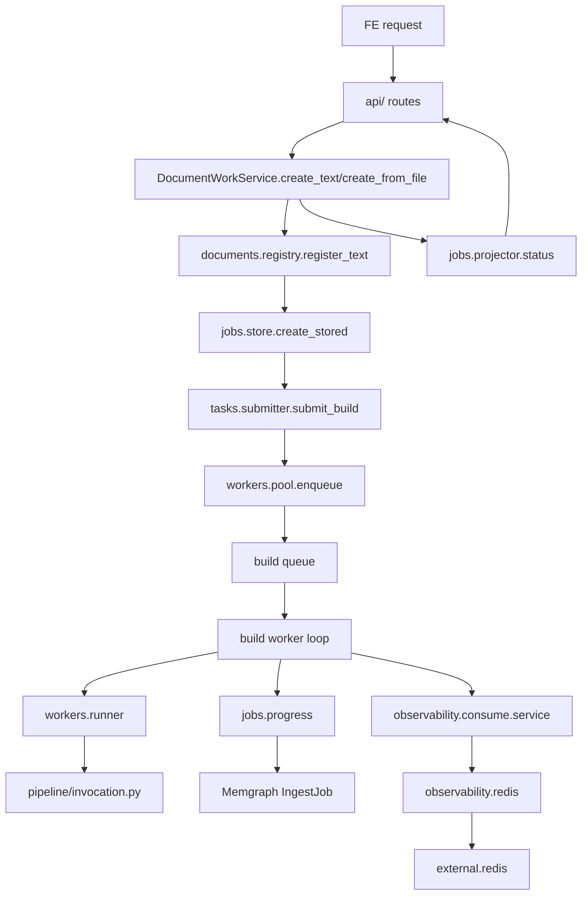
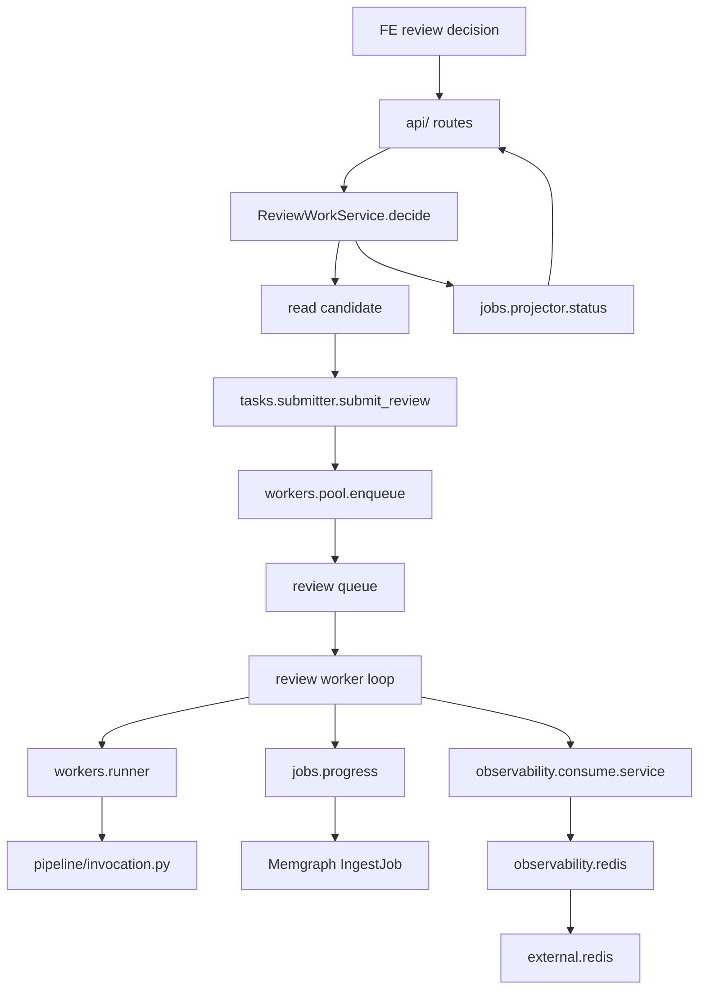
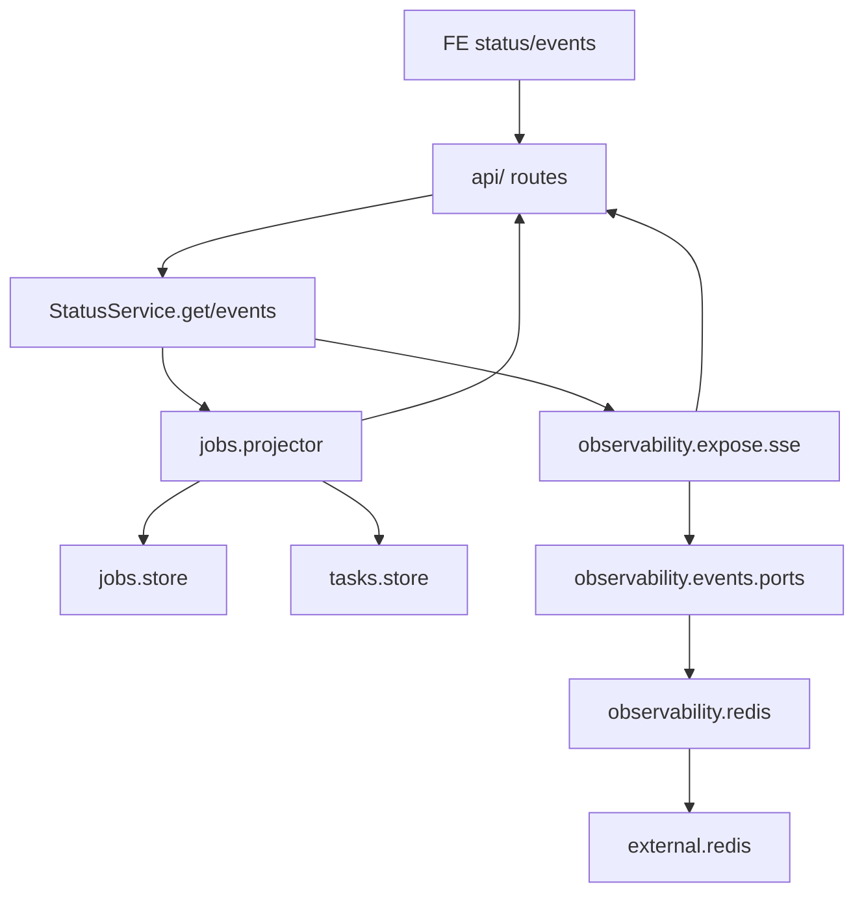

# Knowledge Runtime

`knowledge_runtime/` is the business/runtime boundary between FastAPI routes and
the agent pipeline. It owns the work lifecycle that turns an uploaded document
into knowledge-base changes and exposes the state FE needs to render progress.

This package intentionally avoids the old broad service boundary. Routes should
call this package, and this package should call `pipeline/`, `query/`, and
`external/` through narrow adapters.

## Responsibility

- Accept document work requests from API routes through one facade.
- Register original documents before background work starts.
- Create and project job status for FE.
- Submit idempotent background tasks inside a job.
- Run separate worker lanes for `build` and `review`.
- Publish task lifecycle and worker metrics through the global `observability/`
  service.
- Call `pipeline/invocation.py` from worker code only.

## Not Responsibility

- No FastAPI route definitions.
- No Redis client or SSE implementation; those live in global `observability/`
  and `external/redis/`.
- No agent prompt or pipeline node ownership.
- No direct database driver lifecycle.
- No tool schema ownership.

## Directory Map

```text
knowledge_runtime/
├── service/            # API-facing use-case services
│   ├── runtime.py      # service composition root and worker lifecycle facade
│   ├── documents.py    # document work commands
│   ├── reviews.py      # candidate review decisions
│   ├── status.py       # job status and event stream access
│   ├── catalog.py      # document list/search access
│   └── system.py       # dependency/runtime summary
├── schemas.py          # FE/API DTOs owned by this boundary
├── documents/
│   ├── registry.py     # original document registration
│   └── catalog.py      # document list/search projection
├── jobs/
│   ├── models.py       # job status models
│   ├── store.py        # job state projection access
│   ├── progress.py     # graph result -> persisted job progress modifier
│   └── projector.py    # merge DB progress and task state for FE
├── tasks/
│   ├── models.py       # task kind/status models
│   ├── store.py        # in-memory task state and idempotency
│   └── submitter.py    # submit build/review work to queues
├── workers/
│   ├── pool.py         # build/review worker lane lifecycle
│   └── runner.py       # adapter that invokes pipeline code
```

Job event streaming and process logging are cross-cutting concerns under
`src/observability/`, not a private `knowledge_runtime` subpackage.

## Use Cases

`service/`는 endpoint 이름을 그대로 받아 적는 곳이 아니라, API 요청이 들어왔을
때 runtime이 수행해야 하는 use case를 나눠 갖는 곳이다.

| Use case | Public service method | What it does |
| --- | --- | --- |
| Create document work from text | `service.documents.DocumentWorkService.create_text()` | `job_id`를 만들고 원문 document를 저장한 뒤 `build` task를 queue에 넣는다. |
| Create document work from stored file | `service.documents.DocumentWorkService.create_from_file()` | backend file path를 검증하고 원문 document를 저장한 뒤 `build` task를 queue에 넣는다. |
| Manual build dispatch | `service.documents.DocumentWorkService.start_build()` | 이미 만들어진 job의 `document_id`로 `build:{job_id}` task를 idempotent submit한다. |
| List/search documents | `service.catalog.CatalogService` | FE document list/search projection을 반환한다. |
| Submit candidate decision | `service.reviews.ReviewWorkService.decide()` | candidate에서 `job_id`를 읽고 `review:{job_id}:{candidate_id}` task를 queue에 넣는다. |
| Read job status | `service.status.StatusService.get()` | stored job progress와 current task snapshot을 합쳐 반환한다. |
| Stream job events | `service.status.StatusService.events()` | job-scoped SSE stream을 연다. |
| Dependency summary | `service.system.SystemService.dependency_summary()` | FE/system page용 runtime dependency 정보를 반환한다. |

## Queue And Worker Code

Queue append와 worker 병렬 실행은 아래 파일에 있다.

```text
service/documents.py
  create_text/create_from_file/start_build
    -> TaskSubmitter.submit_build(...)

service/reviews.py
  decide
    -> TaskSubmitter.submit_review(...)

tasks/submitter.py
  submit_build / submit_review
    -> TaskStore.submit(...)          # task_id 생성 + idempotency dedupe
    -> WorkerPool.enqueue(task)       # queue append
    -> observer.lifecycle(...)        # task.queued event
    -> WorkerPool.publish_metrics(...)

workers/pool.py
  __init__
    -> asyncio.Queue per TaskKind     # build queue, review queue

  start
    -> asyncio.create_task(...)       # lane worker 개수만큼 병렬 worker 생성

  enqueue
    -> await queue.put(task)          # 실제 queue append 지점

  _worker_loop
    -> await queue.get()              # free worker가 task를 가져감
    -> _run_task(task)

  _run_task
    -> mark task running
    -> observer.lifecycle(...)
    -> PipelineRunner.run(task)
    -> JobProgressModifier.apply_task_result(...)
    -> mark task succeeded/failed
    -> observer.lifecycle(...)
    -> observer.worker_metrics(...)

workers/runner.py
  run
    -> asyncio.to_thread(...)         # sync pipeline call을 worker thread로 넘김
```

`build` lane과 `review` lane은 서로 다른 queue를 가진다. `WorkerPool.start()`는
각 lane마다 설정된 worker 수만큼 `asyncio.create_task()`를 만들기 때문에, 같은
lane 안에서는 worker 수만큼 병렬로 `queue.get()`을 기다리고, 서로 다른 lane은
서로 막지 않는다.

## Flow Diagrams

### Create Document Work



### Submit Review Decision



### Read Status / Events



## Naming

- Package, file, and class names in this boundary should use
  `knowledge_runtime`, `document`, `job`, `task`, `worker`, `build`, and
  `review`.
- Task kinds are `build` and `review`.
- `job_id` identifies the whole document knowledge-building workflow.
- `task_id` identifies one background execution inside the job.
- Do not add a separate `operation_id`.

## Worker Model

The first runtime uses in-process async queues:

- `build` lane: one worker by default.
- `review` lane: two workers by default.
- Queue size comes from settings.
- Blocking pipeline calls should be wrapped in `asyncio.to_thread()` from the
  worker runner.

If durable replay or multi-process workers become required, the queue adapter
can move behind `tasks.submitter` and `workers.pool` without changing API routes.

## Observability Boundary

Worker code does not import Redis directly. It calls the global observer:

```python
await observer.lifecycle(...)
await observer.worker_metrics(...)
```

The global `observability/` package owns Redis Streams, SSE serialization, and
the event envelope. Pipeline nodes and agent transcript code should consume
`observability.consume.service`; API/status routes should expose streams through
`observability.expose.sse`. Neither side imports the Redis client directly.
