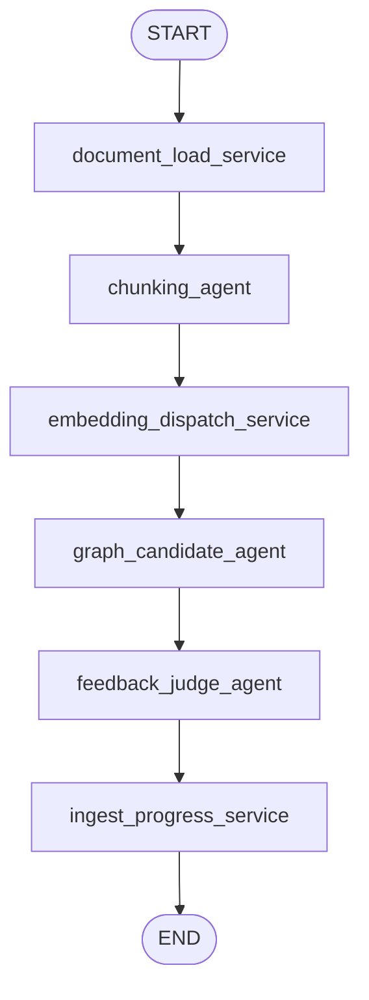
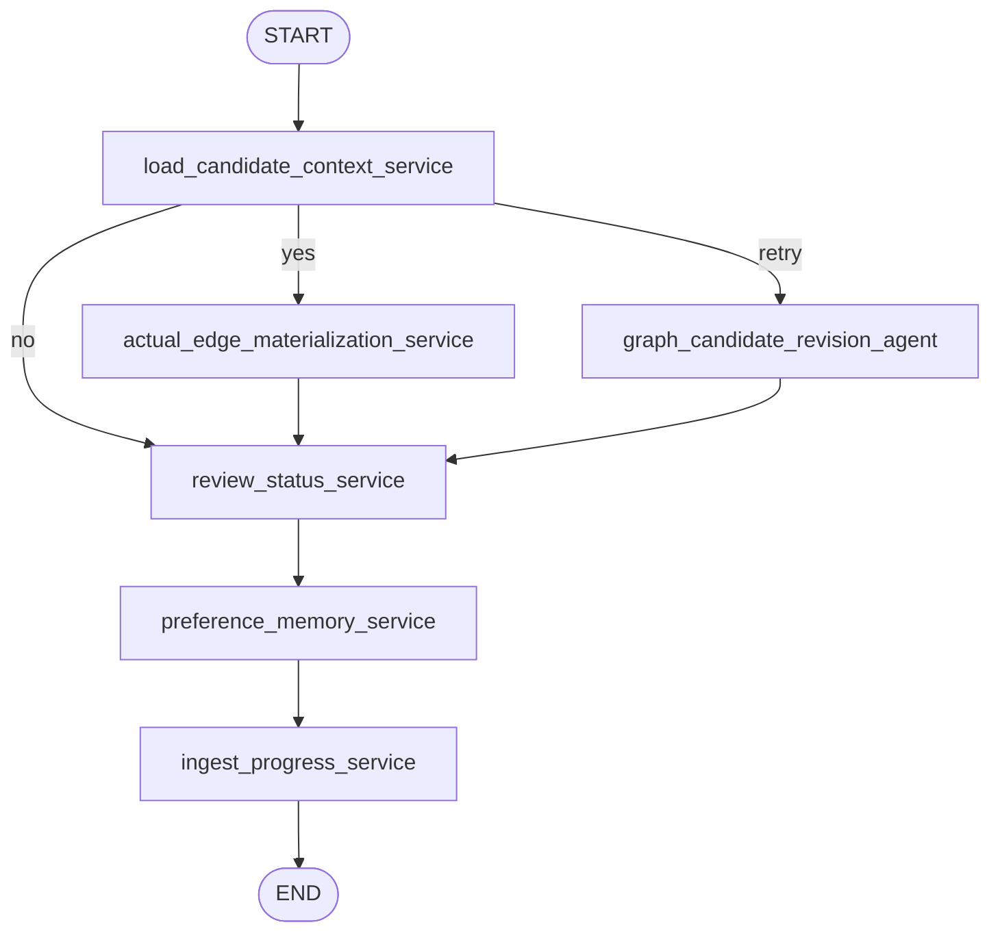

# Pipeline

`pipeline/`은 RAG backend 안에서 문서가 Memgraph knowledge graph로 편입되는
LangGraph 실행 흐름을 담는다. HTTP API, MCP 노출, Memgraph client adapter와는
분리되어 있으며, 여기서는 이미 등록된 `document_id`와 `job_id`를 받아 graph
construction 또는 review decision 흐름을 실행한다.

## 책임 한도

- LangGraph graph 정의와 node routing을 담당한다.
- document construction graph와 candidate review graph를 분리해서 실행한다.
- sub-agent 호출 순서와 service node 호출 순서를 정의한다.
- graph state는 id 중심으로 유지한다.
- pipeline 결과와 phase를 ingestion layer에 반환한다.

## 하지 않는 것

- HTTP endpoint를 만들지 않는다.
- MCP server를 만들지 않는다.
- Memgraph driver를 직접 생성하지 않는다.
- OpenRouter client factory를 직접 소유하지 않는다.
- DB storage schema의 원본 정의를 소유하지 않는다.
- agent tool argument schema를 소유하지 않는다.
- raw document, full chunk object, full candidate object를 shared graph state에
  계속 들고 다니지 않는다.

## 진입점

- `GraphIngestInvocation.start_construction(job_id, document_id)`
  - 새 문서가 DB에 등록된 뒤 graph construction을 시작한다.
  - 호출 위치는 `ingestion/dispatcher.py`이다.
- `GraphIngestInvocation.apply_review_decision(candidate_id, action, reviewer, note)`
  - 사용자가 pending candidate에 대해 `yes`, `no`, `retry` 결정을 내렸을 때
    review graph에 decision을 적용한다.
  - 호출 위치는 `ingestion/dispatcher.py`이다.

## 디렉토리 역할

```text
pipeline/
├── invocation.py    # 두 LangGraph 실행 흐름을 호출하는 facade 진입점
├── graphs/          # 실제 LangGraph 정의
│   ├── document_construction_graph.py
│   └── candidate_review_graph.py
├── schemas.py       # transitional: pipeline 결과/phase와 일부 분리 예정 schema
├── state.py         # LangGraph state TypedDict
├── sub_agents/      # LLM이 판단하고 tool을 호출하는 agent node
└── services/        # deterministic DB write/read와 progress 기록을 수행하는 service node
```

`invocation.py`는 queue layer가 호출하는 public method만 제공한다. 실제 node 구성,
edge 정의, conditional route는 `graphs/` 아래 파일에 둔다.

`sub_agents/`는 LLM 판단이 필요한 작업을 담당한다. `services/`는 LLM 판단이
필요하지 않은 상태 변경, embedding 저장, 승인 edge materialization, ingest
progress 기록 같은 작업을 담당한다.

## 파일 역할

### `invocation.py`

`ingestion/dispatcher.py`가 호출하는 pipeline facade이다. construction graph와 review
graph 실행 method만 노출한다.

### `graphs/document_construction_graph.py`

새 document를 knowledge graph에 편입시키는 LangGraph를 정의한다. 입력은
`job_id`, `document_id`이다. 원문 document 등록은 이미 끝난 상태여야 한다.

### `graphs/candidate_review_graph.py`

사용자의 edge candidate review decision을 반영하는 LangGraph를 정의한다. 승인 시
actual edge materialization을 수행하고, 거절/재시도 시 candidate status와 reviewer
note를 반영한다.

### `state.py`

LangGraph shared state를 정의한다. construction state는 id 중심이어야 한다.
agent observation log, warnings/errors, raw document content는 이 state에 넣지 않는다.

### `schemas.py`

현재는 transitional file이다. pipeline phase/result DTO와 일부 DB entity schema가
섞여 있다. 다음 cleanup에서 DB storage schema는 `query/schema/`로 이동하고, 이 파일은
pipeline runtime result와 workflow enum만 남기거나 더 명확한 runtime module로 분리한다.

### `sub_agents/`

LLM이 판단하고 tool을 호출하는 agent node를 둔다. 각 agent는 자기 prompt와 사용할
tool list를 명확히 가진다. DB write가 필요한 경우 agent가 write-capable tool을
사용한다.

### `services/`

LLM 판단이 필요 없는 deterministic node를 둔다. 예를 들어 embedding dispatch,
approved candidate materialization, review status update, review note persistence,
ingest progress marker 같은 작업이다.

## Construction Graph

새 문서 ingest 후 graph에 추가하는 흐름이다. 이 graph는 `job_id`와
`document_id`만 받고 시작한다. 원문 문서 등록은 pipeline 바깥의
`ingestion/document_service.py`에서 이미 끝난 상태여야 한다.
구현 파일은 `graphs/document_construction_graph.py`이다.



### Construction Node

- `document_load_service`
  - `query.read.get_document_record(document_id)`로 `Document` 노드를 읽는다.
  - `query/schema`의 `DocumentNode`로 validation만 수행하고 raw document 객체는
    state에 싣지 않는다.
  - phase는 `DOCUMENT_REGISTERED`.

- `chunking_agent`
  - `document_id`를 받아 tool로 원문 문서를 읽고 semantic chunk를 만든다.
  - `check_document_unique_string_tool`로 start/end marker가 원문에서 unique한지 확인한다.
  - `write_chunk_tool`로 `Chunk` 노드와 `Document -> Chunk` edge를 저장한다.
  - state에는 생성된 `chunk_ids`만 남긴다.
  - phase는 `CHUNKED`.

- `embedding_dispatch_service`
  - `external.openrouter.create_openrouter_embeddings()`로 embedding client를 만든다.
  - `chunk_ids`로 DB에서 chunk를 다시 읽고 embedding metadata를 저장한다.
  - phase는 `EMBEDDING_DISPATCHED`.

- `graph_candidate_agent`
  - chunk id별로 Memgraph read tools를 사용해 기존 graph context를 탐색한다.
  - 필요하면 text search, vector search, graph traversal, raw read query를 조합한다.
  - `write_relationship_candidate_tool`로 edge candidate인 `RelationshipCandidate`를 저장한다.
  - state에는 생성된 `edge_candidate_ids`만 남긴다.
  - phase는 `CANDIDATES_GENERATED`.

- `feedback_judge_agent`
  - `job_id`, `document_id`, `chunk_ids`, `edge_candidate_ids` 기준으로 진행 가능 여부를 검사한다.
  - 내부 retry loop를 수행하지 않고, 부족하면 `NEEDS_RETRY` phase만 표시한다.
  - 재시도 정책은 API/ingestion layer 또는 별도 graph에서 다룬다.

- `ingest_progress_service`
  - 현재 phase, chunk count, edge candidate count를 `IngestJob`에 저장한다.
  - edge candidate가 있으면 결과 phase는 보통 `PENDING_REVIEW`가 된다.

## Review Graph

사용자가 `RelationshipCandidate`에 대해 승인, 거절, 재시도를 선택했을 때 실행된다.
construction graph와 분리되어 있으므로 UI는 pending review 상태에서 멈춘 뒤,
사용자 결정이 들어오면 이 graph를 별도로 호출한다.
구현 파일은 `graphs/candidate_review_graph.py`이다.



### Review Node

- `load_candidate_context_service`
  - `RelationshipCandidate` 노드를 `candidate_id`로 읽는다.
  - 사용자의 `ReviewAction` 값에 따라 `yes`, `no`, `retry`로 routing한다.

- `actual_edge_materialization_service`
  - `yes`인 경우 candidate의 `left_node`, `right_node`, `relationship_type`,
    `relationship_direction`을 사용해서 실제 graph edge를 만든다.
  - candidate status도 승인 상태로 갱신한다.

- `graph_candidate_revision_agent`
  - `retry`인 경우 기존 candidate, 사용자 note, 주변 graph context를 바탕으로
    revised candidate를 생성한다.
  - `write_candidate_revision_tool`로 새 candidate version을 저장한다.

- `review_status_service`
  - `yes`, `no`, `retry` 결과를 candidate status에 반영한다.
  - 승인 materialization 이후에도 review status를 한 번 더 정리한다.

- `preference_memory_service`
  - 사용자가 note를 남긴 경우 `RelationshipCandidate`에 붙는 `ReviewNote` 노드로
    저장한다.
  - 장기 memory layer는 이 note들을 별도 `memory_update_agent`가 필터링/요약해서
    `AgentMemory` node로 업데이트하는 방향이다.

- `ingest_progress_service`
  - review action 이후의 진행 상태를 `IngestJob`에 저장한다.

## State

Construction graph는 `GraphIngestState`를 사용한다.

- 필수 입력: `job_id`, `document_id`
- 주요 state: `chunk_ids`, `edge_candidate_ids`, `missing_chunk_ids`, `phase`
- state에는 raw document, chunk 객체 리스트, edge candidate 객체 리스트,
  feedback object, retry counter, warning/error log를 넣지 않는다.

Review graph는 `CandidateReviewActionState`를 사용한다.

- 필수 입력: `candidate_id`, `action`, `reviewer`
- 선택 입력: `note`
  - 주요 state: `candidate`, `edge_candidate_ids`, `phase`

## 현재 구현상 주의점

- `CHUNKS_STORED` phase enum은 남아 있지만 현재 graph에는 별도 node가 없다.
  chunk 저장은 `chunking_agent`가 `write_chunk_tool`을 호출하면서 수행한다.
- external MCP는 read-only이고, pipeline 내부 agent tool만 write query를 사용한다.
- OpenRouter chat/embedding client 생성은 `external/openrouter/`에 있다.
- Memgraph query는 `query/read`, `query/write` function을 직접 import해서 사용한다.
  `MemgraphQueryService` 같은 facade singleton은 사용하지 않는다.
