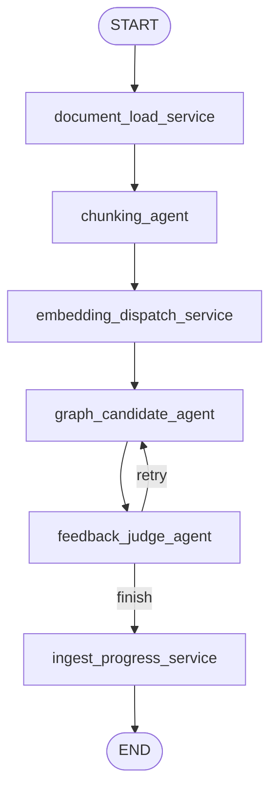

# Pipeline

`pipeline/`은 RAG backend 안에서 문서가 Memgraph knowledge graph로 편입되는
LangGraph 실행 흐름을 담는다. HTTP API, MCP 노출, Memgraph client adapter와는
분리되어 있으며, 여기서는 이미 등록된 `document_id`와 `job_id`를 받아 graph
construction 또는 review decision 흐름을 실행한다.

## 진입점

- `GraphIngestInvocation.start_construction(job_id, document_id)`
  - 새 문서가 DB에 등록된 뒤 graph construction을 시작한다.
  - 호출 위치는 `ingest_tasks/queue.py`이다.
- `GraphIngestInvocation.apply_review_decision(candidate_id, action, reviewer, note)`
  - 사용자가 pending candidate에 대해 `yes`, `no`, `retry` 결정을 내렸을 때
    review graph에 decision을 적용한다.
  - 호출 위치는 `ingest_tasks/queue.py`이다.

## 디렉토리 역할

```text
pipeline/
├── invocation.py    # 두 LangGraph 실행 흐름을 호출하는 facade 진입점
├── graphs/          # 실제 LangGraph 정의
│   ├── document_construction_graph.py
│   └── candidate_review_graph.py
├── schemas.py       # pipeline 입출력 모델과 phase enum
├── state.py         # LangGraph state TypedDict
├── sub_agents/      # LLM이 판단하고 tool을 호출하는 agent node
└── services/        # deterministic DB write/read와 progress 기록을 수행하는 service node
```

`invocation.py`는 queue layer가 호출하는 public method만 제공한다. 실제 node 구성,
edge 정의, conditional route는 `graphs/` 아래 파일에 둔다.

`sub_agents/`는 LLM 판단이 필요한 작업을 담당한다. `services/`는 LLM 판단이
필요하지 않은 상태 변경, embedding 저장, 승인 edge materialization, ingest
progress 기록 같은 작업을 담당한다.

## Construction Graph

새 문서 ingest 후 graph에 추가하는 흐름이다. 이 graph는 `job_id`와
`document_id`만 받고 시작한다. 원문 문서 등록은 pipeline 바깥의
`ingest_tasks/document_service.py`에서 이미 끝난 상태여야 한다.
구현 파일은 `graphs/document_construction_graph.py`이다.



### Construction Node

- `document_load_service`
  - `query.read.get_document_record(document_id)`로 `Document` 노드를 읽는다.
  - `RegisteredDocument`로 validation한 뒤 state에 `document`를 추가한다.
  - phase는 `DOCUMENT_REGISTERED`.

- `chunking_agent`
  - 원문 문서를 읽고 semantic chunk를 만든다.
  - `count_occurrences_tool`로 start/end marker가 원문에서 unique한지 확인한다.
  - `write_chunk_tool`로 `Chunk` 노드와 `Document -> Chunk` edge를 저장한다.
  - phase는 `CHUNKED`.

- `embedding_dispatch_service`
  - `external.openrouter.create_openrouter_embeddings()`로 embedding client를 만든다.
  - chunk text를 embedding하고 `Chunk` 노드에 embedding metadata를 저장한다.
  - phase는 `EMBEDDING_DISPATCHED`.

- `graph_candidate_agent`
  - chunk별로 Memgraph read tools를 사용해 기존 graph context를 탐색한다.
  - 필요하면 text search, vector search, graph traversal, raw read query를 조합한다.
  - `write_relationship_candidate_tool`로 `RelationshipCandidate`를 저장한다.
  - phase는 `CANDIDATES_GENERATED`.

- `feedback_judge_agent`
  - chunk coverage와 candidate 생성 상태를 검사한다.
  - `incomplete=True`이고 retry 횟수가 허용 범위 안이면 `graph_candidate_agent`로
    다시 보낸다.
  - retry가 끝났거나 충분하면 `ingest_progress_service`로 보낸다.

- `ingest_progress_service`
  - 현재 phase, chunk count, candidate count, warning/error를 `IngestJob`에 저장한다.
  - candidate가 있으면 결과 phase는 보통 `PENDING_REVIEW`가 된다.

## Review Graph

사용자가 `RelationshipCandidate`에 대해 승인, 거절, 재시도를 선택했을 때 실행된다.
construction graph와 분리되어 있으므로 UI는 pending review 상태에서 멈춘 뒤,
사용자 결정이 들어오면 이 graph를 별도로 호출한다.
구현 파일은 `graphs/candidate_review_graph.py`이다.


### Review Node

- `load_candidate_context_service`
  - `RelationshipCandidate` 노드를 `candidate_id`로 읽는다.
  - 사용자의 `ReviewAction` 값에 따라 `yes`, `no`, `retry`로 routing한다.

- `actual_edge_materialization_service`
  - `yes`인 경우 candidate의 `source_node`, `target_node`, `relationship_type`을
    사용해서 실제 graph edge를 만든다.
  - candidate status도 승인 상태로 갱신한다.

- `graph_candidate_revision_agent`
  - `retry`인 경우 기존 candidate, 사용자 note, 주변 graph context를 바탕으로
    revised candidate를 생성한다.
  - `write_candidate_revision_tool`로 새 candidate version을 저장한다.

- `review_status_service`
  - `yes`, `no`, `retry` 결과를 candidate status에 반영한다.
  - 승인 materialization 이후에도 review status를 한 번 더 정리한다.

- `preference_memory_service`
  - 사용자가 note를 남긴 경우 `ReviewNote` 노드로 저장한다.
  - 이 note는 이후 candidate generation/revision agent가 reviewer preference로
    참고할 수 있다.

- `ingest_progress_service`
  - review action 이후의 진행 상태를 `IngestJob`에 저장한다.

## State

Construction graph는 `GraphIngestState`를 사용한다.

- 필수 입력: `job_id`, `document_id`
- 주요 state: `document`, `chunks`, `candidates`, `feedback`, `phase`,
  `retry_count`, `warnings`, `errors`

Review graph는 `CandidateReviewActionState`를 사용한다.

- 필수 입력: `candidate_id`, `action`, `reviewer`
- 선택 입력: `note`
- 주요 state: `candidate`, `candidates`, `phase`, `warnings`, `errors`

## 현재 구현상 주의점

- `CHUNKS_STORED` phase enum은 남아 있지만 현재 graph에는 별도 node가 없다.
  chunk 저장은 `chunking_agent`가 `write_chunk_tool`을 호출하면서 수행한다.
- external MCP는 read-only이고, pipeline 내부 agent tool만 write query를 사용한다.
- OpenRouter chat/embedding client 생성은 `external/openrouter/`에 있다.
- Memgraph query는 `query/read`, `query/write` function을 직접 import해서 사용한다.
  `MemgraphQueryService` 같은 facade singleton은 사용하지 않는다.
