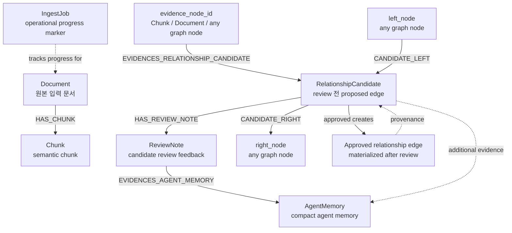

# Query Schema

`query/schema/`는 Memgraph에 저장되는 node와 relationship의 storage contract를
정의하는 위치이다. 이 디렉토리는 database schema의 기준점이다.

## 책임 한도

- Memgraph node label별 property contract 정의.
- relationship type과 relationship property contract 정의.
- database-generated id와 agent-provided semantic field의 경계 정의.
- query/write와 tool adapter가 공유할 storage 기준 제공.

## 하지 않는 것

- LangChain tool argument schema를 직접 소유하지 않는다.
- agent prompt를 두지 않는다.
- FastAPI request/response DTO를 두지 않는다.
- LangGraph state를 두지 않는다.
- Memgraph query를 실행하지 않는다.

## 대상 Storage Contract

초기 대상은 다음 graph object이다.

- `Document`: 최초 업로드된 원문 document node.
- `Chunk`: document에서 agent가 생성한 semantic chunk node.
- `RelationshipCandidate` 또는 `EdgeCandidate`: user review 전 단계의 proposed edge
  candidate node.
- `ReviewNote`: 특정 `RelationshipCandidate` review에 붙는 user approval/rejection/retry
  note. 독립 knowledge node가 아니라 `RelationshipCandidate -[:HAS_REVIEW_NOTE]->
  ReviewNote` 형태의 review artifact node이다.
- `AgentMemory`: review note와 candidate feedback을 근거로 memory update agent가 만든
  compact memory node. semantic knowledge graph의 지식 노드가 아니라 agent가 다음
  판단에서 참고할 memory artifact이다.
- `IngestJob`: document ingest와 graph construction progress marker. semantic knowledge
  graph가 아니라 pipeline 상태 조회를 위한 operational node이다.
- materialized edge metadata: approved candidate가 실제 edge로 반영될 때 남기는
  provenance property.

## Schema Relationship

현재 의도한 storage relationship은 다음과 같다.



주의할 점:

- `RelationshipCandidate`의 `left_node/right_node`는 candidate endpoint이고,
  `evidence_node_id`는 optional grounding/provenance anchor이다. 다른 문서나 chunk가
  두 endpoint 사이의 관계를 언급할 때만 별도로 사용한다.
- `RelationshipCandidate.job_id`는 이 candidate가 어떤 document ingest run에서
  생성됐는지 묶는 runtime provenance field이다. semantic knowledge property가 아니다.
- `RelationshipCandidate.previous_candidate_id`는 retry/revision flow에서 원본 candidate와
  새 candidate version을 연결하기 위한 review workflow property이다.
- `RelationshipCandidate.status`는 `pending_review`, `approved`, `rejected`, `retry`
  중 하나만 허용한다.
- `ReviewNote`는 `RelationshipCandidate` review에 붙는 event성 artifact이다.
- `AgentMemory`는 semantic KG 지식 노드가 아니라, review feedback을 압축한 agent용
  memory artifact이다.
- `IngestJob`은 FE와 worker가 진행 상태를 확인하기 위한 operational node이다.

## Id Ownership

database technical id는 agent가 직접 만들지 않는다.

- document id는 최초 document registration 단계에서 생성하거나 할당한다.
- chunk id는 chunk write tool/database layer가 저장 시 생성하고 결과로 반환한다.
- edge candidate id는 candidate write tool/database layer가 저장 시 생성하고 결과로
  반환한다.
- job id는 ingestion worker/pipeline boundary의 값이며 tool schema에 숨겨 넣지 않는다.

## Tool Schema와 관계

tool schema는 `tools/` 안의 각 tool 파일에 둔다. 그러나 tool schema는 이 DB schema의
agent-write subset으로 유지한다.

예를 들어 `Chunk` storage schema에 `id`, `embedding`, `embedding_model`이 있더라도,
`chunking_agent`가 호출하는 write tool schema는 chunk text와 boundary marker 같은
agent가 판단할 수 있는 필드만 받아야 한다.

## Review Note와 Memory Layer

`ReviewNote`는 먼저 relationship candidate에 대한 개별 reviewer feedback으로 저장한다.
장기 memory layer는 `ReviewNote`를 직접 전부 context에 넣는 방식이 아니라, 별도
`memory_update_agent`가 review note를 필터링하고 요약해서 `AgentMemory` node를
업데이트하는 방식으로 둔다.

권장 방향:

- `ReviewNote`: 원본 reviewer feedback event.
- `AgentMemory`: 반복되는 사용자 선호, 거절 패턴, 승인 기준, 법령 계층 해석 규칙을
  누적한 compact memory.
- candidate generation/revision agent: 원본 note 전체가 아니라 compact memory를 먼저
  읽고, 필요한 경우 관련 note만 추가 조회한다.

## 전체 플로우에서 위치

```text
query/schema
  -> query/write serialization 기준
  -> tools/* tool schema adapter 기준
  -> pipeline/services validation 기준
```

`nodes.py`는 `Document`, `Chunk`처럼 graph content node storage contract를 담는다.
`review.py`는 `RelationshipCandidate`, `ReviewNote`처럼 실제 DB node이지만 semantic
content node가 아니라 review workflow artifact인 storage contract를 담는다.
`memory.py`는 `AgentMemory`처럼 agent가 참고하는 compact memory artifact contract를
담는다.
`runtime.py`는 `IngestJob`처럼 pipeline 실행 상태를 저장하는 operational node contract를
담는다. relationship type 상수나 relationship property contract가 필요해지면 이
디렉토리 안에서 파일을 분리한다.
