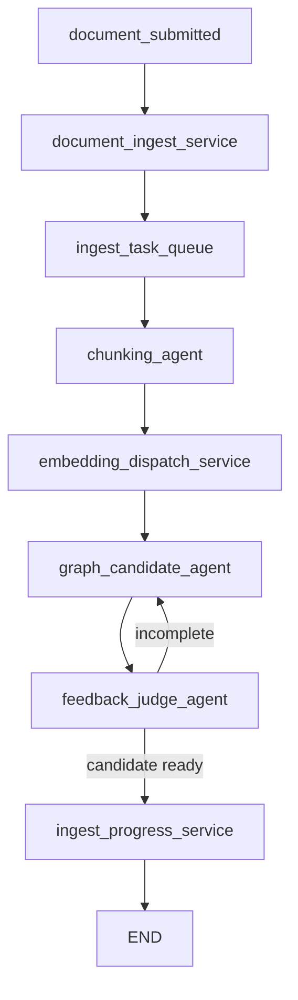
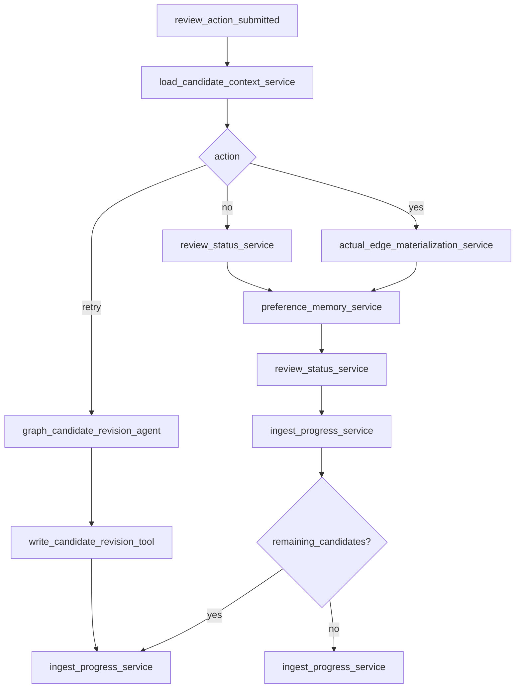
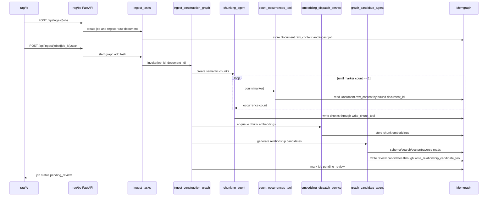
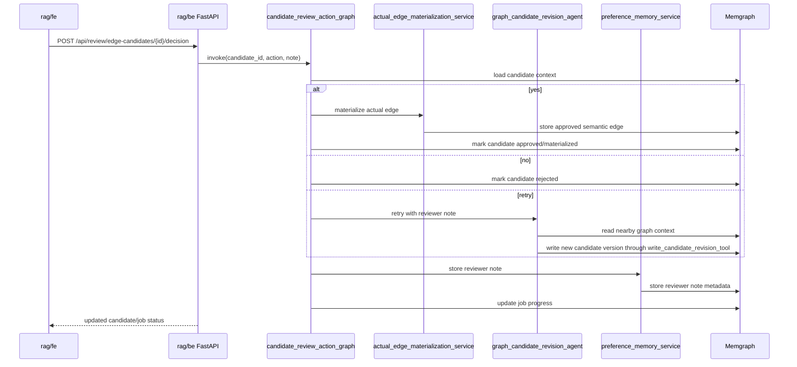

# Agentic Document Ingest Flow PRD

## 1. Executive Summary

### Problem Statement

The current RAG ingest layer mostly stores documents and reports status. It does
not yet define the agentic workflow that places a new public text document into
the existing Memgraph knowledge graph.

Legal and welfare documents need hierarchy-aware graph construction. Laws,
ordinances, enforcement rules, regional scope, effective dates, eligibility
conditions, and reviewer feedback must remain traceable to the original source
text and must improve future ingest runs.

### Proposed Solution

`rag/be` will host a LangGraph-based agentic ingest flow with two separate graph
executions:

- `ingest_construction_graph`: registers a document, runs LLM chunking, verifies
  source markers, creates embeddings, generates relationship candidates, runs a
  feedback judge, writes pending review state, and terminates.
- `candidate_review_action_graph`: starts only after the UI submits yes/no/retry
  plus an optional reviewer note. It materializes approved edges, records
  rejection/retry status, writes reviewer notes, and invokes candidate revision
  when needed.

The flow does not block a server process while waiting for human input. It stores
durable pending-review state and resumes through a later API call.

### Success Criteria

- New document ingest stores `Document.raw_content`, `document_id`,
  `entry_number`, `document_version`, and `content_hash` deterministically.
- `chunking_agent` creates chunks copied from source text and verifies
  `start_unique_string` and `end_unique_string` through repeated
  `count_occurrences_tool` calls.
- `chunking_agent` writes chunk records through `write_chunk_tool`.
- Chunk embeddings use OpenRouter embeddings with `openai/text-embedding-3-large`
  by default and are processed asynchronously with worker pool size 5.
- `graph_candidate_agent` probes the existing graph with agent-facing query tools
  and writes every relationship candidate through `write_relationship_candidate_tool`.
- Reviewers can submit yes/no/retry and optional notes for each candidate.
- Only approved candidates become actual semantic graph edges.

## 2. User Experience & Functionality

### User Personas

- RAG operator: adds public text documents and reviews graph connection
  candidates.
- Graph quality reviewer: reads evidence and rationale, then submits yes/no/retry
  and optional notes.
- Backend agent developer: keeps ingest-time internal write tools separate from
  external read-only MCP tools.
- End user: later receives answers grounded in approved graph edges and source
  chunks.

### User Stories

#### Story 1: Deterministic Document Registration

As a RAG operator, I want every uploaded document to receive stable identifiers
and a version so that graph updates can be traced back to the exact raw document.

Acceptance Criteria:

- `document_ingest_service` handles document registration, not an LLM agent.
- `document_id` is UUID-based.
- `entry_number` is a human-readable monotonic number or database-sequence-like
  value.
- `document_version` increments when the same source document changes and is
  ingested again.
- `content_hash` is a SHA-256 fingerprint of normalized raw content.
- MVP stores long documents directly in `Document.raw_content`.
- The content hash is used for duplicate ingest detection, change detection, and
  embedding/cache reuse decisions.

#### Story 2: Agentic Chunking With Unique Boundary Markers

As a graph construction system, I want chunks to be locatable in the original
document so that every graph candidate has auditable evidence.

Acceptance Criteria:

- `chunking_agent` reads the full raw document and creates semantic chunks.
- Chunk text must be copied from the original text, not paraphrased or
  summarized.
- `chunking_agent` assigns chunk tags, summary, and boundary rationale.
- Chunk location is represented by `start_unique_string` and
  `end_unique_string`.
- `count_occurrences_tool(document_id, text)` returns only the occurrence count
  in `Document.raw_content`.
- To find the start marker, the agent starts from the first word/token of the
  chunk and expands until the count is 1.
- To find the end marker, the agent starts from the last word/token of the chunk
  and expands backward until the count is 1.
- If a marker is not unique, the agent extends the marker and calls the tool
  again.
- `chunking_agent` persists the generated chunk through `write_chunk_tool`; there
  is no separate chunk persistence service for agent-generated chunks.

#### Story 3: Async Embedding

As an ingest system, I want chunk embeddings to be created asynchronously so that
graph construction can scale without blocking a request.

Acceptance Criteria:

- `embedding_dispatch_service` manages the embedding queue.
- Default worker pool size is 5.
- Default embedding model is `openai/text-embedding-3-large`.
- Default embedding dimension is 3072 and must match the Memgraph vector index.
- Each chunk records embedding status, model, dimensions, and created time.
- Failed embedding tasks remain retryable.

#### Story 4: Candidate Generation Without Confidence Hiding

As a reviewer, I want to see all proposed relationship candidates so that I make
the final decision directly.

Acceptance Criteria:

- `graph_candidate_agent` does not hide candidates by confidence/ranking.
- Confidence may be stored only as non-authoritative agent metadata.
- Every candidate includes source/target context, relationship type,
  source chunk, evidence text, and rationale.
- Candidates are review metadata, not actual graph facts.
- Source document-to-chunk system relationships may be created automatically.
- Semantic relationship candidates are not materialized as actual edges before
  reviewer approval.

#### Story 5: Human Review as Two-Part Execution

As a RAG operator, I want the system to stop at pending review and resume only
after UI action so that human review does not block a long-running process.

Acceptance Criteria:

- `ingest_construction_graph` stores pending-review state and terminates.
- The UI lists pending candidates.
- Reviewers can choose yes/no/retry and add an optional note.
- Yes materializes an approved semantic edge and keeps candidate provenance.
- No marks the candidate rejected.
- Retry invokes `candidate_review_action_graph`; candidate rewriting is done by
  `graph_candidate_revision_agent`.
- Human review uses durable state plus resume invocation, not an indefinitely
  waiting process.

#### Story 6: Reviewer Note as Preference Memory

As a graph quality reviewer, I want to leave notes on candidates so that future
agent runs can use my preferences as prompt context.

Acceptance Criteria:

- Each candidate may store an optional reviewer note.
- Notes can be saved on approve, reject, or retry.
- Notes are linked to candidate, document version, relationship type, source and
  target context, region, and legal hierarchy context where possible.
- Future ingest/retry retrieves relevant notes as lightweight prompt memory.
- This is not model fine-tuning.

### Non-Goals

- This PRD does not redefine the external read-only MCP server contract.
- This PRD does not change root `frontend/` or main `backend/` chat runtime.
- MVP does not implement PDF/OCR/VLM ingestion.
- MVP does not auto-approve semantic edges by confidence.
- MVP does not hide candidates by ranking.
- MVP does not fine-tune a model using reviewer notes.

## 3. AI System Requirements

### Naming Rules

- Use `_agent` for LLM reasoning or autonomous tool use.
- Use `_service` for deterministic LangGraph nodes.
- Use `_tool` only for callable interfaces passed to agents.
- Use `_worker` only for background execution units that are not graph nodes.
- Use `_orchestrator` for graph assembly/execution management.

### LangGraph Agents

#### `chunking_agent`

Type: LLM agent

Responsibilities:

- Decide semantic chunk boundaries from full source text.
- Keep chunk text faithful to the source.
- Generate tags, summary, and boundary rationale.
- Use `count_occurrences_tool` until start/end markers are unique.
- Write chunks through `write_chunk_tool`.

Non-responsibilities:

- Semantic graph relationship judgment.
- Legal hierarchy reasoning.
- Actual edge materialization.

#### `graph_candidate_agent`

Type: LLM agent

Responsibilities:

- Read the new chunks and current graph schema.
- Probe Memgraph using allowed read/query tools.
- Generate all semantic relationship candidates.
- Write candidates through `write_relationship_candidate_tool`.
- Include evidence and rationale for each candidate.
- Avoid hiding candidates by ranking or confidence.

Tool budget:

- Default budget is 80 tool calls per chunk group.
- If the budget is exceeded or the agent stops early, `feedback_judge_agent`
  decides whether another run is needed.

#### `feedback_judge_agent`

Type: LLM judge agent

Responsibilities:

- Check chunk and candidate coverage.
- Detect candidates without evidence.
- Check whether `Law -> Ordinance -> EnforcementRule` direction is wrong.
- Decide whether the agent stopped early or completed enough work.
- Request another `graph_candidate_agent` run when incomplete.

#### `graph_candidate_revision_agent`

Type: LLM agent

Responsibilities:

- Reinterpret a candidate after retry action.
- Use reviewer note, original candidate, source chunk, and nearby graph context.
- Write a new candidate version through `write_candidate_revision_tool`.

### Deterministic Services

#### `document_ingest_service`

Type: deterministic ingest task service

Responsibilities:

- Generate `document_id` and `entry_number`.
- Determine document version.
- Store raw content and deterministic content fingerprint.
- Store source metadata and the initial ingest job.

#### `embedding_dispatch_service`

Type: deterministic LangGraph node

Responsibilities:

- Create embedding tasks.
- Dispatch work with default worker count 5.
- Manage retry/backoff policy.

#### `actual_edge_materialization_service`

Type: deterministic LangGraph node

Responsibilities:

- Materialize approved candidates as actual graph edges.
- Preserve provenance back to candidate, evidence, and reviewer decision.
- Keep candidates stored as approved/materialized metadata.

#### `preference_memory_service`

Type: deterministic LangGraph node

Responsibilities:

- Store reviewer notes.
- Link notes to document version, candidate, relation type, source/target
  context, region, and legal hierarchy context.
- Make relevant notes retrievable for retry and future ingest.

#### `review_status_service`

Type: deterministic LangGraph node

Responsibilities:

- Record candidate status transitions: pending, approved, rejected, retry.
- Keep reviewer action audit metadata.

#### `ingest_progress_service`

Type: deterministic LangGraph node

Responsibilities:

- Store ingest job phase and completion state.
- Track pending review, retry-needed, done, and failed states.

#### `ingest_graph_orchestrator`

Type: LangGraph orchestration layer

Responsibilities:

- Build `ingest_construction_graph` and `candidate_review_action_graph`.
- Build `AgentToolContext` and bind runtime context for singleton tools.
- Manage checkpointing, retries, termination, and pending-review transitions.

### Background Workers

#### `embedding_worker`

Type: background worker, not a LangGraph node

Responsibilities:

- Process tasks created by `embedding_dispatch_service`.
- Call OpenRouter embeddings API.
- Store embeddings and metadata on chunks.

### Agent Tools

Agent-facing tools are callable interfaces imported by agents. Query/search
business logic and return contracts are owned by `query/` and
`memgraph_mcp_graphrag_prd.md`; agent PRDs only define which agents receive which
tools.

Runtime context such as `job_id`, `document_id`, `chunk_id`, and `candidate_id`
is bound by the graph ingest runtime through `AgentToolContext`. These values must not
appear in LLM-facing tool schemas. `dry_run`, mock, preview, and no-op controls
must not appear in runtime agent tools.

#### `count_occurrences_tool`

Used by: `chunking_agent`

Responsibilities:

- Load source text by bound `document_id`.
- Count how many times an input string appears in `Document.raw_content`.
- Return the count only.

Non-responsibilities:

- Decide ambiguity.
- Generate retry instructions.
- Choose the marker.

#### `write_chunk_tool`

Used by: `chunking_agent`

Responsibilities:

- Write chunk records generated by the agent.
- Link chunks to the source document.
- Store chunk order, tags, summary, boundary rationale, and start/end markers.
- Use bound job/document context.

#### `get_reviewer_notes_tool`

Used by: `graph_candidate_agent`, `graph_candidate_revision_agent`

Responsibilities:

- Retrieve reviewer notes relevant to current document, chunk, entity,
  relationship type, region, or legal hierarchy context.

Non-responsibilities:

- Create or modify notes.
- Approve/reject candidates.

#### `get_ingest_state_tool`

Used by: `feedback_judge_agent`

Responsibilities:

- Return current ingest phase, processed chunk coverage, candidate count, and
  retry count.

Non-responsibilities:

- Mutate graph state.
- Store candidates.
- Materialize actual edges.

#### `write_relationship_candidate_tool`

Used by: `graph_candidate_agent`

Responsibilities:

- Write relationship candidates as review metadata.
- Link candidates to source chunk, evidence text, proposed source/target context,
  and rationale.
- Set initial status to pending review.

#### `write_candidate_revision_tool`

Used by: `graph_candidate_revision_agent`

Responsibilities:

- Write a new candidate version after retry.
- Link it to the original candidate, reviewer note, and source evidence.

### Agent-Facing Query Tools

Allowed query tools:

- `memgraph.schema_read`
- `memgraph.read_query`
- `memgraph.text_index_search`
- `memgraph.vector_search`
- `memgraph.graph_traverse`
- `memgraph.probe_existing_context`

Rules:

- Read tools are bounded and read-only.
- Write tools are purpose-specific and context-bound.
- Chunk writes are owned by `chunking_agent` through `write_chunk_tool`.
- Relationship candidate writes are owned by `graph_candidate_agent` and
  `graph_candidate_revision_agent`.
- Service nodes must not duplicate chunk or relationship candidate writes.
- External MCP tools are not injected into ingest graphs as write-capable tools.

### Agent Tool Assignment

| Agent | Tools |
| --- | --- |
| `chunking_agent` | `count_occurrences_tool`, `write_chunk_tool` |
| `graph_candidate_agent` | query tools, `write_relationship_candidate_tool`, `get_reviewer_notes_tool` |
| `feedback_judge_agent` | `memgraph.schema_read`, `memgraph.read_query`, `get_ingest_state_tool` |
| `graph_candidate_revision_agent` | query tools, `write_candidate_revision_tool`, `get_reviewer_notes_tool` |

### Evaluation Strategy

- Chunk traceability: each start/end marker appears exactly once in raw content.
- Chunk fidelity: chunk text is copied from source text.
- Candidate coverage: fixture documents produce expected review candidates.
- Review action correctness: yes/no/retry updates status and actual edge state
  correctly.
- Note reuse: retry/future ingest includes relevant reviewer notes.
- Tool budget safety: exceeding 80 calls per chunk group leaves a resumable state.

## 4. Technical Specifications

### Architecture Overview

```text
Text document upload
  -> ingest_tasks.document_ingest_service
  -> registered source document
  -> ingest_task_queue start(job_id, document_id)
  -> ingest_construction_graph
       -> chunking_agent
          -> count_occurrences_tool
          -> write_chunk_tool
       -> embedding_dispatch_service
       -> graph_candidate_agent
          -> query tools
          -> write_relationship_candidate_tool
       -> feedback_judge_agent
       -> pending_review
  -> RAG FE review UI
       -> yes/no/retry + optional note
  -> candidate_review_action_graph
       -> actual_edge_materialization_service OR
          review_status_service OR
          graph_candidate_revision_agent + write_candidate_revision_tool
       -> preference_memory_service
       -> ingest_progress_service
```

### Graph Split

#### `ingest_construction_graph`

Purpose:

- Performs all work possible before human review.
- Stores pending-review state and terminates.



Termination states:

- `pending_review`: candidates were written and UI review is required.
- `failed`: an unrecoverable error happened.
- `needs_retry`: marker validation or tool budget failed and a retry is needed.

#### `candidate_review_action_graph`

Purpose:

- Handles UI review action.
- Materializes approved edges, marks rejection, or writes retry candidate
  versions.



### Sequence: New Document Ingest



### Sequence: Candidate Review Action



### Chunk Marker Algorithm

Start marker:

```text
1. chunking_agent selects chunk_text copied from raw_content.
2. Take the first token/word as marker candidate.
3. Call count_occurrences_tool(marker).
4. If count == 1, use the marker as start_unique_string.
5. If count > 1, append the next token/word and repeat.
6. If count == 0, the chunk is not an exact source substring and must be fixed.
```

End marker:

```text
1. Take the last token/word as marker candidate.
2. Call count_occurrences_tool(marker).
3. If count == 1, use the marker as end_unique_string.
4. If count > 1, prepend the previous token/word and repeat.
5. If count == 0, the chunk is not an exact source substring and must be fixed.
```

### Storage Requirements

This PRD does not fix the final Memgraph schema. It defines only the minimum
storage capabilities required for the flow.

- Documents must store unique id, version, raw content, and deterministic content
  fingerprint.
- Chunks must link to the source document and preserve source-location markers.
- Embeddings must link to chunks and record model/status metadata.
- Relationship candidates must be stored separately from approved semantic edges.
- Candidates must link to source chunk, proposed source/target context, evidence,
  rationale, review status, and candidate versions.
- Reviewer notes must link to candidates and document-version context.
- Approved semantic edges must preserve provenance back to candidate and evidence.
- The graph must represent the domain hierarchy `Law -> Ordinance ->
  EnforcementRule` and regional scope.

### API Boundary Requirements

- `POST /api/ingest/jobs`: creates document entry and ingest job.
- `GET /api/ingest/jobs/{job_id}`: reads job status, phase, counts, and pending
  review count.
- `POST /api/ingest/jobs/{job_id}/start`: starts graph construction for a
  registered document.
- `GET /api/review/edge-candidates?job_id=...`: lists pending candidates with
  evidence and rationale.
- `POST /api/review/edge-candidates/{candidate_id}/decision`: accepts yes/no/retry
  plus optional note and invokes `candidate_review_action_graph`.
- `GET /api/review/notes?document_id=...`: optional note visibility endpoint.

### LangGraph Requirements

- Use `StateGraph` for graph construction.
- Use state persistence/checkpointing for failed or retried jobs.
- Use conditional edges for incomplete/retry/pending-review transitions.
- Use tool-calling agents for `chunking_agent`, `graph_candidate_agent`, and
  `graph_candidate_revision_agent`.
- Default graph candidate budget is 80 tool calls per chunk group.
- Human review is represented as persisted state and a later API call.

### OpenRouter Requirements

- Chat LLM calls use OpenRouter OpenAI-compatible chat completions through a
  LangChain-compatible client.
- Embeddings use OpenRouter embeddings API.
- Default embedding model is `openai/text-embedding-3-large`.
- Do not log API keys, secrets, raw credentials, or full prompts containing
  secrets.

### Memgraph Requirements

- Store `Document.raw_content` in Memgraph for MVP.
- Store chunks, embeddings, candidates, review notes, and actual edges in the
  same Memgraph database.
- Use official Memgraph vector search syntax for vector query wrappers.
- Replace temporary `CONTAINS` keyword search with Memgraph text search.
- External MCP read-only tools must not expose writes.
- Internal ingest tools may write only through controlled, audited,
  context-bound wrappers.

## 5. Risks & Roadmap

### Technical Risks

- Long raw content in `Document.raw_content` may increase memory/query payload.
  Mitigation: MVP stores full content; later split large documents if needed.
- LLM chunking may paraphrase. Mitigation: marker loop and chunk fidelity tests.
- Marker search may consume too many tool calls. Mitigation: max marker length,
  tool-call budget, and failed chunk state.
- Embedding latency/rate limits may delay graph construction. Mitigation: worker
  pool, retry/backoff, and persisted embedding task state.
- Reviewer notes may become noisy. Mitigation: retrieve only context-related
  notes.
- Candidate volume may be high. Mitigation: UI grouping without hidden candidate
  filtering.

### Phased Rollout

#### MVP: Two-Graph Ingest Backbone

- Implement `document_ingest_service`.
- Implement `count_occurrences_tool`.
- Implement `chunking_agent` and `write_chunk_tool`.
- Implement embedding dispatcher with worker count 5.
- Implement `graph_candidate_agent` and `write_relationship_candidate_tool`.
- Implement `feedback_judge_agent`.
- Store pending review status.

#### v1.1: Review Action Workflow

- Implement candidate decision API.
- Implement yes/no/retry graph.
- Implement actual edge materialization.
- Implement reviewer note persistence.
- Implement retry with note-fed context.

#### v1.2: Search and Memory Quality

- Replace temporary `CONTAINS` search with Memgraph text search.
- Add note retrieval for graph candidate prompt context.
- Add fixtures for law/ordinance/enforcement-rule hierarchy.

#### v1.3: Operational Visibility

- Expand `rag/fe` review queue UI.
- Show evidence, rationale, proposed source/target, and optional note field.
- Show graph job progress by phase.
- Add candidate grouping and bulk decisions without hiding candidates.

### Reference Documentation

- LangGraph workflows and agents: https://docs.langchain.com/oss/python/langgraph/workflows-agents
- LangGraph interrupts and resume concepts: https://docs.langchain.com/oss/python/langgraph/interrupts
- OpenRouter API overview: https://openrouter.ai/docs/api/reference/overview
- OpenRouter embeddings API: https://openrouter.ai/docs/api/reference/embeddings
- Memgraph vector search: https://memgraph.com/docs/querying/vector-search
- Memgraph text search: https://memgraph.com/docs/querying/text-search
- Microsoft GraphRAG default dataflow reference: `reference/graphrag/docs/index/default_dataflow.md`
- Microsoft GraphRAG indexing methods reference: `reference/graphrag/docs/index/methods.md`
