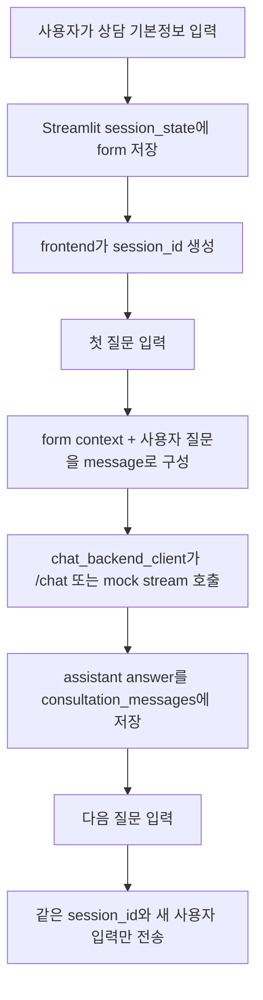

# Consultation Form Flow



## 첫 턴

첫 턴에는 form 값이 다음 형태로 backend message에 포함됩니다.

```text
[상담 입력 컨텍스트]
- 나이: 34세
- 지역: 서울시 강남구
- 상담 대상: 본인
- 사용자가 원하는 정보: 불이익 대응
- 진행 단계: 분쟁 발생
- 기타 정보: 장애인 등록 완료, 근로자

[사용자 질문]
회사에서 장애 때문에 불이익을 받은 것 같아요.
```

## 후속 턴

후속 턴에는 frontend가 전체 history를 다시 보내지 않습니다.

```json
{
  "session_id": "streamlit-...",
  "message": "그럼 어디에 진정을 넣어야 하나요?",
  "metadata": {
    "source": "streamlit",
    "turn_index": 2,
    "context_seeded": false
  }
}
```

backend가 LangGraph/LangChain memory를 붙이면 같은 `session_id`를 `thread_id`로 사용해 이전 context를 복원합니다.
